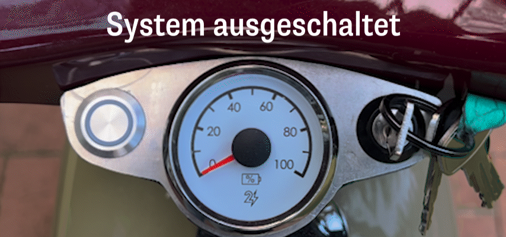

# Fahrzeug fährt nicht

## Fahrzeug fährt nicht - Betätigung des Zündschloss führt aber zu leuchtendem Taster

### Im Antriebsmodul ist rote LED zu sehen

## Fahrzeug fährt nicht - Betätigung des Zündschloss führt NICHT zu leuchtendem Taster
Sitzbank mehr als 10% aufgeladen 
Sitzbank ist mit Deinem Antriebsmodul verbunden
Armaturen sind mit Deinem Antriebsmodul verbunden

# System lässt sich nicht ausschalten

## System an auch ohne Armaturen

Wenn auch mit nicht angeschlossenen Armaturen das System weiterhin anbleibt, ist ausgeschlossen, dass die Armaturen verantwortlich sind. Der Fehler lässt sich also auf Antriebsmodul und Sitzbank eingrenzen.

### Akkuspannung liegt an auch ohne Antriebsmodul

Ziehe den Hauptstecker aus der Sitzbank und miss mit einem Spannungsmessgerät die Ausgangsspannung an dem Sitzbankstecker. Ist diese über 42V bei einem Akku mit 50V Nennspannung (siehe Beschriftung auf Sitzbank) oder über 60V bei einem Akku mit 72V Nennspannung, dann bedeutet das, dass das Batteriemanagementsystem (BMS) die Spannung nicht korrekt abschaltet. Andernfalls liegt eine Spannung über 0V aber unter den besagten Grenzen an.

Wenn das Batteriemanagementsystem (BMS) die Spannung nicht korrekt abschaltet, müssen wir die Sitzbank bei uns reparieren.

### Akkuspannung liegt ohne Antriebsmodul nicht an

Du hast das Problem nun auf das Antriebsmodul eingegrenzt. Es wird entweder an Günther (SRZ00743) liegen, oder an einer defekten Hauptschlagader (SRZ00041 oder SRZ00613 bei Duos).

## System geht aus, wenn Armaturen abgesteckt werden

Wenn das System ohne Betätigung des Zündschlosses an ist und ausgeht sobald du die Armaturen absteckst, dann bedeutet das, auf der Key-Leitung in den Armaturen ist irgendwo ein Kurzschluss.

# Licht geht nicht an

