# Anleitung zur Elektrifizierung einer Simson Schwalbe KR51/2, KR51/1 & KR51 mit MID50 Umbaukit

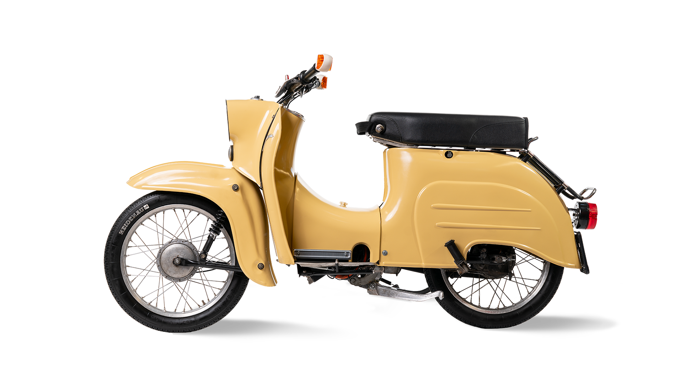

<h2>Voraussetzungen</h2>

Folgende Teile benötigst du:
<table>
  <tr>
    <td valign="top">
      <ul style="list-style-type:none; padding-left:0; margin-top:0;">
        <li><input type="checkbox"> 1x Kupplungsdeckel inkl. Verschlusselementen</li>
        <li><input type="checkbox"> 1x Lichtmaschinendeckel</li>
        <li><input type="checkbox"> 1x Zylinderkopf (bei KR51/1 und KR51 zwingend mit integrierter Motoraufnahme)</li>
        <li><input type="checkbox"> 1x Zylinder (Achtung: Überstand der Laufbuchse muss entfernt werden) oder 4x Geist Zylinder Hülsen</li>
        <li><input type="checkbox"> 12V Glühbirnen, Blinkgeber und Hupe</li>
        <li><input type="checkbox"> Bei KR51: BA15D Frontlicht Birnenfassung</li>
      </ul>
    </td>
  </tr>
</table>

Folgende Werkzeuge benötigst du:
<table>
  <tr>
    <td valign="top" style="padding-right:30px;">
      <ul style="list-style-type:none; padding-left:0; margin-top:0;">
        <li><input type="checkbox"> 10er, 13er, 19er Maulschlüssel</li>
        <li><input type="checkbox"> 10er und 13er Nuss, Knarre und Verlängerungsstück</li>
        <li><input type="checkbox"> Inbusschlüssel SW3, SW6</li>
        <li><input type="checkbox"> Torxschlüssel TX25 & TX30</li>
      </ul>
    </td>
    <td valign="top" style="padding-left:30px;">
      <ul style="list-style-type:none; padding-left:0; margin-top:0;">
        <li><input type="checkbox"> Seitenschneider</li>
        <li><input type="checkbox"> Kreuzschlitz- und Schlitzschraubenzieher</li>
        <li><input type="checkbox"> Hakenschlüssel, Rohrzange oder Hammer</li>
      </ul>
    </td>
  </tr>
</table>

<h2>Lieferumfang</h2>

!!! note "Hinweis: Bitte bewahre deine Verpackung auf"
    Im Garantiefall wird die Originalverpackung für den Rückversand benötigt.

<h4>Alle Varianten</h4>
<table>
  <tr>
    <td valign="top">
      <ul style="list-style-type:none; padding-left:0; margin-top:0;">
        <li><input type="checkbox"> 1x Antriebsmodul</li>
        <li><input type="checkbox"> 1x MID50 Akku</li>
        <li><input type="checkbox"> 1x Ladegerät 350W oder 1200W</li>
      </ul>
    </td>
  </tr>
</table>

<h4>KR51/2 spezifische Teile</h4>
<table>
  <tr>
    <td valign="top" style="padding-right:30px;">
      <ul style="list-style-type:none; padding-left:0; margin-top:0;">
        <li><input type="checkbox"> 1x Akkuhalterung (2x Gummipuffer, 2x Kantenschutz)</li>
        <li><input type="checkbox"> 1x Bowdenzugsensor</li>
        <li><input type="checkbox"> 3x Stellschraube</li>
        <li><input type="checkbox"> 1x Druckfeder</li>
        <li><input type="checkbox"> 1x Armatur</li>
        <li><input type="checkbox"> 1x Riemenspannschlüssel</li>
        <li><input type="checkbox"> 1x Tachoantrieb für Antriebsritzel Z=14</li>
        <li><input type="checkbox"> 1x Bordnetzkabel</li>
        <li><input type="checkbox"> 1x Bordnetzkabel-Verlängerung</li>
        <li><input type="checkbox"> 1x Aux DCDC Kabel</li>
      </ul>
    </td>
    <td valign="top" style="padding-left:30px;">
      <ul style="list-style-type:none; padding-left:0; margin-top:0;">
        <li><input type="checkbox"> 1x HMI Splitter Kabel</li>
        <li><input type="checkbox"> 2x M4x10 Schlitzschrauben</li>
        <li><input type="checkbox"> 2x M4 Unterlegscheiben</li>
        <li><input type="checkbox"> 1x M6 Flachsteck Kontaktzunge</li>
        <li><input type="checkbox"> 2x Zündschlüssel</li>
        <li><input type="checkbox"> 10x Kabelbinder</li>
        <li><input type="checkbox"> 1x Einmalhandschuhe</li>
        <li><input type="checkbox"> 1x Ersatz-O-Ring für Akkustecker</li>
        <li><input type="checkbox"> Optional: 12V Glühbirnenset und Blinkgeber</li>
        <li><input type="checkbox"> MID50 Teilegutachten</li>
      </ul>
    </td>
  </tr>
</table>

<h4>KR51/1 spezifische Teile</h4>
<table>
  <tr>
    <td valign="top" style="padding-right:30px;">
      <ul style="list-style-type:none; padding-left:0; margin-top:0;">
        <li><input type="checkbox"> 1x Akkuhalterung</li>
        <li><input type="checkbox"> 1x Bowdenzugsensor</li>
        <li><input type="checkbox"> 1x Armatur</li>
        <li><input type="checkbox"> 1x Riemenspannschlüssel</li>
        <li><input type="checkbox"> 1x Tachoantrieb für Antriebsritzel Z=14</li>
        <li><input type="checkbox"> 1x Bordnetzkabel</li>
        <li><input type="checkbox"> 1x Bordnetzkabel-Verlängerung</li>
        <li><input type="checkbox"> 1x Aux DCDC Kabel</li>
        <li><input type="checkbox"> 1x HMI Splitter Kabel</li>
        <li><input type="checkbox"> 2x M4x10 Schlitzschrauben</li>
        <li><input type="checkbox"> 2x M4 Unterlegscheiben</li>
        <li><input type="checkbox"> 1x M6 Flachsteck Kontaktzunge</li>
        <li><input type="checkbox"> 2x Zündschlüssel</li>
      </ul>
    </td>
    <td valign="top" style="padding-left:30px;">
      <ul style="list-style-type:none; padding-left:0; margin-top:0;">
        <li><input type="checkbox"> 10x Kabelbinder</li>
        <li><input type="checkbox"> 1x Einmalhandschuhe</li>
        <li><input type="checkbox"> 1x Ersatz-O-Ring für Akkustecker</li>
        <li><input type="checkbox"> Optional: 12V Glühbirnenset und Blinkgeber</li>
        <li><input type="checkbox"> MID50 Teilegutachten</li>
        <li><input type="checkbox"> 1x M8x70 Außensechskantschraube</li>
        <li><input type="checkbox"> 1x M8 Unterlegscheibe</li>
        <li><input type="checkbox"> 1x M8 Kombimutter</li>
        <li><input type="checkbox"> 2x Kettenschlauchadapter</li>
        <li><input type="checkbox"> 1x Bremszugblech</li>
        <li><input type="checkbox"> 1x Bremszug Widerlager</li>
        <li><input type="checkbox"> 2x M6x12 Unterlegscheibe</li>
        <li><input type="checkbox"> 1x Hülsenmutter M5x30</li>
        <li><input type="checkbox"> 1x M5 Flanschmutter</li>
      </ul>
    </td>
  </tr>
</table>

<h3>Akkuhalterung</h3>
<table>
  <tr>
    <td valign="top" style="padding-right:30px;">
      <ul style="list-style-type:none; padding-left:0; margin-top:0;">
        <li><input type="checkbox"> 1x Baugruppe Akkuhalterung</li>
        <li><input type="checkbox"> 1x 20x8x10 Abstandshülse</li>
        <li><input type="checkbox"> 3x M6 Flanschmutter</li>
        <li><input type="checkbox"> 5x M6x25 Sechskantschraube</li>
        <li><input type="checkbox"> 5x M6 Unterlegscheibe</li>
      </ul>
    </td>
    <td valign="top" style="padding-left:30px;">
      <ul style="list-style-type:none; padding-left:0; margin-top:0;">
        <li><input type="checkbox"> 2x M6x10 Langmutter</li>
        <li><input type="checkbox"> 1x Sitzbankschlosshaken lang</li>
        <li><input type="checkbox"> 2x Sitzbank Gummipuffer</li>
        <li><input type="checkbox"> 2x Kantenschutz</li>
      </ul>
    </td>
  </tr>
</table>

<h3>M500 oder M50 Motor Adapter Kit</h3>
<table>
  <tr>
    <td valign="top" style="padding-right:30px;">
      <ul style="list-style-type:none; padding-left:0; margin-top:0;">
        <li><input type="checkbox"> 1x Kupplungsdeckel Adapter</li>
        <li><input type="checkbox"> 1x Lichtmaschinendeckel Adapter</li>
        <li><input type="checkbox"> 2x Motorhalteblech</li>
        <li><input type="checkbox"> 2x Distanzhülse lang</li>
        <li><input type="checkbox"> 2x Distanzhülse kurz</li>
        <li><input type="checkbox"> 1x M5x12 Hülsenmutter</li>
        <li><input type="checkbox"> 4x M5 Gleitmutter</li>
        <li><input type="checkbox"> 4x M5 Gewindestange</li>
        <li><input type="checkbox"> 4x M5 Flanschmutter</li>
      </ul>
    </td>
    <td valign="top" style="padding-left:30px;">
      <ul style="list-style-type:none; padding-left:0; margin-top:0;">
        <li><input type="checkbox"> 12x M5x10 Senkkopfschraube</li>
        <li><input type="checkbox"> 2x M5x25 Hülsenmutter</li>
        <li><input type="checkbox"> 2x M8x85 Außensechskantschraube</li>
        <li><input type="checkbox"> 2x M8x100 Außensechskantschraube (bei KR51/1 und KR51 nur 1x)</li>
        <li><input type="checkbox"> 4x M8 Mutter</li>
        <li><input type="checkbox"> 4x M8 Unterlegscheibe</li>
        <li><input type="checkbox"> 6x M6x35 Zylinderschraube</li>
      </ul>
    </td>
  </tr>
</table>

<h2>Kleingeschriebenes</h2>

Der Verwendungszweck des Umbaukits ist der Umbau der oben genannten Simson Modelle gemäß der vorliegenden Montageanleitung, sowie deren Nutzung im Straßenverkehr gemäß der Bedienungsanleitung. Bitte habe Verständnis dafür, dass wir uns bei der Entwicklung des Umbausatzes nach dem Originalzustand der erwähnten Simson Modelle gerichtet haben. Bei Umbauten mit Bauteilen, die nicht dem Original entsprechen, oder Veränderung der Originalteile durch einen Unfall, Verschleiß, oder beabsichtigte Modifikationen können wir nicht gewährleisten, dass das Umbaukit fehlerfrei und sicher funktioniert, bzw. sich überhaupt einbauen lässt. Solltest du dir bezüglich deines Fahrzeugs unsicher sein, kontaktiere uns gerne.

Das dir vorliegende Dokument „MID50 - Schwalbe - Montage- und Bedienungsanleitung" wird von der Second Ride GmbH zur Verfügung gestellt und versteht sich als Ergänzung zur Original-Hersteller-Bedienungsanleitung. Beide Dokumente sind als Einheit zu sehen. Sie gehören unmittelbar zusammen, wobei die Erklärungen zum Verbrennungsmotor unberücksichtigt bleiben können.

Bitte lies dieses Dokument zuerst vollständig und genau durch, bevor du mit dem Umbau startest und deine erste Fahrt antrittst. Du findest hier Warnungen und Hinweise, Informationen und Ratschläge sowie Verhaltensmaßnahmen im Notfall und weitere wichtige Anmerkungen zu deinem Fahrzeug. Bei Nichtbeachtung der Anweisungen kann es zu leichten oder schweren Verletzungen sowie Lebensgefahr kommen. Zudem kann die Leistungsfähigkeit des Fahrzeugs eingeschränkt sein. Bitte lies auch die neben den Symbolen aufgeführten Warnungen und Hinweise sorgfältig durch. Nur so kann ein ordnungsgemäßer Einbau des Umbaukits, sowie eine ordnungsgemäße Nutzung des Fahrzeugs sichergestellt werden. Bei Nichtbeachtung dieser Warnungen und Hinweise nimmst du Personen- bzw. Fahrzeugschäden billigend in Kauf.

Beachte bitte, dass die Entsorgung von Bordnetz-Batterie, Getriebeöl und Kraftstoff-Öl-Gemisch nicht im Hausmüll bzw. im Abwasser oder der Umwelt geschehen darf. Bitte informiere dich über die fachgerechte Entsorgung dieser Substanzen. Altbatterien können Schadstoffe enthalten, die bei nicht sachgerechter Lagerung oder Entsorgung die Umwelt oder Gesundheit schädigen können. Batterien enthalten aber auch wichtige Rohstoffe wie zum Beispiel Eisen, Zink, Mangan oder Nickel, die recycelt werden können. Bitte sende den Akku nach Gebrauch an uns zurück. Um einen sicheren Transport zu gewährleisten, empfehlen wir die Verwendung der Original-Verpackungen. Bitte nimm in jedem Fall Kontakt zu uns auf.

Einige Flüssigkeiten, die in Fahrzeugen verwendet werden (Batteriesäure, Batteriekühlmittel, Bremsflüssigkeit, Kraftstoff, Scheibenwaschflüssigkeit usw.), sind giftig und dürfen nicht eingeatmet, geschluckt oder mit offenen Wunden in Kontakt gebracht werden. Lese und befolge zu deiner Sicherheit stets die Anweisungen, die auf den Flüssigkeitsbehältern aufgedruckt sind bzw. beachte den vom Gesetzgeber vorgeschriebenen Umgang mit diesen Stoffen.

Alle hier enthaltenen technischen Daten und Beschreibungen waren zum Zeitpunkt der Drucklegung aktuell. Da aber die kontinuierliche Verbesserung eines der Hauptziele ist, behalten wir uns das Recht vor, jederzeit Veränderungen an den Produkten vorzunehmen. Wenn du Irrtümer oder Auslassungen in diesem Dokument bemerkst, schreib das bitte unbedingt in den Discord-Forum (siehe Kapitel "Nützliche Links").

Bedeutung der Warnzeichen:

<table style="border:none; border-collapse:collapse;">
  <tr>
    <td style="border:none;"></td>
    <td style="border:none;">Allgemeine Warnung</td>
    <td style="border:none;"></td>
    <td style="border:none;">Gefahren durch das Aufladen von Batterien</td>
  </tr>
  <tr>
    <td style="border:none;">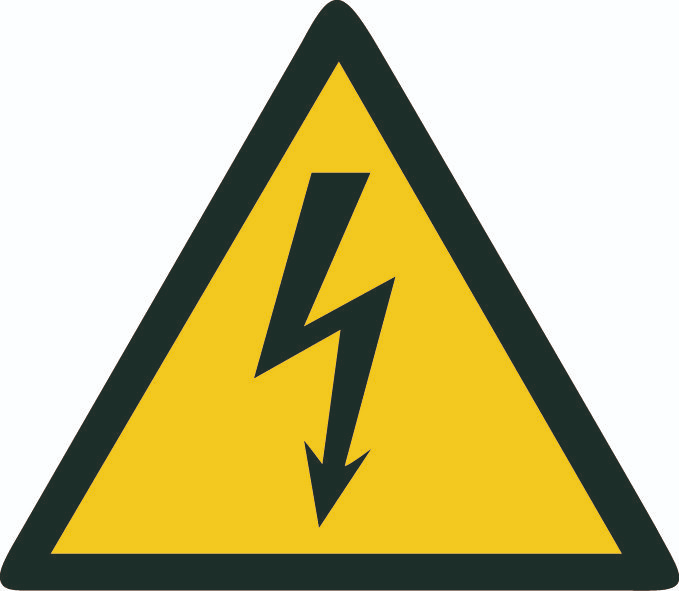</td>
    <td style="border:none;">Elektrische Spannung</td>
    <td style="border:none;"></td>
    <td style="border:none;">Heiße Oberfläche</td>
  </tr>
  <tr>
    <td style="border:none;"></td>
    <td style="border:none;">Feuergefährliche Stoffe</td>
    <td style="border:none;"></td>
    <td style="border:none;">Giftige Stoffe</td>
  </tr>
  <tr>
    <td style="border:none;"></td>
    <td style="border:none;">Gefahr der Handverletzung</td>
    <td style="border:none;"></td>
    <td style="border:none;"></td>
  </tr>
</table>

## Demontage

Bevor du mit der Demontage beginnst, entferne die Batterie des Fahrzeugs, um Kurzschlüsse zu vermeiden.

### 1. Karosserie

Bei der Schwalbe ist der Umbau etwas aufwendiger als bei den Modellen S50, S51 und S70. Das liegt vor allem an der großzügigen Verkleidung, welche den Zugang zu Motor, Elektrik und Tank erschweren. Fang am Besten erstmal damit an, den Motortunnel zu entfernen.

  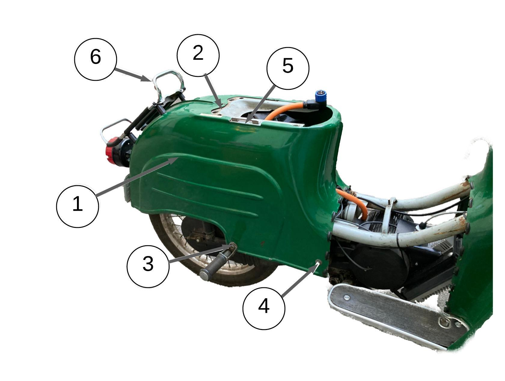

Als nächstes ist die Haube (1) an der Reihe. Demontiere dafür zunächst die Sitzbank inklusive des Scharniers (5). Entferne nun die fünf Schrauben die die Haube noch halten: eine Schraube oben, mittig hinter dem Tankdeckel (2), zwei Schrauben mit denen die Soziusrasten befestigt sind (3), und zwei jeweils an den vorderen, unteren Ecken der Haube (4). Damit du die Haube gleich abnehmen kannst, müssen noch die Kabel, die zum Rücklicht führen, abgeklemmt werden. In der Nähe des Motors solltest du eine 3-polige Klemmbuchse mit Kabeln, die nach hinten führen, finden. Entferne die Kabel von einer Seite der Buchse. Nun kann die Haube herunter gehoben werden. Ist die Haube runter, kannst du den Tank demontieren.

### 2. Motoranschlüsse

Nun können alle elektrischen und mechanischen Verbindungen am Motor gelöst werden. Stell sicher, dass der Benzinhahn zugedreht ist (nach links in Fahrtrichtung) und zieh den Schlauch vom Vergaser ab. Wenn du möchtest, kannst du an dieser Stelle auch den Tank demontieren. Den verbleibenden Treibstoff im Tank kannst du nun mit dem Schlauch in ein geeignetes Gefäß (z.B. Benzinkanister) ablassen. Löse die Schelle der Ansaugmuffe und zieh diese vom Vergaser ab. Schraube den Gas- und Starterzug vom Vergaser ab, hänge den Kupplungszug aus der Halterung am Motorblock und drehe die Tachowelle aus der Halterung. Falls du eine Schwalbe mit Handschaltung hast, entferne auch den zugehörigen Bowdenzug. Entferne nun noch den Zündkerzenstecker und das Massekabel vom Motorblock.

Falls du eine KR51/1 oder KR51 mit einer Seilzug Hinterradbremse hast, hänge noch den Bremszug aus dem Motordeckel rechts aus. Dazu hilft es, am Hinterrad die zylinderförmige Mutter am Hinterradbremshebel zu lösen.

### 3. Armaturenabdeckung

Entferne die beiden Schlitzschrauben aus der silbernen Armaturenabdeckung mit einem Schlitzschraubendreher und entferne die Blechabdeckung.

#### KR51/2

Entnehme das Befestigungsblech (7), an dem Steuerteil, Leitungsverbinder (8) und Sicherungshalter (9) hängen. Alle Kabel, die an diesen befestigt sind, können abgesteckt werden. Schaue dafür in das Kapitel *Montage des Umbaukits → Elektrik.* Das Befestigungsblech mit den drei erwähnten Bauteilen muss entfernt werden, damit später Platz für die Armaturen ist.

  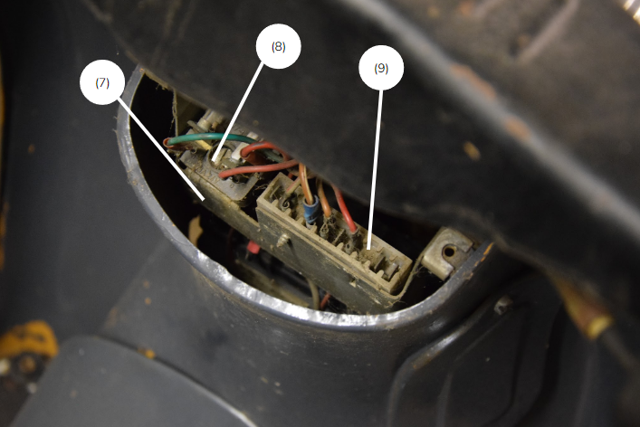

### 4. Auspuff

Nun sollte nur noch der Auspuff an dem Motor befestigt sein. Dieser ist am Motor mit einer großen Mutter befestigt, die mit einer Rohrzange oder einem Hakenschlüssel entfernt werden kann.

!!! tip "Tipp: Wenn die Krümmermutter sich nicht lösen will"
    Wenn die Krümmermutter sich nicht lösen will, kannst du sie mit einem alten Schlitzschraubenzieher und einem Hammer (am besten aus Gummi oder Holz) in die Kerben der Krümmermutter schlagen und sie so lösen.

Die andere Befestigung des Auspuffs liegt hinten in Form einer Rohrschelle vor. Diese kann durch Entfernen der Schraube geöffnet werden.

### 5. Kette

Bevor der Motor entfernt werden kann, muss noch die Kette vom Antriebsritzel genommen werden. Nimm zuerst den Lichtmaschinendeckel vom Motor ab. Löse dann sowohl die Mutter der Hinterachse rechts, als auch die Steckachse links. Ein paar Umdrehungen reichen hier, da das Hinterrad nur verschoben werden muss. Die kleinen Muttern der Kettenspanner kannst du jetzt nach ganz hinten bis zum Ende des Gewindes schrauben. Nun sollte es möglich sein, das Hinterrad nach vorne zu schieben. Nun ist es an der Zeit, die fettige Kette vom Antriebsritzel herunter zu heben. Dafür haben wir dem Paket Einmalhandschuhe beigelegt.

!!! tip "Tipp: Kette entspannen"
    Wenn das Moped auf dem Hauptständer aufgebockt ist, kannst du nun durch Anheben am Aufbockgriff das Hinterrad zum Schweben bringen und mit dem Fuß gegen das Hinterrad treten, sodass es 1-2 cm nach vorne kommt.

### 6. Motor

Nach all dieser Vorarbeit ist der Motor jetzt bereit, entfernt zu werden. Dieser ist bei der KR51/2 mit zwei langen M8 Schrauben in den Motorlagerblechen (10) verschraubt. Bei der KR51/1 und der KR51 ist dort nur eine M8 Schraube, die zweite sitzt oben am Zylinderkopf. Es kann fummelig sein, den Motor herauszuheben. Unterstützung von einer zweiten Person kann jetzt sehr hilfreich sein. Löse die Muttern und versuche die Schrauben aus den Bohrungen zu ziehen. Es hilft, den Motor dabei etwas anzuheben. Nun kannst du ihn aus der Lagerung herausnehmen. Glückwunsch! Deine Simson ist kein Verbrennungsfahrzeug mehr!

### 7. Lenker-Anbauteile

Choke-Hebel und Kupplungshebel inkl. ihrer Bowdenzüge können abmontiert werden.

## Montage des Umbaukits

Bei der Montage des Umbaukits werden ausschließlich Schrauben der Größe M4, M5, M6 und M8 verwendet. Damit die einzelnen Teile wie vorgesehen halten und festgeschraubt sind, solltest du idealerweise die folgenden Anzugsmomente verwenden: 
M4: 2,9 Nm 
M5: 5,7 Nm 
M6: 9,8 Nm 
M8: 24 Nm 

### 1. Antriebmodul Montage

#### Motorhalter montieren

Zuerst muss der Motorhalter in der Motoraufnahme der Schwalbe montiert werden. Nimm dir dafür die M8x100 Außensechskantschraube (1) und lege die Unterlegscheibe auf. Führe die M8 Schraube durch die obere Bohrung der Motoraufnahme auf der Kettenseite. Schiebe nun in dieser Reihenfolge folgende Bauteile auf die Schraube auf: Distanzhülse kurz (2), Motorhalteblech (3), Distanzhülse lang (4), Motorhalteblech (3), Distanzhülse kurz (2). Stoße dann mit der Schraube durch das zweite Rahmenblech der Schwalbe und drehe die M8 Mutter (5) auf die Schraube und drehe diese locker bis zum Anschlag auf. Bei KR51/1 und KR51 ist die zweite Motoraufnahme an dem Zylinderkopf, dazu später mehr. Bei KR51/2 muss nun die zweite M8x100 Schraube (1) durch die untere Bohrung in der Motoraufnahme der Schwalbe auf Kettenseite, dann durch das rechte Motorhalteblech, durch die zweite Distanzhülse lang, durch das linke Motorhalteblech und dann durch die linke Motoraufnahme der Schwalbe. Im Anschluss muss dann die M8 Mutter aufgeschraubt werden.

  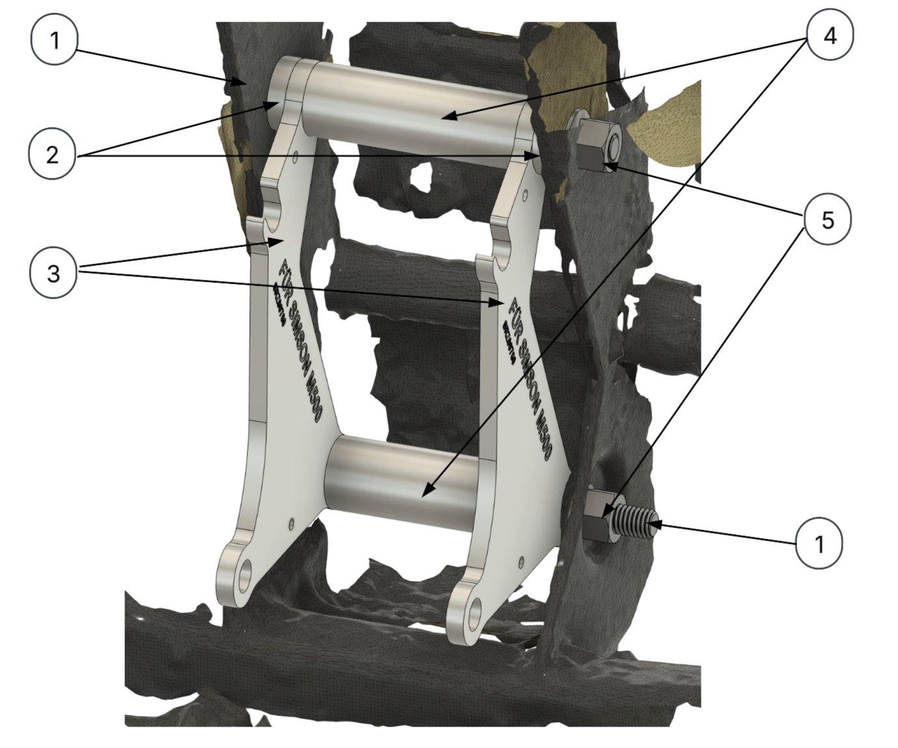

#### Antriebsmodul einhängen

Stelle das Antriebsmodul erstmal unter das Fahrzeug und führe die Kabel zwischen die beiden Rahmenrohre hoch. Schiebe nun das Antriebsmodul mit dem unteren Anschraubpunkt zwischen die Motorhaltebleche, die du zuvor montiert hast. Schiebe die M8x85 Schraube mit Unterlegscheibe von Kettenseite durch die Motorhaltebleche und durch den unteren Aufnahmepunkt des Antriebsmoduls. Sichere das Ganze mit der M8 Mutter.

  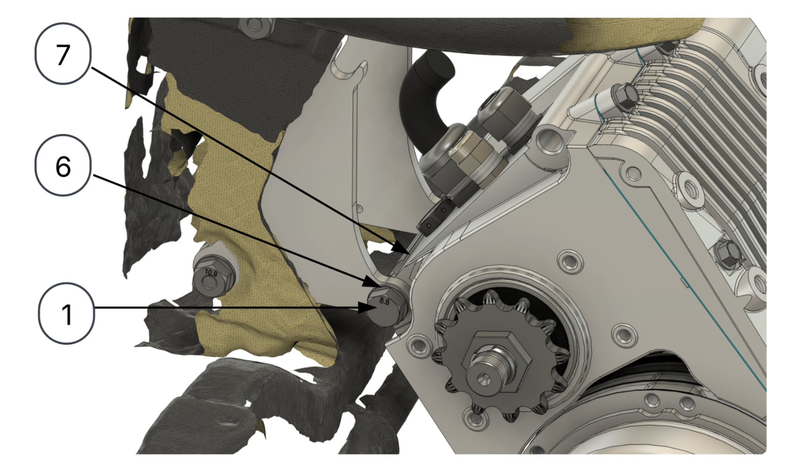

Drehe nun das Antriebsmodul nach oben, so dass die obere Aufnahme der Motoraufnahme und des Antriebmoduls übereinanderliegen. Setze die Unterlegscheibe auf die M8 Schraube und schiebe diese durch den oberen Aufnahmepunkt. Sichere das Ganze mit der M8 Mutter. Bei KR51/2 kannst du nun alle 4 Schraubverbindungen festziehen. Bei KR51/1 und KR51 muss zuerst die Zylinderkopfaufnahme montiert werden.

  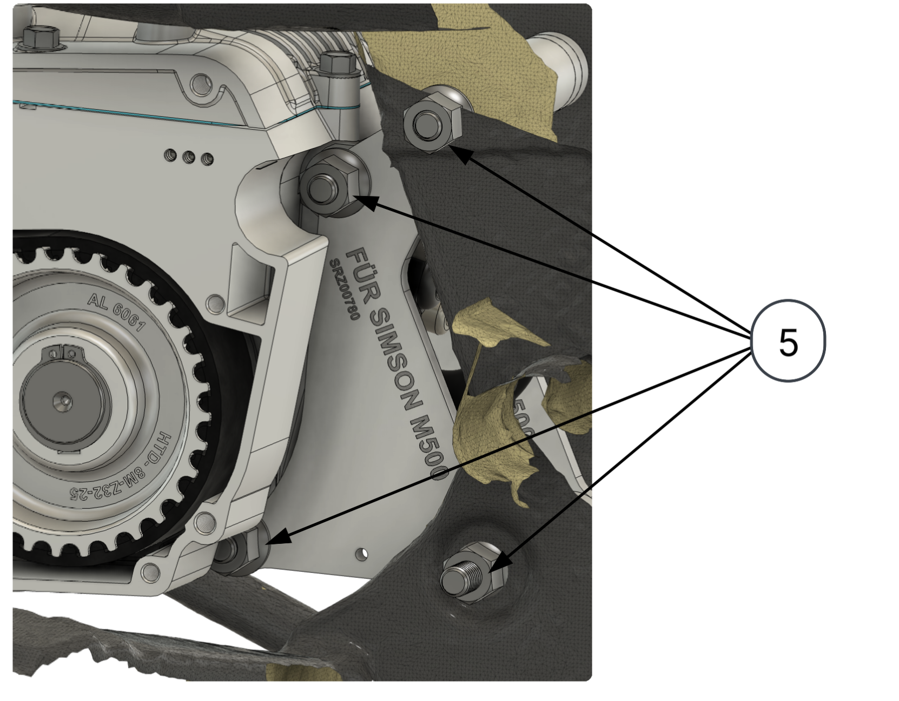

#### Seitendeckel Adapter anbauen

Nachdem das Antriebsmodul im Fahrzeug sitzt, können die Seitendeckel Adapter angebracht werden. Für die linke Seite (in Fahrtrichtung), entferne die M5 Außensechskantschraube (8), die das Riemenspannstützblech (9) hält und schiebe den Kupplungsdeckeladapter (10) zwischen das Riemenspannstützblech (9) und Antriebsmodul, bis die Montagepunkte beider übereinstimmen. Schraube diesen mit den drei Senkkopfschrauben (11) fest. Schraube zuletzt die Außensechskantschraube (8) des Riemenspannstützbleches (9) fest. Um die von Werk aus eingestellte Riemenspannung nicht zu verändern, lass die M6 Schraube des Riemenspanners festgezogen.

  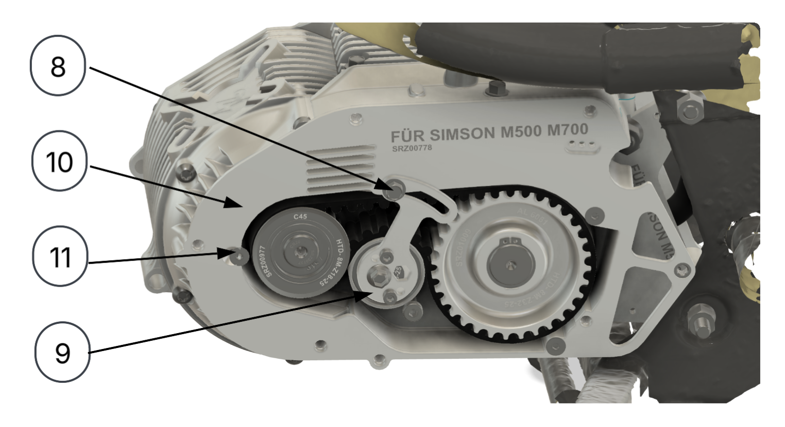

Nimm nun das Adapterblech für den rechten Seitendeckel (12) und schraube diesen am Antriebsmodul fest. Nutze dafür die 8x Senkkopfschraube (11) und ziehe sie der Reihenfolge nach fest.

  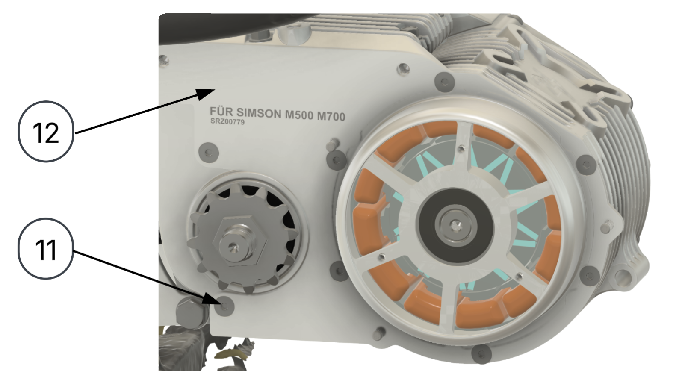

#### Zylinder und Zylinderkopf montieren

Nun kann der Zylinderkopf angebracht werden, der bei der KR51 und KR51/1 für die zweite Motoranbindung des Antriebsmoduls benötigt wird. Dafür müssen die M5 Nutmuttern (13) mit den Gewindestangen (14) versehen werden und in die Nuten im Flansch des Motors eingesetzt werden. Bei KR51/2 muss nicht zwangsläufig ein Zylinder oder Zylinderkopf verbaut werden.

  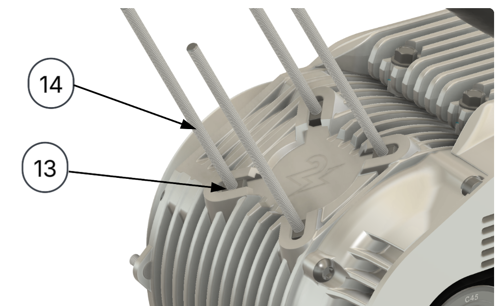

Im Anschluss werden entweder die Hülsen des Geist-Zylinders (15) oder ein Zylinder ohne Laufbuchse auf die Gewindestangen (14) geschoben. Dann muss der Zylinderkopf (16) draufgesetzt werden und mit den 4x M5 Flanschmuttern (17) festgeschraubt werden.

Bei der KR51/1 und KR51 kann nun das Antriebsmodul so positioniert werden, dass die M8x70 Schraube mit Unterlegscheibe (18) durch die obere Rahmenaufnahme und Zylinderkopfaufnahme geschoben werden. Dann muss das Ganze mit der M8 Mutter (5) gesichert werden. Nun können alle 4x M8 Verschraubungen festgezogen werden.

  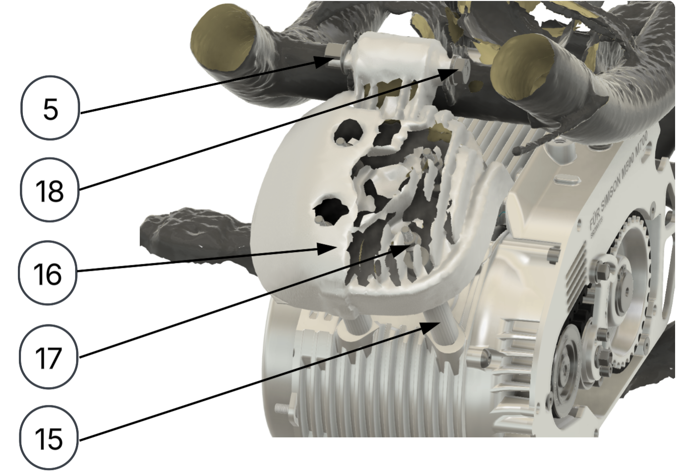

#### Seitendeckel anbringen

Nun kann die Kette auf das Ritzel geschoben werden und die Tachoschnecke des Tachoantriebs auf die Abtriebswelle gesteckt und durch die Spange gesichert werden.

  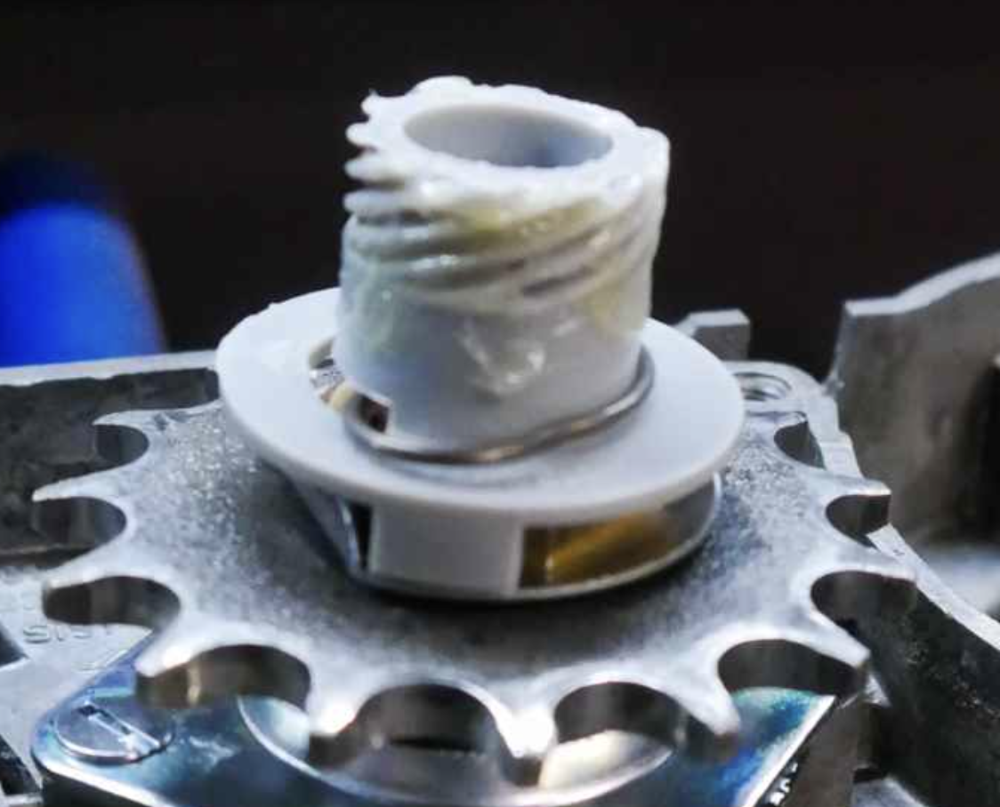

Im Anschluss muss der Lichtmaschinendeckel angeschraubt werden. Bei der KR51/1 und der KR51 müssen vorher die Kettenschlauchadapter in die Kettenschläuche eingeklipst werden, damit diese korrekt in dem M500 Lichtmaschinendeckel passen.

Nun kann das Tachoritzel des mitgelieferten Tachoantriebs in den Lichtmaschinendeckel eingesetzt werden. Fette zuerst das Ritzel mit dem mitgelieferten Schmierfett an beiden Enden. Setze nun das Tachoritzel mit dem Vierkant nach oben in den Lichtmaschinendeckel und setze die Kunststoffabdeckung bis zum Anschlag ein. Befestige diese dann durch das Eintreiben des Splintes von Außen. Dann kann der Lichtmaschinendeckel mit den Hülsenmuttern montiert werden. Achte dabei darauf, dass die Kettenschläuche richtig in der Aufnahme davon im Lichtmaschinendeckel sitzen.

Ein ausführliches Anleitungsvideo zur Montage des Tachoantriebs findest du hier:

  <iframe width="700" height="394" src="https://www.youtube.com/embed/lcTrvHQQLhc" frameborder="0" allowfullscreen></iframe>

#### Bremszugadapter montieren (KR51 und KR51/1)

Bei KR51 und KR51/1 muss der Bremszugadapter montiert werden, wenn kein originaler Lichtmaschinendeckel verbaut wird. Dafür muss die obere Hülsenmutter des Lichtmaschinendeckels entfernt werden. An diesem Punkt wird der Bremszugadapter montiert. Führe dafür die M5x30 Hülsenmutter (23) durch die obere Bohrung des Bremszugbleches (24) und stecke die beiden Unterlegscheiben (25) auf. Führe nun die Hülsenmutter in den Anschraubpunkt des Lichtmaschinendeckels und schraube diese dort fest.

  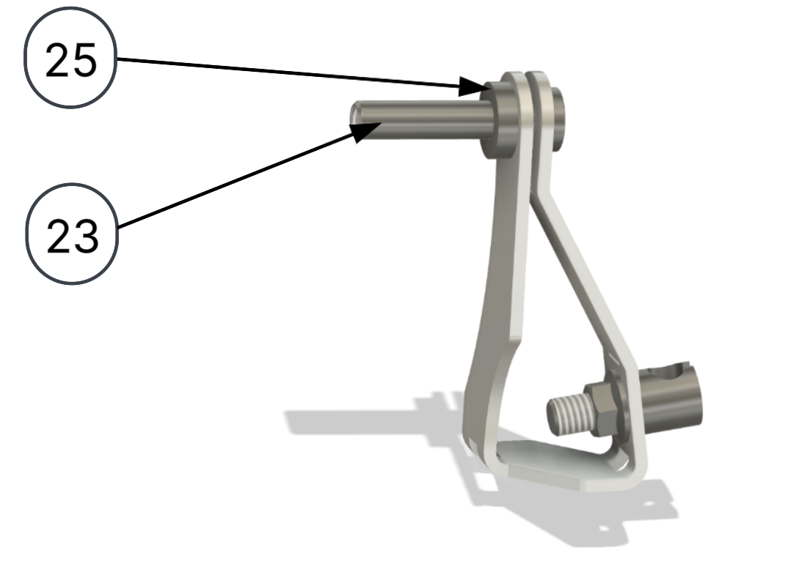
  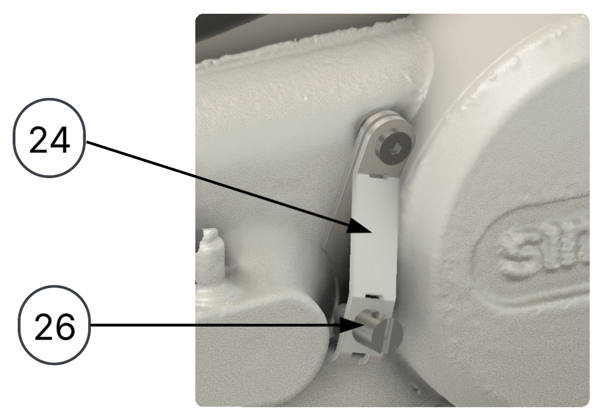

Zuletzt kann der Hinterradbremszug in das Widerlager eingehängt werden. Stelle sicher, dass die Bremse gut funktioniert, indem du sie in dem Zustand ausprobierst.

### 2. Kettenspannung und Spur einstellen

Jetzt wo das Antriebsmodul fest verbaut ist, kannst du das Hinterrad wieder nach hinten ziehen und die Kettenspannermuttern schon mal für eine grobe Voreinstellung nach vorne drehen. Fange bei der Feineinstellung nun mit dem rechten Kettenspanner an: Drehe die Kettenspannermutter soweit nach vorne, bis die Kette im Schlauch nur noch 2 cm Spiel nach oben und unten hat. Das kannst du testen, indem du den Kettenschlauch an der dünnsten Stelle zwischen Daumen und Zeigefinger zusammen presst und eine Auf-/Ab-Bewegung machst.

  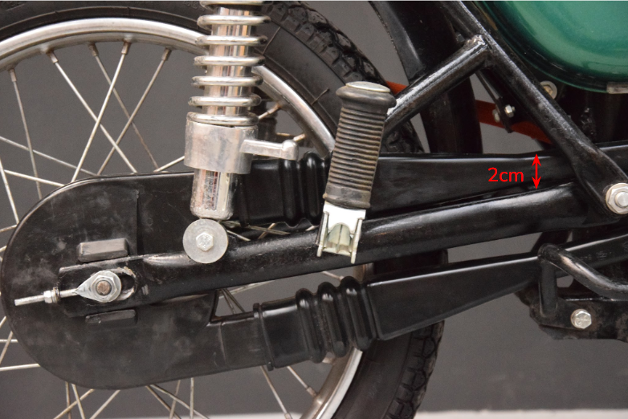

Wenn du mit der Kettenspannung zufrieden bist, kannst du dich nun dem anderen Kettenspanner widmen. Mit diesem Kettenspanner stellst du nun die sogenannte Spur des Fahrzeugs ein. Klingt komplizierter als es ist. Achte einfach darauf, dass beide Räder in einer Linie sind. Dafür kannst du ein langes gerades Brett verwenden oder dich einfach drei Schritte hinter das Moped hocken und mit einem Auge über das Hinterrad das Vorderrad anpeilen.

  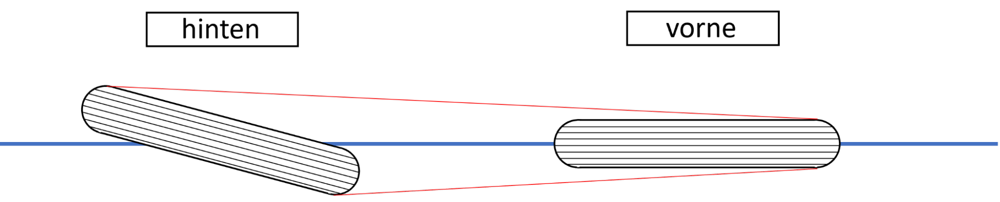

Prüfe nun nochmal die Kettenspannung und korrigiere gegebenenfalls. Sind nun also beide Kettenspanner richtig eingestellt, kannst du die Hinterachse und Mutter wieder festziehen. Jetzt brauchst du nur noch unseren Kettenschutz wieder anschrauben.

### 3. Akkuhalterung

Nun, da das Antriebsmodul montiert ist, kann die Akkuhalterung eingebaut werden. Zuerst muss dafür die untere Schraube des Schutzbleches (1) entfernt und durch eine Abstandshülse (2) etwas versetzt werden. Nimm dir dafür die Abstandshülse und setze sie zwischen Schutzblech und Rahmenaufnahme (3). Schiebe nun von der Seite des Rads die M6 Schraube (4) mit einer Unterlegscheibe durch Schutzblech, Abstandshülse und Rahmenaufnahme und sichere das Ganze mit der M6 Flanschmutter (5).

  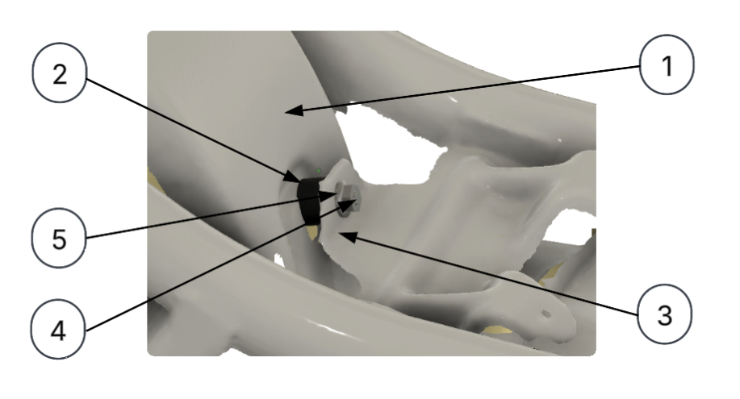

Als nächstes müssen die beiden unteren Aufnahmepunkte gesetzt werden. Nimm dir dafür die beiden Langmuttern (6), setze diese auf den Tankaufnahmepunkten auf und schraube jeweils eine M6 Sechskantschraube (7) mit Unterlegscheibe von unten ein. Ziehe diese Verbindung fest.

  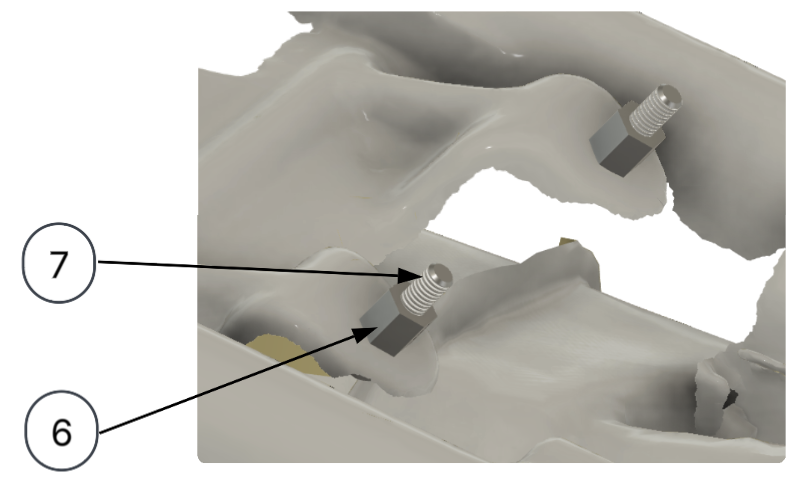

Nun ist es soweit, die Akkuhalterung einzusetzen. Dafür muss bei dieser allerdings zuerst die Blende mitsamt Seitenschienen abgenommen werden. Dafür müssen die fünf M5 Senkkopfschrauben (10) entfernt werden.

  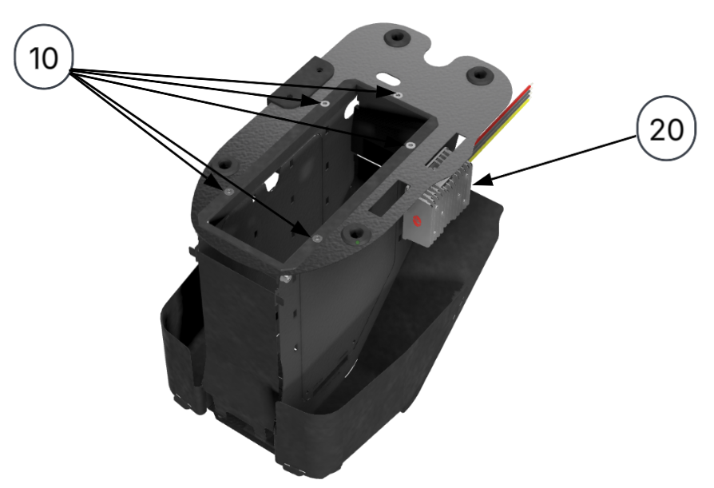

Schiebe als nächstes die unteren beiden Aufnahmepunkte mit den Gummitüllen (11) des Akkuträgers auf die beiden M6 Langmuttern, die du vorher montiert hast. Schiebe dabei den Akkuträger zwischen die beiden Rahmenträger. Sichere das Ganze in dem du die beiden M6 Flanschmuttern (12) auf die Gewindeüberstände schraubst und festziehst.

  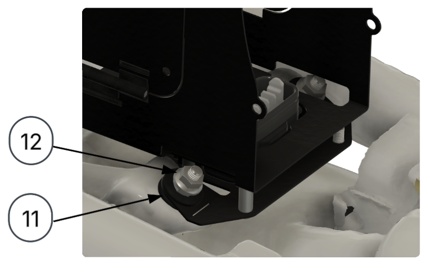

Stelle sicher, dass das Kabel des Steckermoduls in der Vertiefung neben dem Rahmenrohr entlang läuft und nicht zwischen Akkuträger und Schutzblech klemmt.

Jetzt ist der Moment gekommen, die Kabel des Antriebsmoduls anzuschließen. Lege dafür zuerst das dicke schwarze Kabel "Hauptschlagader" unter dem Inlay in der gegenüberliegenden Vertiefung zwischen Kotflügel und Rahmenrohr hoch bis zu dem Stromsammelpunkt. Du kommst an den Stromsammelpunkt, indem du den hinteren Akkuanschlag (13) nach vorne klappst. Dort befinden sich der Bat-Minus Sammelpunkt (14) und der Bat-Plus Sammelpunkt (15). Es sind bereits das Plus und Minus Kabel des Akkus und des DCDC-Wandlers angeschlossen. Um die Antriebsmodul Verbindungen zu ergänzen, müssen zuerst die rote Abdeckkappe und dann die Muttern entfernt werden, die auf beiden Punkten sitzen.

  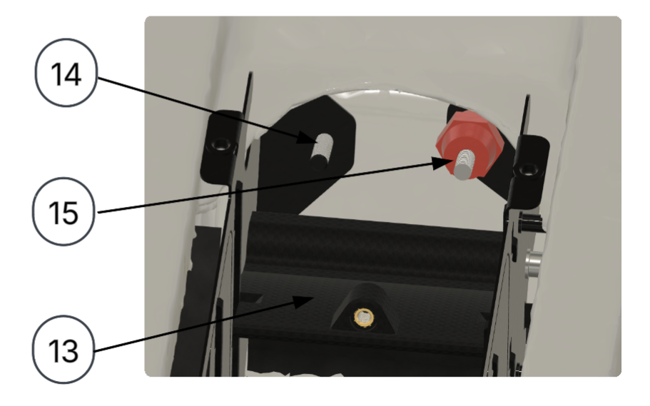

Füge nun die beiden Schraubkontakte des Antriebsmodulkabels "Hauptschlagader" zu den jeweiligen Punkten. Das rote kommt an den roten Bat-Plus-Sammelpunkt und das schwarze an den Bat-Minus-Sammelpunkt. Schiebe die Schraubkontakte auf die jeweilige Gewindestange und achte darauf, dass die Kontaktfläche plan auf der des darunterliegenden Schraubkontakts aufliegen kann und schraube nun die Muttern auf die Gewindestangen auf, um die Kabel zu sichern.

Bevor du die Muttern fest ziehst, müssen die 6-poligen Signalkabel "System Com" der Hauptschlagader und des Steckermodulkabels miteinander verbunden werden. Das Signalkabel des Steckermoduls ist bereits in den heruntergeklappten hinteren Akkuanschlag (13) eingeklipst. Entnehme dieses und stecke dort das Gegenstück aus dem Antriebsmodulkabel ein. Klemme im Anschluss diese Verbindung in die dafür vorgesehene Stelle in dem hinteren Akkuanschlag (13).

  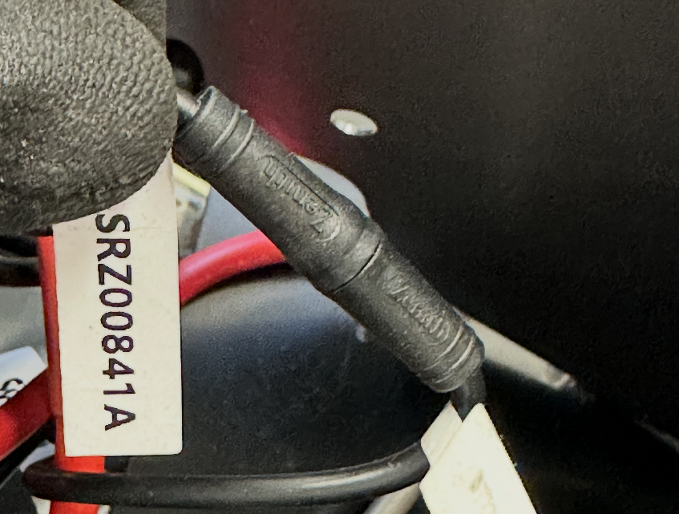

!!! note "Hinweis: Hier könnten in Zukunft weitere MID50 Akkus verbunden werden"
    Das MID50 System ist um weitere Akkus oder Zubehör, wie z.B. einen externen Ladeanschluss, erweiterbar. Dafür haben wir diese Sammelpunkte vorgesehen. Dort werden in Zukunft diese zusätzlichen Komponenten angeschlossen. Um neben den Leistungsanschlüssen auch die Kommunikation zu verbinden, müssen die 6-poligen Signalkabel verbunden werden.

Bevor die Muttern endgültig festgezogen werden können, stelle sicher, dass die Kabel nirgends gequetscht werden, an keiner scharfen Kante anliegen und durch die dafür vorgesehenen Aussparungen rechts und links am Akkuträger hindurchlaufen.

Wenn du das geprüft hast, kannst du nun die Muttern festziehen. Setze im Anschluss die rote Abdeckkappe wieder auf die Mutter des Bat-Plus-Terminals.

  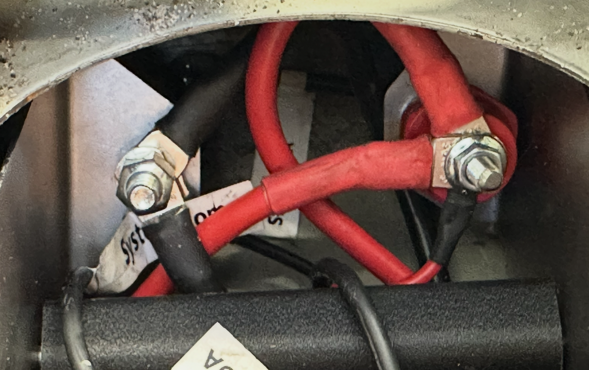

Als nächstes musst du noch das "EDU AUX Cable" Kabel vom Antriebsmodul mit dem mitgelieferten "AUX DCDC-Brake Cable" verbinden. Stecke diese zusammen und verschraube die Steckersicherung. Stecke nun das gelbe Kabel mit dem des DCDC-Wandlers (20) zusammen und verstaue das Kabel unter der Kunststoffverkleidung neben dem Steckermodulkabel. Nimm dir einen Kabelbinder und befestige die Kabel an dem Rahmenrohr. Nimm dir außerdem die beiden mitgelieferten 12V Verlängerungskabel (schwarz-rot, mit einem weißen zweipoligen Stecker an beiden Enden) und stecke diese beiden ineinander und dann an den DCDC-Wandler (20). Lege das Verlängerungskabel entlang des Rahmenrohrs zur Lampenmaske der Schwalbe, wo die Fahrzeugelektronik liegt. Dort wird es später mit der Fahrzeugelektronik verbunden.

Jetzt bietet es sich an, das Motorabschaltungskabel anzustecken.

!!! info "Info: Was das Motorabschaltungskabel macht"
    Mithilfe von diesem Kabel erfährt das Antriebsmodul, ob du die Hinterradbremse (oder auch Vorderradbremse, wenn du dort auch einen Bremskontakt hast) betätigst. Solange die Bremse betätigt ist, ist es dann nicht mehr möglich, Gas zu geben. Wir haben diese Funktion vorgesehen, weil es keine Kupplung mehr gibt und somit keine Möglichkeit mehr, die Kraftübertragung zu trennen, wenn ein Fehler mit der Gasannahme auftritt. Zum Beispiel könnte der Gasgriff auf offener Stellung hängen bleiben. Ein solches Szenario stellt keine Gefahr mehr dar, wenn man nur die Fußbremse betätigen muss, um die Leistung des Motors wegzunehmen.

!!! tip "Tipp: Externer Bremslichtschalter für mehr Zuverlässigkeit"
    Der originale Bremslichttaster von Simson befindet sich in der Nabe des Hinterrads. Dort ist er nur sehr schwer einstellbar und zusätzlich bauartbedingt unzuverlässig. Wir empfehlen stark einen externen Bremslichtschalter nachzurüsten und Bremslicht und Motorabschaltung daran anzuschließen.

Das Kabel ist Teil des "AUX DCDC-Brake Cable" Kabels, welches du vorher schon angeschlossen hast. Nimm das lange schwarze Kabel und führe es entlang der Schwinge zum Bremskontakt (24) am Hinterrad. Entferne dort das originale Bremssignalkabel (23), stecke unseres auf und verbinde das originale mit der Extra-Fahne, welche von unserem Kabel abgeht. Wir haben dir noch eine Kontaktfahne zum Anschrauben beigelegt, falls deine zu stark korrodiert ist oder komplett fehlt. Nutze die Kabelbinder, um wie auch das originale Bremskontaktkabel das Motorabschaltungskabel an der Schwinge entlang zu führen, so dass es nicht durch dessen Auf- und Ab-Bewegung beschädigt werden kann.

  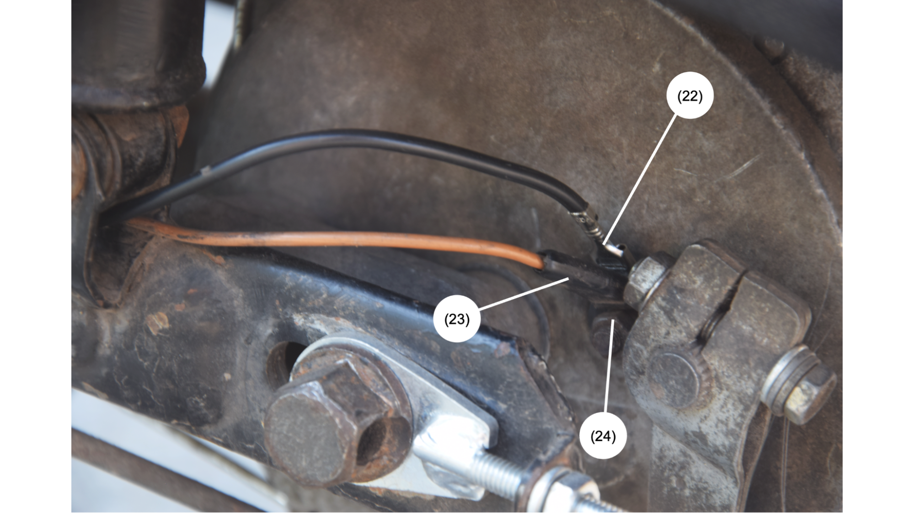

Nachdem das Antriebsmodul mit dem Akkukasten verbunden wurde, kommt nun wieder die Haube auf den Rahmen. Es hilft die Haube beim Montieren quer zur Fahrrichtung zu spreizen, sodass du sie ohne Hängenbleiben über die Akkuhalterung und über die beiden Fußstützpunkte heben kannst.

Bevor du die Akkuhalterung festschrauben kannst, hake vorne die Haube mit der vorderen Kante in der dafür vorgesehenen Vertiefung (16) in dem vorderen Akkuanschlag der Akkuhalterung ein.

  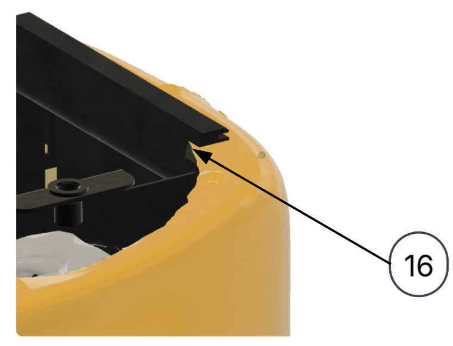

Im Anschluss kann die Blende eingesetzt werden. Fange vorne in dem vorderen Akkuanschlag (16) an, der auch für die Blende (17) eine Vertiefung besitzt, und setze die Blende dort ein. Lege die Blende dann einfach auf die Haube auf und achte darauf, dass die Sitzbankauflageadapter (18) in die Rahmenaufnahmepunkte einrasten. Jetzt kannst du die Seitenschienen (19) wieder einsetzen und mit den M5 Senkkopfschrauben (10) festschrauben. Im Anschluss kannst du den hinteren Akkuanschlag hochklappen und auch diesen mit einer M5 Senkkopfschraube festschrauben. Als letzten Schritt müssen noch die Sitzbankauflageadapter befestigt werden. Dafür müssen diese mit Druck in den Rahmen gedrückt werden und anschließend jeweils eine M5 Senkkopfschraube bis zum Anschlag festgeschraubt werden.

  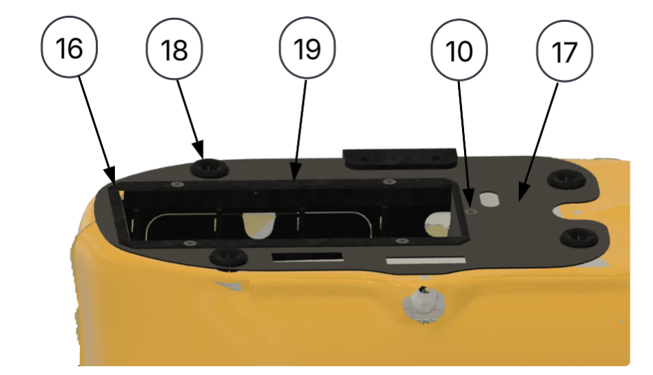

Jetzt muss die Sitzbank noch auf die Erhöhung angepasst werden, indem in die beiden hinteren Gummipufferaufnahmen die beiden mitgelieferten Gummipuffer eingesetzt werden und die verlängerte Schlossaufnahme mit dem Schlosshakenadapter festgeschraubt werden. Im Anschluss kann die Sitzbank wieder über die Scharnieraufnahmepunkte am Rahmen festgeschraubt werden. Da dieser jetzt höher sitzt, musst du die mitgelieferten M6x25 Schrauben nehmen.

Teste im Anschluss, ob der Akku gut reingerutscht und ob die Sitzbank abschließbar ist.

### 4. Fahrzeugelektrik

Stecke das rot-schwarze Kabel, an dessen einem Ende ein passender weißer Stecker und am anderen Ende mehrere Flachsteckhülsen und ein Ringkabelschuh sind, an das Gegenstück über dem Antriebsmodul und führe es entlang dem Rahmenrohr hoch zur Lampenmaske. Für das Anschließen der Flachsteckhülsen ist es notwendig, die Lampenmaske über die zwei Kreuzschlitzschrauben abzunehmen. Zum Anstecken der Flachstecker ist es von Vorteil, das Zündschloss aus seiner Halterung zu lösen. Hebel dazu die Zündschlossabdeckung ab und entferne die 3 Schrauben, die das Zündschloss halten. Nun hast du mehr Spielraum, um an die Flachsteckverbindungen zu kommen. Verbinde nun die roten Kabel des Second Ride Kabels mit dem Zündschloss an folgenden Kontakten:

**59, 59B, 30, unbeschrifteter Dreifachstecker**

Die schwarze Ader kannst du am Masse-Sammelpunkt, am Lenker rechts unter dem Blinkschalter, befestigen. Du musst übrigens keine Sicherung mehr verwenden, da die Spannungsversorgung im Falle eines Kurzschlusses automatisch abschaltet, bis der Kurzschluss wieder aufgehoben wird.

Unter folgendem Link findest du den für dein Moped passenden Schaltplan. Dort ist abgebildet, welche Komponenten entfernt werden können. Du musst keine Sorge haben, etwas falsch zu machen. Unser System hat einen Kurzschlussschutz, sodass lediglich das Licht solange nicht angeht, bis du den Fehler behoben hast.

<a href="https://second-ride.de/schaltplaene?utm_source=anleitung">Hier geht es zu den Schaltplänen</a>

Falls dein Fahrzeug noch mit 6V Elektrik ausgestattet ist, musst du alle Glühbirnen, den Blinkgeber und evt. die Hupe gegen 12V Komponenten austauschen. Dann ist jetzt der Zeitpunkt gekommen, um die Scheinwerferbirne und Armaturenbeleuchtungsbirne am Zündschloss zu tauschen.

!!! note "Hinweis: Spezielle Birnenfassung bei KR51 und KR51/1"
    Bei frühen KR51 und KR51/1 Modellen kann es sein, dass statt der typischen BA15D eine andere Birnenfassung BA20D verbaut ist. Damit dort 12V-Birnen passen, muss auf eine BA15D Fassung umgerüstet werden.

!!! info "Info: Vorteil 12V gegenüber 6V Beleuchtung"
    Die 12V Glühbirnen sind deutlich heller als die 6V Versionen und auch die Hupe ist mit 12V lauter. Nach dem Umbau bist du also sicherer unterwegs auf den Straßen.

Jetzt kannst du das Zündschloss und die Lampenmaske wieder anbringen und das originale Zündschloss auf die Stellung mit dem Scheinwerfer- bzw. "II"-Symbol (die dritte im Uhrzeigersinn) stellen.

### 5. Armaturen

Schraube die Tachowelle an die dafür vorgesehene Stelle im Lichtmaschinendeckel. Das Kunststoffgewinde dafür befindet sich an der gleichen Stelle wie beim zuvor demontierten Verbrennermotor. So funktioniert dein originaler Tacho nun wie gehabt weiter.

Anstelle des zuvor demontierten Armaturenblechs, kannst du nun das von uns mitgelieferte Armaturenblech (13) mit Taster (17), Ladestandsanzeige (15) und Zündschloss (14) montieren. Führe dafür zuerst das Kabel durch die Öffnung auf die das Armaturenblech gehört, und leite es am Rahmen entlang zu dem Kabel auf der Rückseite des Antriebmoduls. Dort kannst du es mit dem passenden Stecker verbinden. Auf beiden Steckern sind Pfeile aufgebracht, welche die richtige Orientierung zum Zusammenstecken anzeigen. Sichere das Kabel mit einem Kabelbinder am Rahmen.

  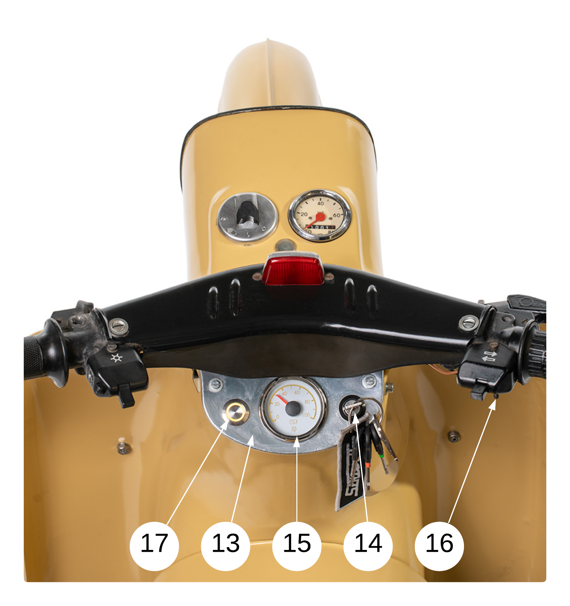

### 6. Gaszug

Damit das Drehen des Gasdrehgriffs richtig über den Bowdenzug in ein elektrisches Signal umgewandelt wird, haben wir den UBS - Universalen Bowdenzugsensor entwickelt und dir mitgeliefert. Entferne zunächst den Gaszug aus dem Vergaserkolben, in dem du den Kolben und Deckel zusammen drückst. Dadurch sollte der Gaszug im Kolben herausnehmbar sein. Kolben, Feder und Deckel werden nicht mehr benötigt.

Nimm dir nun den Gaszugsensor und schraube die Kappe ab. Achtung, darunter sitzt eine komprimierte Feder. Beim UBS sind mehrere Stellschrauben und eine härtere Feder dabei, die verschiedene lange Bowdenzugenden und Rückstellkräfte ermöglichen. Die folgenden Kombinationen sollten auf Anhieb funktionieren:

KR51/2 → M8x25 mit Kontermutter & stärkere Feder

KR51/1 → M8x10 ohne Kontermutter & stärkere Feder

Schraube die passende Stellschraube (1) in den Deckel (2) ein und schiebe den Gaszug durch die Stellschraube. Schiebe von der anderen Seite die Feder auf und schiebe nun den Magnetschieber (3) seitlich auf den Gaszug auf, bis dieser in der Mitte dessen sitzt. Jetzt kannst du den Magnetschieber mitsamt Feder in den Bowdenzugsensor einsetzen und den Deckel mit etwas Druck aufdrehen.

  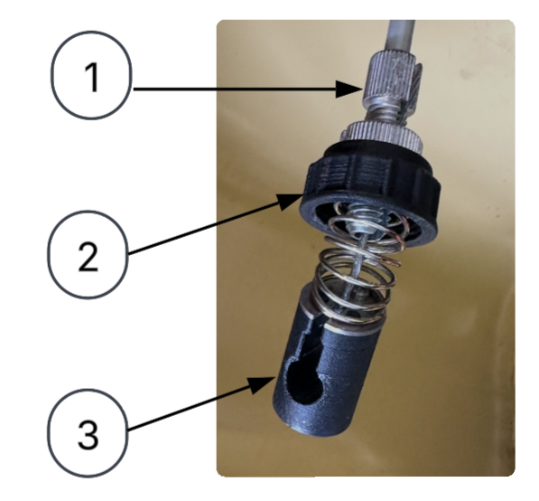

Um den UBS einzustellen, ziehe im montierten Zustand an dem Gaszug. Hier sollte kein Spiel mehr fühlbar sein, aber auch nur minimale Vorspannung anliegen. Drehe die Einstellschraube soweit heraus, bis das Spiel im Gaszug vollständig verschwunden ist. Kontere die Stellschraube mit der Stellmutter.

Nutze einen Kabelbinder, um den UBS an dem rechten Rahmenrohr zu befestigen. Achte darauf, dass das Gaszugkabel nicht zu sehr gebogen wird. Je gerader dieses verläuft, desto besser läuft der Gaszug.

Achte darauf, dass dein Gaszug und Gasdrehgriff geringstmöglichen Reibungswiderstand haben. Der Gasgriff sollte allein mit der Federkraft aus der maximal offenen Stellung vollständig zurückschnappen. Ist das nicht der Fall, hilft es den Gasdrehgriff abzubauen, zu reinigen und neu zu fetten und/oder den Bowdenzug zu ersetzen. Es kann auch sein, dass das Gummi des Gasdrehgriffs am Klemmstück reibt. Dagegen hilft es, das Gummi am demontierten Gasgriffrohr nach außen zu verschieben. Eine Videoanleitung rund um die Gasdrehgriffwartung findest du auf dem Youtubekanal 2Radgeber:

<iframe width="560" height="315" src="https://www.youtube.com/embed/XWQ3W5QNqvs" title="Youtubekanal 2Radgeber" frameborder="0" allow="accelerometer; autoplay; clipboard-write; encrypted-media; gyroscope; picture-in-picture" allowfullscreen></iframe>

Montiere zum Schluss wieder den Motortunnel. Hierbei kann es je nach dem Zustand deiner Schwalbe sein, dass der Motortunnel nicht an dem Motordeckel vorbei passt, da der Spalt dort kleiner geworden ist. Hier empfiehlt es sich, das Gummiteil und die Schraube an der Stelle zu entfernen.

!!! warning "Wichtig: Firmwareupdate durchführen"
    Bitte führe bevor du das umgebaute Fahrzeug benutzt erst ein Firmwareupdate durch. Wie das funktioniert, erfährst du im Kapitel "Firmware Update".

## Digitale Drosselung

<a href="https://second-ride.de/videoanleitung-drosselung?utm_source=anleitung">Unter diesem Link findest du das folgende Kapitel als Videoanleitung.</a>

!!! info "Warum wir dir den Antrieb ungedrosselt liefern"
    Das MID50 Umbaukit ist so konzipiert, dass es in alle möglichen Fahrzeuge mit ihren jeweiligen erlaubten Geschwindigkeits- und Leistungsgrenzen, Kettenübersetzungen und Reifengrößen verbaut werden kann. Da aber alle diese 4 Variablen eine andere digitale Drosselung erforderlich machen, muss die Drosselung spezifisch auf das individuelle Fahrzeug zugeschnitten werden. Damit wir aber nicht gegen die gesetzliche Anforderung verstoßen, lässt sich diese Drosselung nach dem endgültigen Speichern nicht mehr ändern. Ob du endgültig gespeichert hast und die Drosselung korrekt durchgeführt hast, prüft der Sachverständige bei der Änderungsabnahme.

Nach der Montage des Umbaukits, musst du einmalig den Konfigurator zur digitalen Drosselung durchlaufen:

1. Drehe den Zündschlüssel in die eingeschaltete Position. Sobald der Taster pulsiert, halte ihn gedrückt. Nach 5 Sekunden sollte der Taster die Aktivierung des Konfigurationsmodus anzeigen: Doppelblinken, dann kurz Pause, dann wieder Doppelblinken, …  
   Du erkennst den Konfigurationsmodus auch daran, dass die LED am Antriebsmodul Lila leuchtet.

2. Nimm ein WLAN-fähiges Gerät (Smartphone, Tablet, Laptop, etc.) und öffne die WLAN-Einstellungen. Du solltest ein Netzwerk namens "Second Ride Legal Limits" sehen. Verbinde dich mit diesem.

3. Sobald du erfolgreich verbunden bist, öffnet sich der Legal Limit Konfigurator automatisch. Sollte sich nach 30 Sekunden noch keine Seite von selbst geöffnet haben, versuche Folgendes:

    - **Mobile Daten deaktivieren:** Schalte mobile Daten (4G/5G) auf deinem Gerät aus, damit der gesamte Datenverkehr über das "Second Ride Legal Limits" WLAN läuft.
    - **Kein anderes WLAN verbunden?** Stelle sicher, dass sich dein Gerät nicht automatisch mit einem anderen WLAN (z.B. deinem Heimnetzwerk) verbunden hat.
    - **Konfigurator manuell öffnen:** Gib folgende Adresse in deinen Browser ein: `192.168.4.1`. Der Legal Limit Konfigurator sollte sich dann öffnen.

4. Folge hier den Schritten, um deinen Antrieb zu kalibrieren. Zuerst wirst du nach deiner maximalen Leistung und maximalen Geschwindigkeit gefragt. Gib hier die maximal erlaubte Geschwindigkeit aus deinen Fahrzeugpapieren ein. Im Falle von Simson ist das in den meisten Fällen 60 km/h.

    Für die maximale Leistung gilt folgende Regel:  
    Gemäß unseres Teilegutachtens darf die maximal erlaubte Leistung das 1,4-fache der Leistung deiner Fahrzeugpapiere, aber maximal 4 kW sein.

5. Im Konfigurationsprozess wird deine Antriebsübersetzung und die Vorwärts-Drehrichtung des Motors automatisch bestimmt, indem du den Hinterreifen markierst, das Fahrzeug eine Radumdrehung nach vorne schiebst und dann die gefahrene Distanz (Abrollumfang) in cm in den Konfigurator eingibst. Für die Markierung des Bodens und Reifens haben wir dir ein Stück Kreide beigelegt.

    !!! info "Info: Simson KR51/2 & KR51/1 Parameter"
        Wenn dein Fahrzeug im Serienstand ist (keine andere Radreifenkombination oder Tuning-Hinterradzahnrad), dann kannst du folgende Parameter verwenden und sparst das Messen: 
        - Antriebsübersetzung: 4,9 – um das zu erreichen, drehe das Hinterrad einfach langsam in der Luft, bis 4,9 Motorumdrehungen gemessen wurden. 
        - Abrollumfang: 165 cm

6. Nachdem du den Antrieb korrekt konfiguriert hast, kannst du den Legal Limits Konfigurator schließen, indem du das Fahrzeug ausschaltest. Jetzt solltest du eine Probefahrt auf abgesperrter bzw. privater Strecke machen, um zu validieren, dass dein Fahrzeug die konfigurierte Geschwindigkeit erreicht. Dabei hilft eine GPS-Tacho App. Der mechanische Tacho ist oft sehr ungenau.

7. Um mit deinem umgebauten Fahrzeug die Straßenzulassung zu erlangen, ist es zwingend notwendig, die für dein Fahrzeug zulässigen Leistungs- und Geschwindigkeitsgrenzen **endgültig** im System **abzuspeichern**. Öffne dafür den Legal Limit Konfigurator erneut, in dem du Schritt 1. - 3. erneut durchführst. Nachdem sich der Legal Limit Konfigurator geöffnet hat, kannst du die Konfiguration endgültig speichern.

!!! warning "Warnung: Endgültig Speichern kann nicht rückgängig gemacht werden"
    In Ausnahmefällen, wenn zum Beispiel ein Umbaukit in ein neues Fahrzeug gebaut werden soll und damit eine neue Drosselung erforderlich ist, kannst du bei uns ein Einmal-Passwort für deinen Motor erwerben, mit dem einmalig neu gedrosselt werden kann. Wir fordern dann allerdings Nachweise dazu, dass du eine neue Änderungsabnahme anstrebst.

Mit der endgültigen Speicherung der Antriebskonfiguration bist du nun bereit für die Abnahme und Zulassung deines Umbaus.
