# Anleitung zur Elektrifizierung einer Simson S50/S51/S70 mit MID50 Umbaukit

## Voraussetzungen

Folgende Teile benötigst du:
<table>
  <tr>
    <td valign="top">
      <ul style="list-style-type:none; padding-left:0; margin-top:0;">
        <li><input type="checkbox"> 1x Kupplungsdeckel inkl. Verschlusselementen</li>
        <li><input type="checkbox"> 1x Lichtmaschinendeckel</li>
        <li><input type="checkbox"> 12V Glühbirnen, Blinkgeber und Hupe</li>
      </ul>
    </td>
  </tr>
</table>

Folgende Werkzeuge benötigst du:
<table>
  <tr>
    <td valign="top" style="padding-right:30px;">
      <ul style="list-style-type:none; padding-left:0; margin-top:0;">
        <li><input type="checkbox"> 2x 10er, 13er, 19er Maulschlüssel</li>
        <li><input type="checkbox"> 10er und 13er Nuss, Knarre und Verlängerungsstück</li>
        <li><input type="checkbox"> Inbusschlüssel SW3, SW6</li>
        <li><input type="checkbox"> Torxschlüssel TX25 & TX30</li>
      </ul>
    </td>
    <td valign="top" style="padding-left:30px;">
      <ul style="list-style-type:none; padding-left:0; margin-top:0;">
        <li><input type="checkbox"> Seitenschneider</li>
        <li><input type="checkbox"> Kreuzschlitz- und Schlitzschraubenzieher</li>
        <li><input type="checkbox"> Hakenschlüssel, Rohrzange oder Hammer</li>
      </ul>
    </td>
  </tr>
</table>

## Lieferumfang

!!! note "Hinweis: Bitte bewahre deine Verpackung auf"
    Im Garantiefall wird die Originalverpackung für den Rückversand benötigt.

<h4>Alle Varianten</h4>
<table>
  <tr>
    <td valign="top">
      <ul style="list-style-type:none; padding-left:0; margin-top:0;">
        <li><input type="checkbox"> 1x Antriebsmodul</li>
        <li><input type="checkbox"> 1x MID50 Akku</li>
        <li><input type="checkbox"> 1x Ladegerät 350W oder 1200W</li>
      </ul>
    </td>
  </tr>
</table>

<h4>S50/S51/S70 spezifische Teile</h4>
<table>
  <tr>
    <td valign="top" style="padding-right:30px;">
      <ul style="list-style-type:none; padding-left:0; margin-top:0;">
        <li><input type="checkbox"> 1x Bowdenzugsensor</li>
        <li><input type="checkbox"> 3x Stellschraube</li>
        <li><input type="checkbox"> 1x Lenkerarmatur</li>
        <li><input type="checkbox"> 1x Ladestandsanzeige</li>
        <li><input type="checkbox"> 1x Ladestandsanzeigenhalter</li>
        <li><input type="checkbox"> 1x Riemenspannschlüssel</li>
        <li><input type="checkbox"> 1x Tachoantrieb für Antriebsritzel Z=14</li>
        <li><input type="checkbox"> 1x Schmierfett Beutel</li>
        <li><input type="checkbox"> 1x Bordnetzkabel</li>
        <li><input type="checkbox"> 1x Bordnetzkabel-Verlängerung</li>
        <li><input type="checkbox"> 1x Aux DCDC Kabel</li>
      </ul>
    </td>
    <td valign="top" style="padding-left:30px;">
      <ul style="list-style-type:none; padding-left:0; margin-top:0;">
        <li><input type="checkbox"> 1x HMI Splitter Kabel</li>
        <li><input type="checkbox"> 2x M4 Unterlegscheiben</li>
        <li><input type="checkbox"> 1x M6 Flachsteck Kontaktzunge</li>
        <li><input type="checkbox"> 2x Zündschlüssel</li>
        <li><input type="checkbox"> 10x Kabelbinder</li>
        <li><input type="checkbox"> 1x Einmalhandschuhe</li>
        <li><input type="checkbox"> 1x Ersatz-O-Ring für Akkustecker</li>
        <li><input type="checkbox"> 1x Schreibtafel Kreide</li>
        <li><input type="checkbox"> Optional: 12V Glühbirnenset und Blinkgeber</li>
        <li><input type="checkbox"> MID50 Teilegutachten</li>
        <li><input type="checkbox"> Kabellabel verschiedenfarbig</li>
      </ul>
    </td>
  </tr>
</table>

<h3>Akkuherzkasten</h3>
<table>
  <tr>
    <td valign="top" style="padding-right:30px;">
      <ul style="list-style-type:none; padding-left:0; margin-top:0;">
        <li><input type="checkbox"> 1x Akkuherzkasten montiert</li>
        <li><input type="checkbox"> 2x Seitendeckel Halter Oben</li>
        <li><input type="checkbox"> 2x Seitendeckelhalter Unten</li>
        <li><input type="checkbox"> 6x M5x16 Flachkopfschraube</li>
        <li><input type="checkbox"> 1x M6 Unterlegscheibe groß</li>
        <li><input type="checkbox"> 1x Distanzmuffe Sechskant mit Gewinde M6x35</li>
        <li><input type="checkbox"> 1x Distanzmuffe Sechskant mit Gewinde M6x25</li>
        <li><input type="checkbox"> 1x Distanzmuffe Sechskant M6x30</li>
        <li><input type="checkbox"> 1x Distanzmuffe Sechskant M6x18</li>
        <li><input type="checkbox"> 4x M6x12 Flachkopfschraube Torx</li>
      </ul>
    </td>
    <td valign="top" style="padding-left:30px;">
      <ul style="list-style-type:none; padding-left:0; margin-top:0;">
        <li><input type="checkbox"> 1x M8x80 Außensechskantschraube</li>
        <li><input type="checkbox"> 2x M8 Mutter</li>
        <li><input type="checkbox"> 1x M8 Unterlegscheibe</li>
        <li><input type="checkbox"> 1x M8x Unterlegscheibe</li>
        <li><input type="checkbox"> 1x M8x60 Madenschraube</li>
        <li><input type="checkbox"> 1x M8x22x2 Unterlegscheibe</li>
        <li><input type="checkbox"> 1x M8 Unterlegscheibe mit Axialdichtung</li>
      </ul>
    </td>
  </tr>
</table>

<h3>M500 oder M50 Motor Adapter Kit</h3>
<table>
  <tr>
    <td valign="top" style="padding-right:30px;">
      <ul style="list-style-type:none; padding-left:0; margin-top:0;">
        <li><input type="checkbox"> 1x Kupplungsdeckel Adapter</li>
        <li><input type="checkbox"> 1x Lichtmaschinendeckel Adapter</li>
        <li><input type="checkbox"> 2x Motorhalteblech</li>
        <li><input type="checkbox"> 2x Distanzhülse lang</li>
        <li><input type="checkbox"> 2x Distanzhülse kurz</li>
        <li><input type="checkbox"> 1x M5x12 Hülsenmutter</li>
        <li><input type="checkbox"> 4x M5 Gleitmutter</li>
        <li><input type="checkbox"> 4x M5 Gewindestange</li>
        <li><input type="checkbox"> 4x M5 Flanschmutter</li>
      </ul>
    </td>
    <td valign="top" style="padding-left:30px;">
      <ul style="list-style-type:none; padding-left:0; margin-top:0;">
        <li><input type="checkbox"> 12x M5x10 Senkkopfschraube</li>
        <li><input type="checkbox"> 2x M5x25 Hülsenmutter</li>
        <li><input type="checkbox"> 2x M8x85 Außensechskantschraube</li>
        <li><input type="checkbox"> 2x M8x100 Außensechskantschraube</li>
        <li><input type="checkbox"> 4x M8 Mutter</li>
        <li><input type="checkbox"> 4x M8 Unterlegscheibe</li>
        <li><input type="checkbox"> 6x M6x35 Zylinderschraube</li>
      </ul>
    </td>
  </tr>
</table>

## Kleingeschriebenes

Der Verwendungszweck des Umbaukits ist der Umbau der oben genannten Simson Modelle gemäß der vorliegenden Montageanleitung, sowie deren Nutzung im Straßenverkehr gemäß der Bedienungsanleitung. Bitte habe Verständnis dafür, dass wir uns bei der Entwicklung des Umbausatzes nach dem Originalzustand der erwähnten Simson Modelle gerichtet haben. Bei Umbauten mit Bauteilen, die nicht dem Original entsprechen, oder Veränderung der Originalteile durch einen Unfall, Verschleiß, oder beabsichtigte Modifikationen können wir nicht gewährleisten, dass das Umbaukit fehlerfrei und sicher funktioniert, bzw. sich überhaupt einbauen lässt. Solltest du dir bezüglich deines Fahrzeugs unsicher sein, kontaktiere uns gerne.

Das dir vorliegende Dokument „MID50 - S50/S51/S70 - Montage- und Bedienungsanleitung" wird von der Second Ride GmbH zur Verfügung gestellt und versteht sich als Ergänzung zur Original-Hersteller-Bedienungsanleitung. Beide Dokumente sind als Einheit zu sehen. Sie gehören unmittelbar zusammen, wobei die Erklärungen zum Verbrennungsmotor unberücksichtigt bleiben können.

Bitte lies dieses Dokument zuerst vollständig und genau durch, bevor du mit dem Umbau startest und deine erste Fahrt antrittst. Du findest hier Warnungen und Hinweise, Informationen und Ratschläge sowie Verhaltensmaßnahmen im Notfall und weitere wichtige Anmerkungen zu deinem Fahrzeug. Bei Nichtbeachtung der Anweisungen kann es zu leichten oder schweren Verletzungen sowie Lebensgefahr kommen. Zudem kann die Leistungsfähigkeit des Fahrzeugs eingeschränkt sein. Bitte lies auch die neben den Symbolen aufgeführten Warnungen und Hinweise sorgfältig durch. Nur so kann ein ordnungsgemäßer Einbau des Umbaukits, sowie eine ordnungsgemäße Nutzung des Fahrzeugs sichergestellt werden. Bei Nichtbeachtung dieser Warnungen und Hinweise nimmst du Personen- bzw. Fahrzeugschäden billigend in Kauf.

Beachte bitte, dass die Entsorgung von Bordnetz-Batterie, Getriebeöl und Kraftstoff-Öl-Gemisch nicht im Hausmüll bzw. im Abwasser oder der Umwelt geschehen darf. Bitte informiere dich über die fachgerechte Entsorgung dieser Substanzen. Altbatterien können Schadstoffe enthalten, die bei nicht sachgerechter Lagerung oder Entsorgung die Umwelt oder Gesundheit schädigen können. Batterien enthalten aber auch wichtige Rohstoffe wie zum Beispiel Eisen, Zink, Mangan oder Nickel, die recycelt werden können. Bitte sende den Akku nach Gebrauch an uns zurück. Um einen sicheren Transport zu gewährleisten, empfehlen wir die Verwendung der Original-Verpackungen. Bitte nimm in jedem Fall Kontakt zu uns auf.

Einige Flüssigkeiten, die in Fahrzeugen verwendet werden (Batteriesäure, Batteriekühlmittel, Bremsflüssigkeit, Kraftstoff, Scheibenwaschflüssigkeit usw.), sind giftig und dürfen nicht eingeatmet, geschluckt oder mit offenen Wunden in Kontakt gebracht werden. Lese und befolge zu deiner Sicherheit stets die Anweisungen, die auf den Flüssigkeitsbehältern aufgedruckt sind bzw. beachte den vom Gesetzgeber vorgeschriebenen Umgang mit diesen Stoffen.

Alle hier enthaltenen technischen Daten und Beschreibungen waren zum Zeitpunkt der Drucklegung aktuell. Da aber die kontinuierliche Verbesserung eines der Hauptziele ist, behalten wir uns das Recht vor, jederzeit Veränderungen an den Produkten vorzunehmen. Wenn du Irrtümer oder Auslassungen in diesem Dokument bemerkst, schreib das bitte unbedingt ins Discord-Forum (siehe Kapitel „Nützliche Links").

Bedeutung der Warnzeichen:

<table style="border:none; border-collapse:collapse;">
  <tr>
    <td style="border:none;"></td>
    <td style="border:none;">Allgemeine Warnung</td>
    <td style="border:none;"></td>
    <td style="border:none;">Gefahren durch das Aufladen von Batterien</td>
  </tr>
  <tr>
    <td style="border:none;"></td>
    <td style="border:none;">Elektrische Spannung</td>
    <td style="border:none;"></td>
    <td style="border:none;">Heiße Oberfläche</td>
  </tr>
  <tr>
    <td style="border:none;"></td>
    <td style="border:none;">Feuergefährliche Stoffe</td>
    <td style="border:none;"></td>
    <td style="border:none;">Giftige Stoffe</td>
  </tr>
  <tr>
    <td style="border:none;"></td>
    <td style="border:none;">Gefahr der Handverletzung</td>
    <td style="border:none;"></td>
    <td style="border:none;"></td>
  </tr>
</table>

## Demontage

Bevor du mit der Demontage beginnst, entferne die Batterie des Fahrzeugs, um Kurzschlüsse zu vermeiden.

### 1. Motoranschlüsse

Zuerst werden alle elektrischen und mechanischen Verbindungen am Motor gelöst. Stell sicher, dass der Benzinhahn zugedreht ist und zieh den Schlauch vom Vergaser ab. Den verbleibenden Treibstoff im Tank kannst du nun mit dem Schlauch in ein geeignetes Gefäß (z.B. Benzinkanister) ablassen. Löse die Schelle der Ansaugmuffe und zieh diese vom Vergaser ab. Schraube den Gas-(2) und Starter-Bowdenzug(1) vom Vergaser ab, hänge den Kupplungszug aus der Halterung am Motorblock(5) und drehe die Tachowelle aus der Halterung(6). Entferne nun noch den Zündkerzenstecker(3) und das Massekabel vom Motorblock. Entferne den linken Herzkastendeckel, um die von der Lichtmaschine kommenden Kabel abstecken und entfernen zu können.

  

### 2. Auspuff

Nun sollte nur noch der Auspuff an dem Motor befestigt sein. Dieser ist am Motor mit einer großen Mutter(4) befestigt, die mit einer Rohrzange oder einem Hakenschlüssel entfernt werden kann.

!!! tip "Tipp: Wenn die Krümmermutter sich nicht lösen will"
    Wenn die Krümmermutter sich nicht lösen will, kannst du sie mit einem alten Schlitzschraubenzieher und einem Hammer (am besten aus Gummi oder Holz) in die Kerben der Krümmermutter schlagen und sie so lösen.

Die andere Befestigung des Auspuffs liegt hinten in Form einer Rohrschelle vor. Diese kann durch Entfernen der Schraube geöffnet werden. Die Auspuffstrebe(7) kannst du gleich mit entfernen. Dafür einfach oben am hinteren Federbein die Schraube demontieren, die Auspuffstrebe entfernen und das Federbein wieder mit dem Rahmenobergurt und der Obergurtstützstrebe verschrauben.

### 3. Kette

Bevor der Motor entfernt werden kann, muss noch die Kette vom Antriebsritzel genommen werden. Nimm zuerst den Lichtmaschinendeckel vom Motor ab. Löse dann sowohl die Mutter der Hinterachse rechts, als auch die Steckachse links. Ein paar Umdrehungen reichen hier, da das Hinterrad nur verschoben werden muss. Die kleinen Muttern der Kettenspanner kannst du jetzt nach ganz hinten bis zum Ende des Gewindes schrauben. Nun sollte es möglich sein, das Hinterrad nach vorne zu schieben.

!!! tip "Tipp: Kette entspannen"
    Wenn das Moped auf dem Hauptständer aufgebockt ist, kannst du nun durch Anheben am Rahmenobergurt das Hinterrad zum Schweben bringen und mit dem Fuß gegen das Hinterrad treten, sodass es 1-2 cm nach vorne kommt.

Nun ist es an der Zeit, die fettige Kette vom Antriebsritzel herunter zu heben. Dafür haben wir dem Paket Einmalhandschuhe beigelegt.

### 4. Motor

Nun ist der Motor bereit, entfernt zu werden. Dieser ist mit zwei langen M8 Schrauben in den Motorlagerblechen(10) verschraubt. Es kann fummelig sein, den Motor herauszuheben. Unterstützung von einer zweiten Person kann jetzt sehr hilfreich sein. Löse die Muttern und versuche die Schrauben aus den Bohrungen zu ziehen. Es hilft, den Motor dabei etwas anzuheben. Wenn beide Schrauben raus sind, sollte der Motor in der Regel von selbst noch in der Lagerung hängen. Indem du den Motor jetzt anhebst, kannst du ihn aus der Lagerung herausnehmen. Glückwunsch! Dein Moped ist nun kein Verbrennungsfahrzeug mehr.

!!! tip "Interessant zu wissen"
    Karl Clauss Dietel, Chef-Entwickler der S50, teilte uns in einer E-Mail mit, dass er das Moped absichtlich so offen gestaltet hatte. So wäre ein Wechsel des Antriebs einfacher, sollten mal bessere Antriebe durch neue Technologien zur Verfügung stehen. Danke für Ihre Voraussicht! Herr Prof. Dietel verstarb am 02.01.2022. Er prägte das Produktdesign des Ostens maßgeblich - ob Auto, Moped oder Radio. Dafür wurde er mit dem höchsten deutschen Designpreis ausgezeichnet.

### 5. Lenker-Anbauteile

Am Lenker kannst du nun den linken Handhebel sowie den Kupplungs- und Starter-Bowdenzug demontieren.

!!! tip "Tipp: Kupplungshebel und Choke-Hebel aufbewahren"
    Bewahre den Kupplungshebel und den Choke-Hebel inkl. ihrer Bowdenzüge auf. Second Ride plant eine E-Kupplung und einen E-Choke anzubieten, mit denen sich zum Beispiel Rekuperation oder Fahrmodi über die Originalhebel steuern lassen.

### 6. Sitzbank & Tank

Die originale Sitzbank ist mit drei Schrauben am Rahmenobergurt befestigt. Die erste ist vorne und kann von der linken Seite mit einem Schraubenzieher entfernt werden. Die anderen beiden befinden sich hinten über dem Gepäckträger.
Um den Tank abzunehmen, schraube die M8 Tankschraube heraus und hebe diesen nach hinten aus der vorderen Rahmenhalterung heraus. 

### 7. Herzkasten

Baue zunächst die Seitendeckel ab und lege sie beiseite. Als nächstes muss der Herzkasten ausgebaut werden, dokumentiere und baue dafür die Elektronik und den Herzkasten wie folgt aus:

!!! warning "Hinweis: Kabelverbindungen dokumentieren"
    Fotografiere alle Kabelverbindungen am Zündschloss(1), Blinkgeber(2) und Mehrfachverbinder(3), bevor du sie löst. Markiere doppelte Kabelfarben zusätzlich mit den mitgelieferten Kabeletiketten, damit sie später nicht verwechselt werden. Lege den Vorbau-Kabelstrang nach vorne und den Heck-Kabelstrang nach hinten, damit sie beim Einbau nicht beschädigt werden. Sorgfältig dokumentierte Kabelanschlüsse ersparen beim Zusammenstecken viel Ärger und Fehlersuche.

  

Baue Zündschloss(1), Blinkgeber(2) und Mehrfachverbinder(3) aus und ziehe den Kabelbaum heraus. Lege diese drei Komponenten beiseite – sie werden beim Einbau des Akkuherzkastens wieder benötigt. Die restliche Elektronik, Blei-Batterie(4) sowie der Herzkasten selbst werden nicht mehr gebraucht. Schraube dann den Herzkasten an seinen beiden Rahmenbefestigungspunkten(5) und den unteren Seitendeckelhalter(6) ab und lege diese beiseite. Der Rahmen ist nun bereit für den Einbau des Akkuherzkastens.

## Montage des Umbaukits

Bei der Montage des Umbaukits werden ausschließlich Schrauben der Größe M4, M5, M6 und M8 verwendet. Damit die einzelnen Teile wie vorgesehen halten und festgeschraubt sind, solltest du idealerweise die folgenden Anzugsmomente verwenden: 
M4: 2,9 Nm 
M5: 5,7 Nm 
M6: 9,8 Nm 
M8: 24 Nm 

### 1. Antriebsmodul Montage

#### Motorhalter montieren

Zuerst muss der Motorhalter in der Motoraufnahme der S50/S51/S70 montiert werden. Nimm dir dafür die M8x100 Außensechskantschraube(1) und lege die Unterlegscheibe auf. Führe die M8 Schraube durch die obere Bohrung der Motoraufnahme auf der Kettenseite. Schiebe nun in dieser Reihenfolge folgende Bauteile auf die Schraube auf: Distanzhülse kurz(2), Motorhalteblech(3), Distanzhülse lang(4), Motorhalteblech(3), Distanzhülse kurz(2). Stoße dann mit der Schraube durch das zweite Rahmenblech und drehe die M8 Mutter(5) auf die Schraube und drehe diese locker bis zum Anschlag auf. Nun muss die zweite M8x100 Schraube(1) durch die untere Bohrung in der Motoraufnahme auf Kettenseite, dann durch das rechte Motorhalteblech, durch die zweite Distanzhülse lang, durch das linke Motorhalteblech und dann durch die linke Motoraufnahme. Im Anschluss muss dann die M8 Mutter aufgeschraubt werden.

  

#### Antriebsmodul einhängen

Stelle das Antriebsmodul erstmal unter das Fahrzeug und führe die Kabel zwischen die beiden Rahmenrohre hoch. Schiebe nun das Antriebsmodul mit dem unteren Anschraubpunkt zwischen die Motorhaltebleche, die du zuvor montiert hast. Schiebe die M8x85 Schraube mit Unterlegscheibe von Kettenseite durch die Motorhaltebleche und durch den unteren Aufnahmepunkt des Antriebsmoduls. Sichere das Ganze mit der M8 Mutter.

  

!!! warning "Wichtig: Kabel korrekt verlegen"
    Achte beim Einhängen des Antriebsmoduls auf die richtige Kabelführung:

    - Das **dicke Hauptkabel mit Wellrohr** (Hauptschlagader) muss zwischen der Simson Motorhalterung und dem MID50 Motorhalter nach **links herausgeführt** werden, damit es später korrekt in den Akkuherzkasten verlegt werden kann.
    - Die **3 Signalkabel** müssen **nach oben** zwischen Rahmenrohr und der Hülse des MID50 Motorhalters hochverlegt werden, damit sie später im Akkuherzkasten korrekt angeschlossen werden können.

  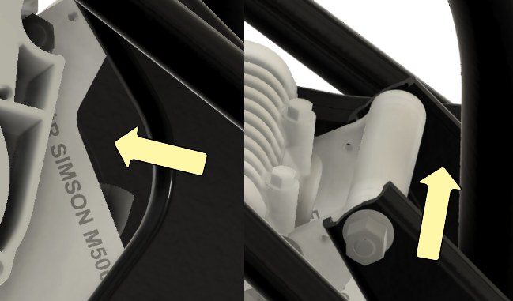

Drehe nun das Antriebsmodul nach oben, so dass die obere Aufnahme der Motoraufnahme und des Antriebsmoduls übereinanderliegen. Setze die Unterlegscheibe auf die M8 Schraube und schiebe diese durch den oberen Aufnahmepunkt. Sichere das Ganze mit der M8 Mutter. Nun kannst du alle 4 Schraubverbindungen festziehen.

  

#### Seitendeckel Adapter anbauen

Nachdem das Antriebsmodul im Fahrzeug sitzt, können die Seitendeckel Adapter angebracht werden. Für die linke Seite (in Fahrtrichtung), entferne die M5 Außensechskantschraube(8), die das Riemenspannstützblech(9) hält und schiebe den Kupplungsdeckeladapter(10) zwischen das Riemenspannstützblech(9) und Antriebsmodul, bis die Montagepunkte beider übereinstimmen. Schraube diesen mit den drei Senkkopfschrauben(11) fest. 

  

Nimm nun das Adapterblech für den rechten Seitendeckel(12) und schraube dieses am Antriebsmodul fest. Nutze dafür die 8x Senkkopfschraube(11) und ziehe sie der Reihenfolge nach fest.

  

#### Seitendeckel anbringen

Nun kann die Kette auf das Ritzel geschoben werden und die Tachoschnecke des Tachoantriebs auf die Abtriebswelle gesteckt und durch die Spange gesichert werden.

  

Im Anschluss muss der Lichtmaschinendeckel angeschraubt werden.

Nun kann das Tachoritzel des mitgelieferten Tachoantriebs in den Lichtmaschinendeckel eingesetzt werden. Fette zuerst das Ritzel mit dem mitgelieferten Schmierfett an beiden Enden. Setze nun das Tachoritzel mit dem Vierkant nach oben in den Lichtmaschinendeckel und setze die Kunststoffabdeckung bis zum Anschlag ein. Befestige diese dann durch das Eintreiben des Splintes von Außen. Dann kann der Lichtmaschinendeckel mit den Hülsenmuttern montiert werden und die Tachowelle in dem dafür vorgesehenen Gewinde festgeschraubt werden. So funktioniert dein Originaltacho einfach weiter. Achte darauf, dass die Kettenschläuche richtig in der Aufnahme davon im Lichtmaschinendeckel sitzen.

Ein ausführliches Anleitungsvideo zur Montage des Tachoantriebs findest du hier:

  <iframe width="700" height="394" src="https://www.youtube.com/embed/lcTrvHQQLhc" frameborder="0" allowfullscreen></iframe>

### 2. Kettenspannung und Spur einstellen

Jetzt wo das Antriebsmodul fest verbaut ist, kannst du das Hinterrad wieder nach hinten ziehen und die Kettenspannermuttern schon mal für eine grobe Voreinstellung nach vorne drehen. Fange bei der Feineinstellung nun mit dem rechten Kettenspanner an: Drehe die Kettenspannermutter soweit nach vorne, bis die Kette im Schlauch nur noch 2 cm Spiel nach oben und unten hat. Das kannst du testen, indem du den Kettenschlauch an der dünnsten Stelle zwischen Daumen und Zeigefinger zusammen presst und eine Auf-/Ab-Bewegung machst.

  

Wenn du mit der Kettenspannung zufrieden bist, kannst du dich nun dem anderen Kettenspanner widmen. Mit diesem Kettenspanner stellst du nun die sogenannte Spur des Fahrzeugs ein. Klingt komplizierter als es ist. Achte einfach darauf, dass beide Räder in einer Linie sind. Dafür kannst du ein langes gerades Brett verwenden oder dich einfach drei Schritte hinter das Moped hocken und mit einem Auge über das Hinterrad das Vorderrad anpeilen.

  

Prüfe nun nochmal die Kettenspannung und korrigiere gegebenenfalls. Sind nun also beide Kettenspanner richtig eingestellt, kannst du die Hinterachse und Mutter wieder festziehen. Jetzt brauchst du nur noch den Kettenschutz wieder anschrauben.

### 3. Akkuherzkasten

#### Vorbereitung des Akkuherzkastens

Schraube zunächst das Zubehörpanel ab, indem du die drei schwarzen Torx-Schrauben(1) entfernst. Schraube anschließend die obere und untere Akkufachverschraubung(2) ab und entnehme das linke Akkufach(3). Nimm dann die obere und untere Brustbeinversteifung(4) ab, indem du die Torx-Schrauben löst.

  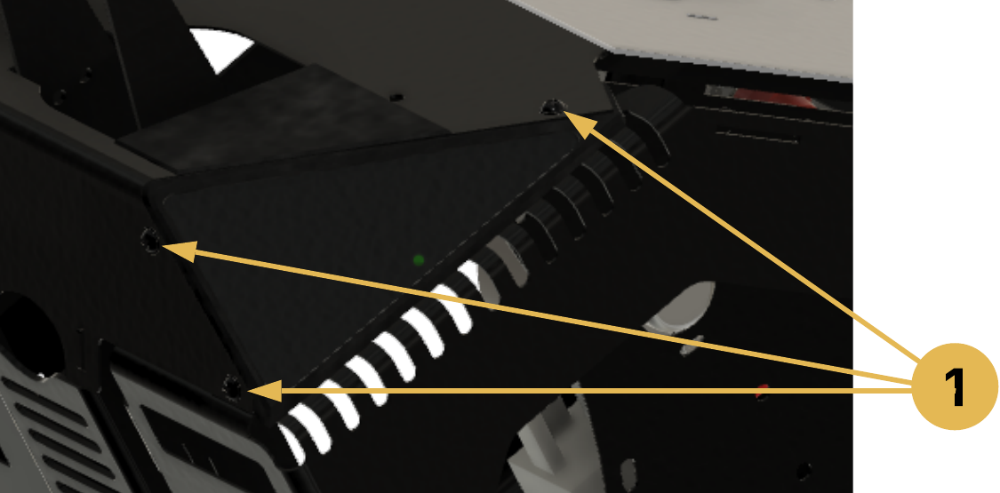

  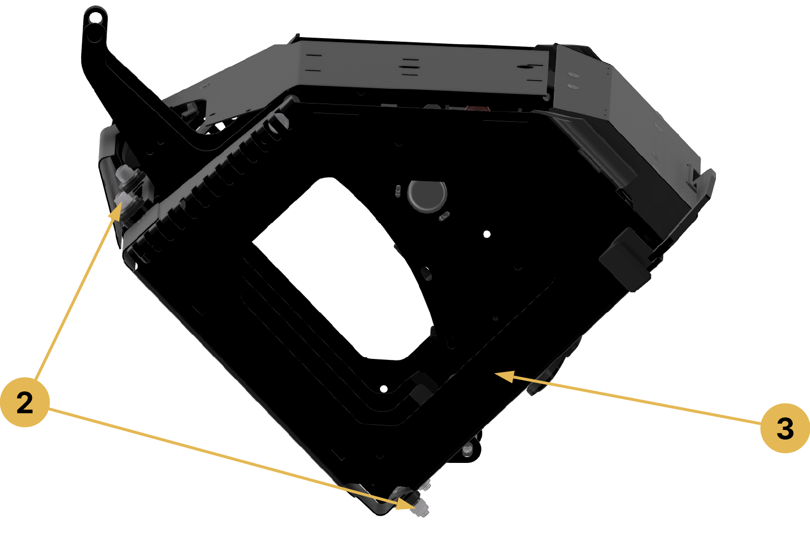

  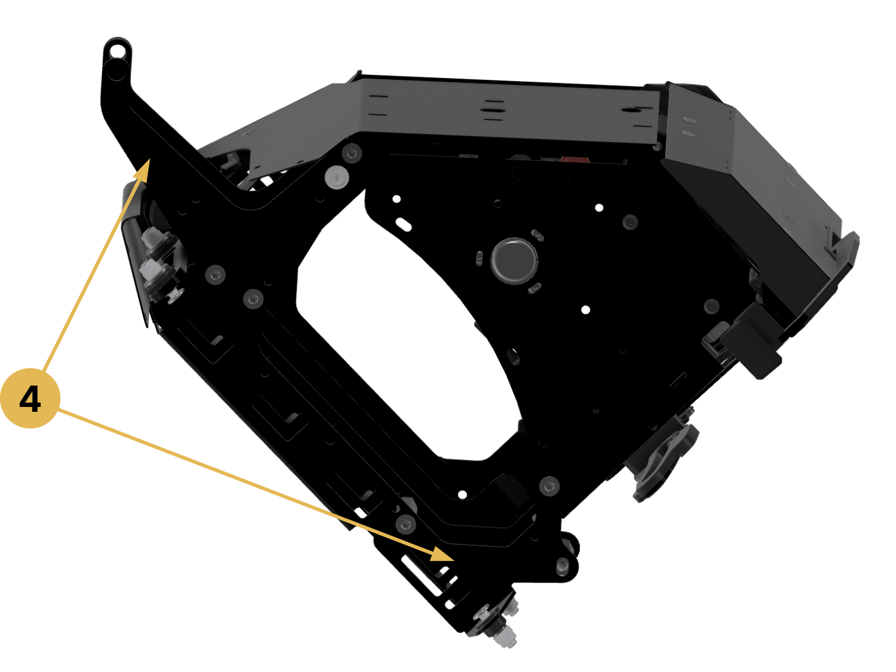

#### Einbau in den Rahmen

Entferne die Schraube und Mutter, die den Obergurt(1) vorne an den Rahmen anbinden.

!!! warning "Achtung"
    Um ein Abknicken des Obergurts(1) und ein Wegknicken des Hinterrads nach hinten zu vermeiden, setzt du die beigelegte M8x80 Schraube(2) mit M8 Unterlegscheibe zusammen mit der oberen Brustbeinversteifung(3) von links ein und treibst damit die alte Schraube mit einem Hammer heraus. Die neue Schraube schiebt sich dabei direkt an die Stelle der alten.

  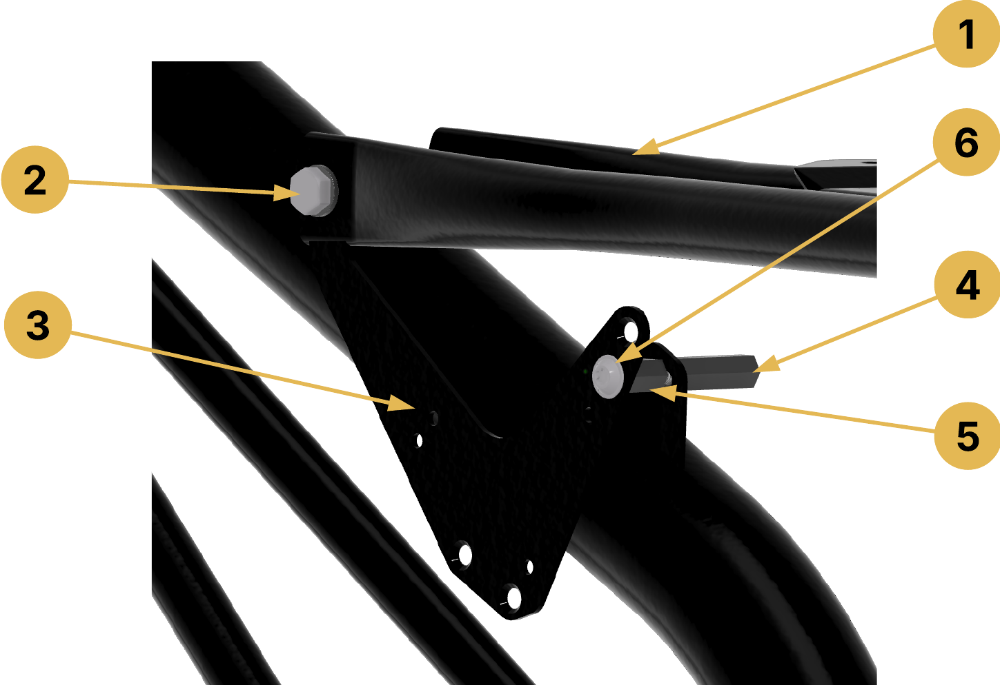

Als Nächstes montierst du die beigelegten Sechskantmuffen locker am Fahrzeug. Sie bilden die Anschraubpunkte, an denen der Akkuherzkasten später mit den Rahmenlaschen verbunden wird. Setze am oberen Anschraubpunkt von rechts die M6x35 Distanzmuffe mit Gewinde(4) ein und kontere sie von links mit der M6x18 Distanzmuffe(5). Schraube an dieser Stelle gleich die obere Brustbeinversteifung(3) mit der M6x12 Flachkopfschraube(6) mit an. Setze danach am unteren Anschraubpunkt von rechts die M6x25 Distanzmuffe mit Gewinde(7) ein und kontere sie von links mit der M6x30 Distanzmuffe(8). Drehe alle Schraubverbindungen zunächst nur so weit ein, dass sie sich in den Langlöchern noch verschieben lassen. Das ist wichtig, damit du den Akkuherzkasten später ausrichten kannst.

!!! tip "Tipp"
    Drehe alle Schraubverbindungen handfest an und dann eine halbe bis ganze Umdrehung wieder zurück. So stellst du sicher, dass sich der Akkuherzkasten beim Ausrichten noch bewegen lässt.

  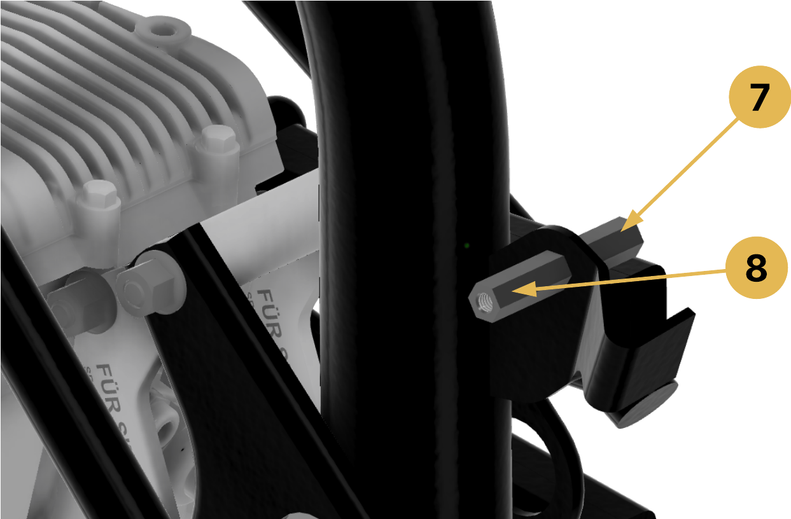

Bereite nun den Tankaufnahmepunkt vor. Schraube den M8x60 Gewindestift(9) mit dem Innensechskant nach oben von oben durch das Gewinde des Tankaufnahmepunkts ein. Achte darauf, dass der Gewindestift dabei nicht unter der Unterkante des Rahmenobergurts(1) hervorsteht. Drehe anschließend von unten die obere M8 Mutter(10) mit der Fläche nach unten und darunter die Unterlegscheibe mit Axialdichtung(11) jeweils ein paar Umdrehungen auf den Gewindestift auf.

  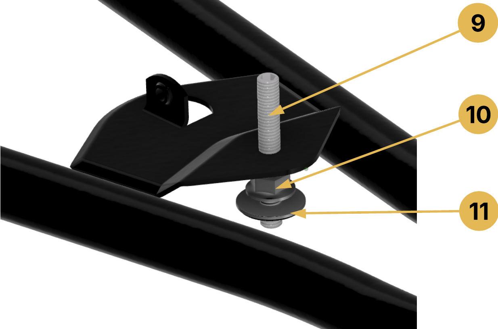

Setze jetzt den Akkuherzkasten(12) in den Rahmen ein und schraube den M8x60 Gewindestift(9) so weit durch, dass er etwa 10 mm in den Akkuherzkasten hineinragt. Drehe danach die untere M8 Mutter(13) von unten so weit hoch, bis die Oberseite des Akkuherzkastens am Rahmenobergurt(1) anliegt.

!!! warning "Achtung"
    Drehe die Mutter wirklich nur von Hand hoch. Wird sie in diesem Schritt zu weit eingeschraubt, verbiegt sich die Oberseite des Akkuherzkastens.

  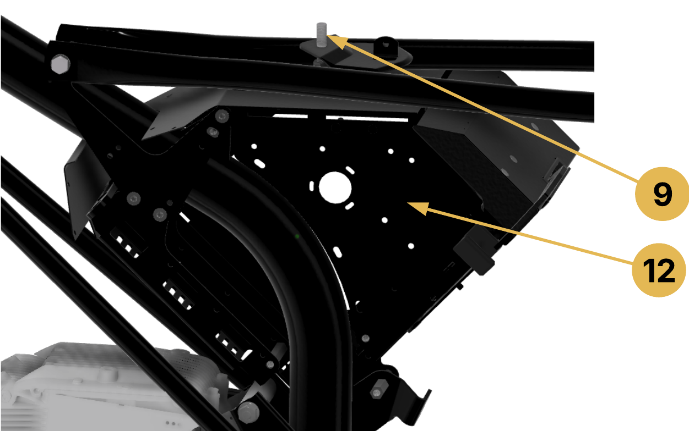

  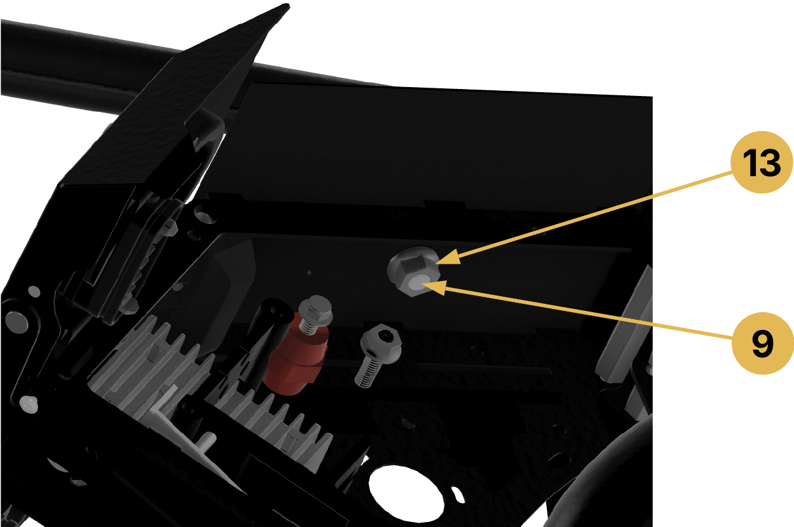

  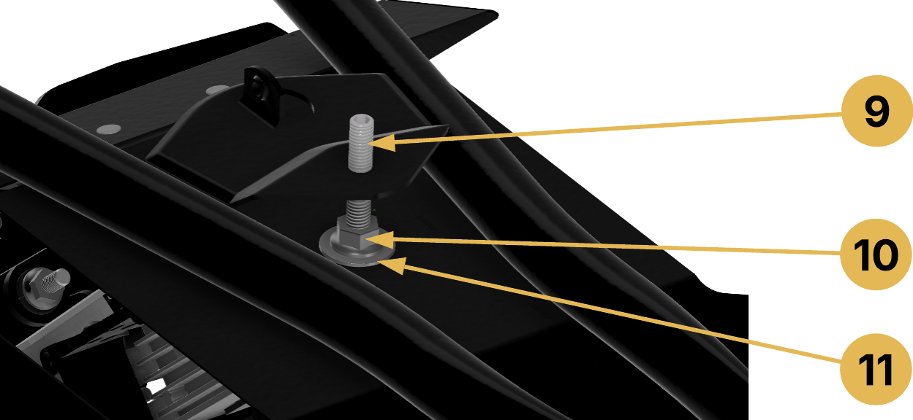

Lege nun die EDU Signalkabel entlang dem Rahmenrohr nach oben. Setze die M6x12 Senkkopfschrauben(14) in die Senkungen der Versteifungsbleche ein, kontere sie von der anderen Seite und ziehe sie fest.

  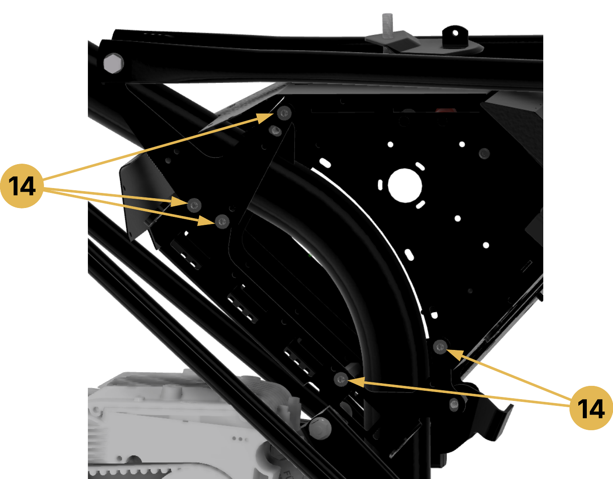

Setze nun die M6x12 Flachkopfschrauben(6) an den Rahmenlaschenanschraubpunkten locker ein, sodass sie fast vollständig eingeschraubt sind.

!!! tip "Tipp"
    Drehe sie handfest an und dann eine Umdrehung wieder zurück.

  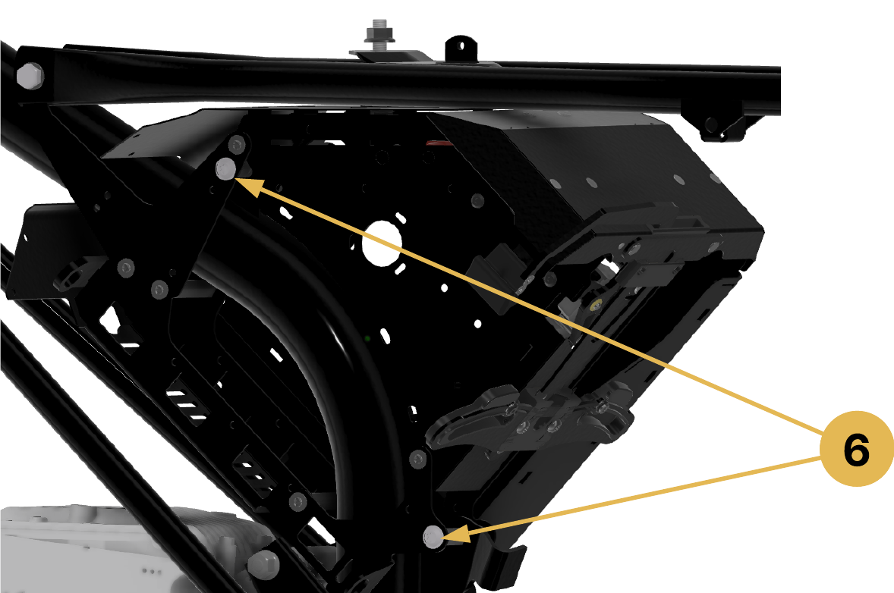

Jetzt richtest du den Akkuherzkasten endgültig aus und ziehst die Anschraubpunkte fest. Ziehe dafür an beiden Rahmenlaschenanschraubpunkten die jeweils beiden Gewindemuffen(15) mit zwei 10er Schlüsseln gegeneinander fest. Ziehe anschließend die M6x12 Flachkopfschrauben(6) fest.

  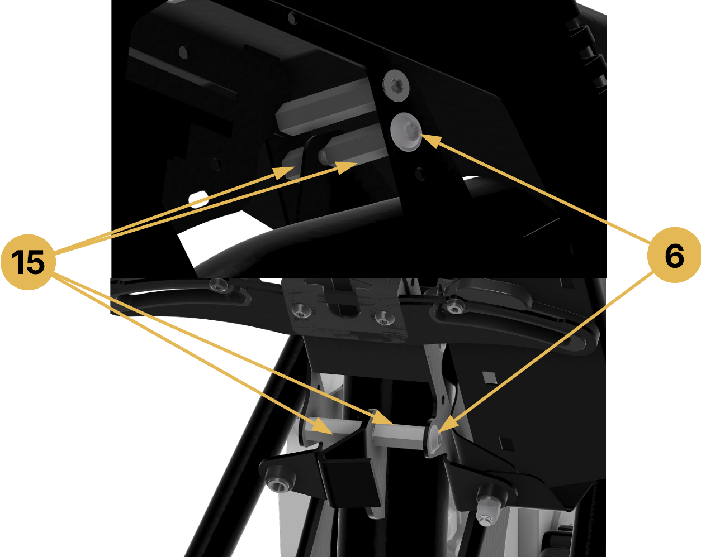

Ziehe zum Schluss an der Tankaufnahme die obere M8 Mutter(10) über der Unterlegscheibe mit Axialdichtung(11) fest und halte dabei die untere M8 Mutter(13) von unten nur in Position. Ziehe danach noch die M8 Mutter(16) und die M8x80 Schraube(2) der vorderen Rahmenobergurtverschraubung fest.

  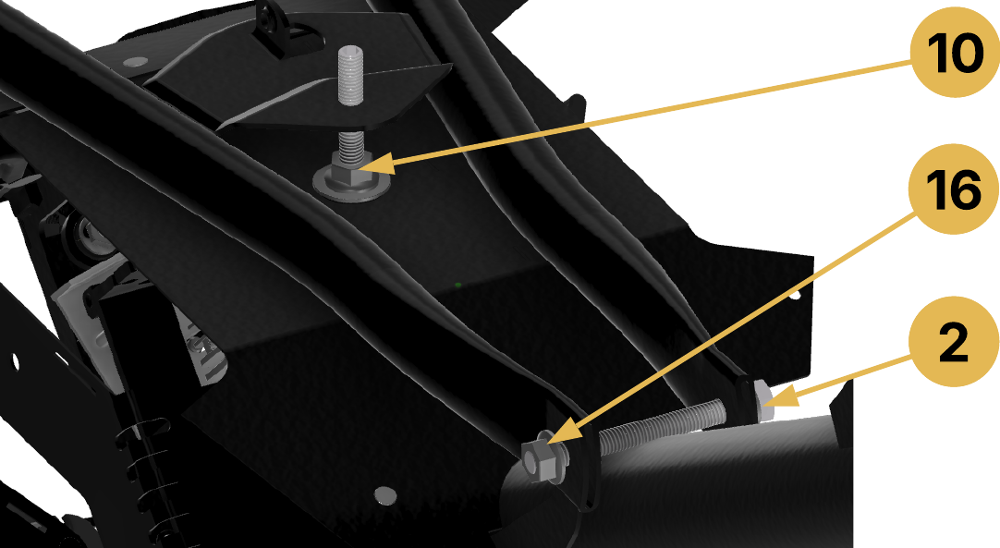

Setze nun das linke Akkufach(17) wieder ein und baue es zuerst oben wieder zusammen. Setze dafür die Metallhülse(18) von oben in das Gleitlager(19) ein und führe die Flachkopfschraube(20) von unten ein und schraube die M6 Mutter(22) locker auf. Wiederhole das Gleiche von unten. Achte dabei darauf, dass die Gleithülse in der dafür vorgesehenen Führung sitzt. Ziehe anschließend beide Akkufachgelenke mit ca. 5 Nm fest.

  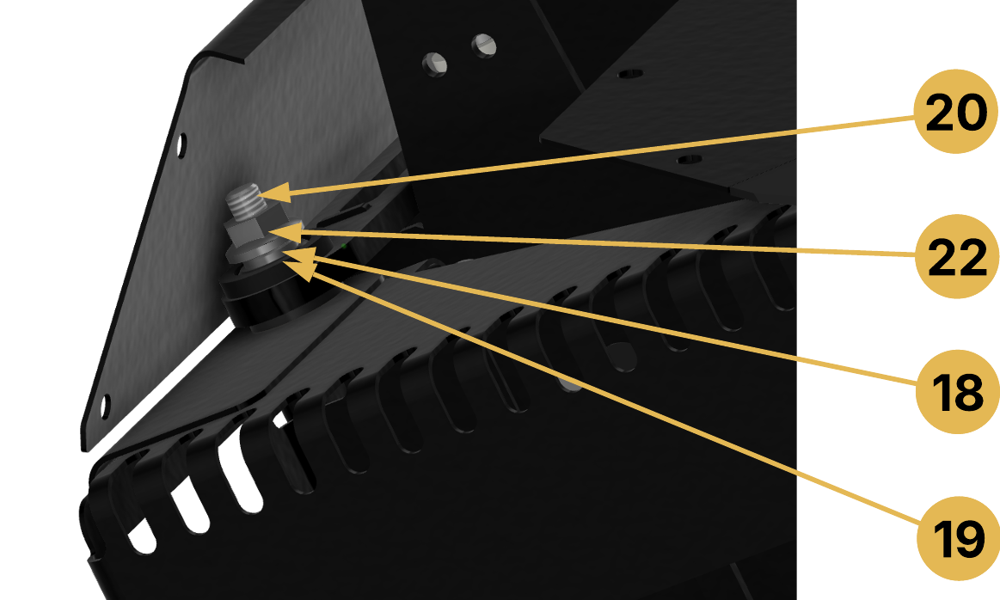

  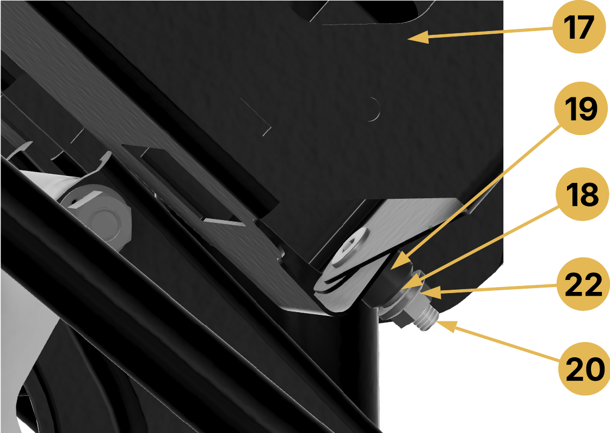

Als Nächstes können das Zubehörpanel(23) und die Rahmenrohrabdeckung(24) wieder angeschraubt werden. Setze die Rahmenrohrabdeckung(24) ein, positioniere das Panel wieder an der richtigen Stelle und schraube es mit den drei Kunststoffschrauben(25) fest.

  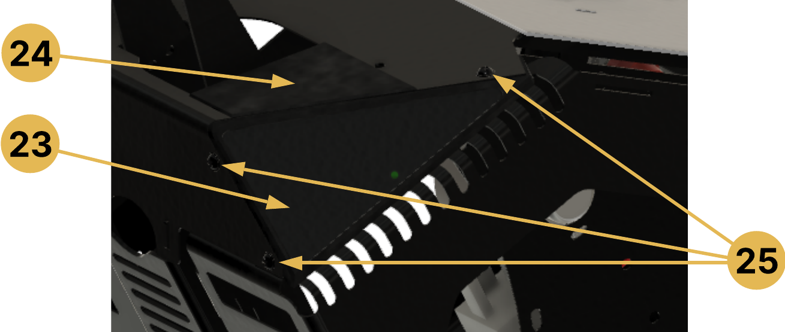

!!! tip "Tipp"
    Ziehe die Kunststoffschrauben nur leicht handfest an, um das Gewinde nicht zu beschädigen.

Zum Schluss montierst du die Seitendeckeladapter. Schraube den oberen Seitendeckeladapter(26) oben an und den unteren Seitendeckeladapter(27) unten von der Innenseite des Akkufachs an. Nutze dafür jeweils die M5x16 Schraube. Hänge den Seitendeckel anschließend unten ein und ziehe ihn oben von außen mit der M5x16 Flachkopfschraube fest. Auf der Seite des Schlosses wird zusätzlich die M6 Unterlegscheibe benötigt, um den großen Ausschnitt im Seitendeckel abzudecken.

!!! note "Hinweis"
    Die Seitendeckeladapter sind keine Pflicht, wir empfehlen sie jedoch zu montieren. Sie verbessern die Stabilität des Akkufachs sowie das Gefühl beim Öffnen und Schließen.

  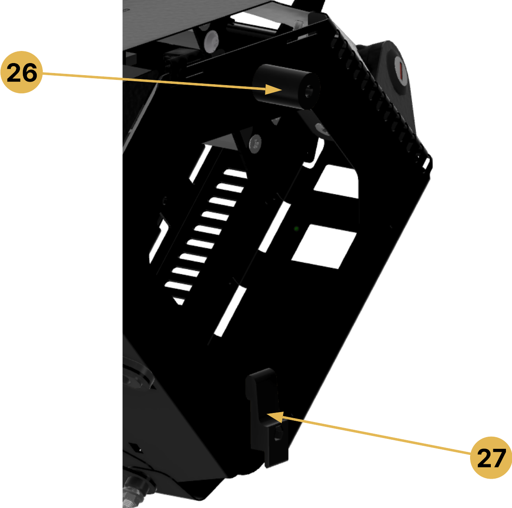

#### Elektronik montieren

Klipse zunächst den Mehrfachverbinderhalter(1) aus, klipse den Mehrfachverbinder in den Halter ein und lege beides beiseite.

  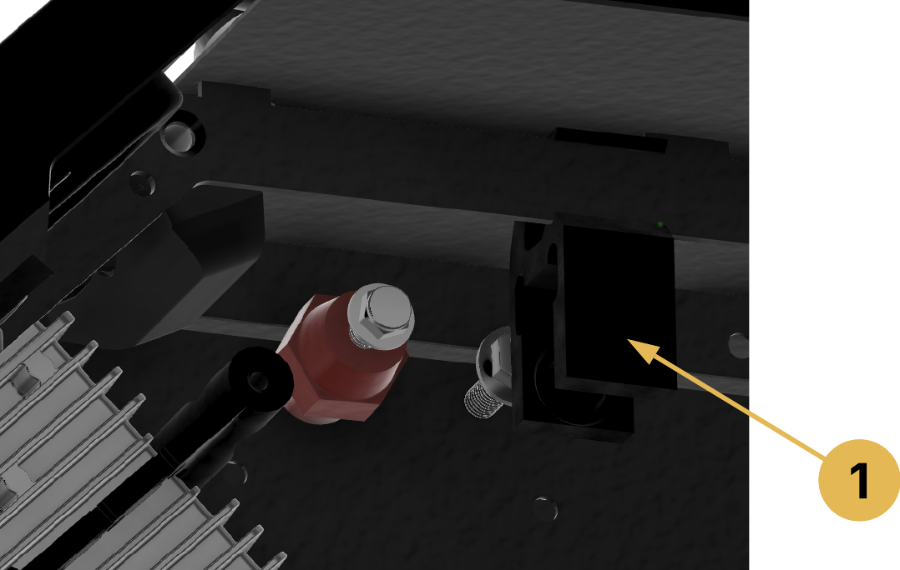

Führe nun die Hauptschlagader(2) in den Akkuherzkasten ein. Lege sie wie gezeigt am Rahmenrohr(3) nach oben, sichere sie mit Kabelbindern(4) locker und schraube sie an den Terminals fest. Schraube dabei den Ringkabelschuh des roten Kabels(5) an den roten Batteriepluspol(6) und den des schwarzen Kabels(7) an den Masse-Anschraubpunkt(8). An beiden sind bereits die Ringkabelschuhe der Steckermodule angeschraubt. Die Kabel der Hauptschlagader sollten ohne Biegung gerade in Fahrtrichtung von den Anschraubpunkten der Terminals wegzeigen. Verbinde außerdem unbedingt das Signalkabel(9) der Hauptschlagader mit dem der Steckermodule. Die Schlaufe unten an der Schwinge(10) dient dazu, die Länge genau so abzustimmen, dass die Hauptschlagader an den Schraubterminals wie gezeigt nach rechts wegstehen kann.

  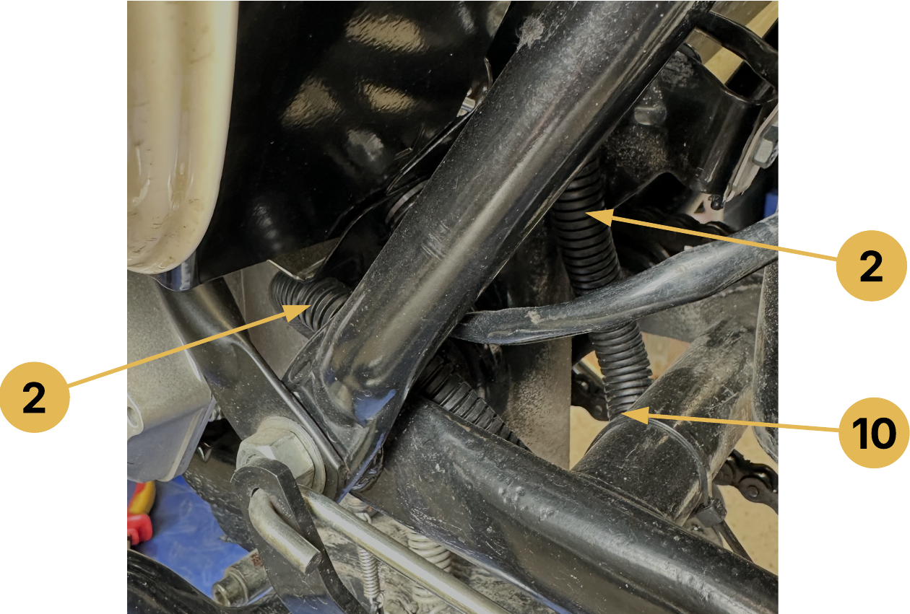

  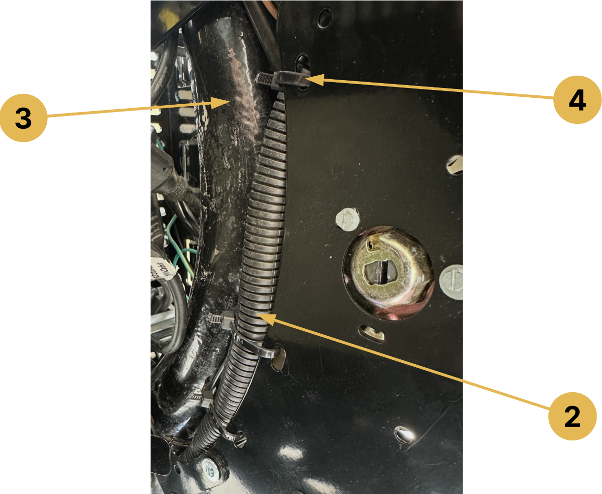

  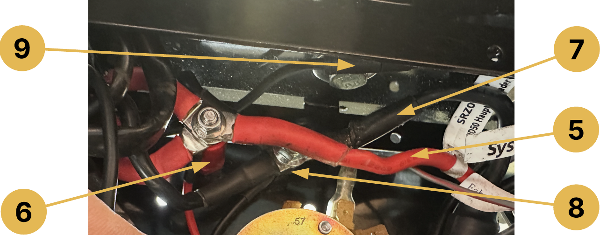

!!! warning "Wichtig: Kabelschuhe korrekt anschließen"
    Die Kabelschuhe müssen so sitzen, dass die Kontaktflächen sicher übereinander liegen und keine Isolierung zwischen die Kontaktflächen gerät. Die Kabel sollten in verschiedene Richtungen abstehen und nicht exakt übereinander liegen.

Baue nun den originalen Kabelbaum wieder ein. Schraube zunächst das Zündschloss(11) fest und klipse den Blinkgeber(12) ein, während du den Mehrfachverbinder(13) noch lose lässt. Führe danach den Kabelbaum ein, indem du den hinteren von hinten durch die Gummitülle auf die Oberseite des Akkuherzkastens und den vorderen von vorne am Rahmenrohr entlang zum Zündschloss(11) und Mehrfachverbinder(13) führst. Schließe anschließend alle Kabelverbindungen anhand deiner zuvor gemachten Fotos wieder an und sichere sie mit Kabelbindern. Schraube zuletzt das Massekabel des Simson Kabelbaums sowie das Massekabel des 12V DCDC-Wandlers(14) mit ihren Ringkabelschuhen an der oberen M6x10 Flachkopfschraube(15) fest, die den Masse-Sammelpunkt des originalen Herzkastens ersetzt.

  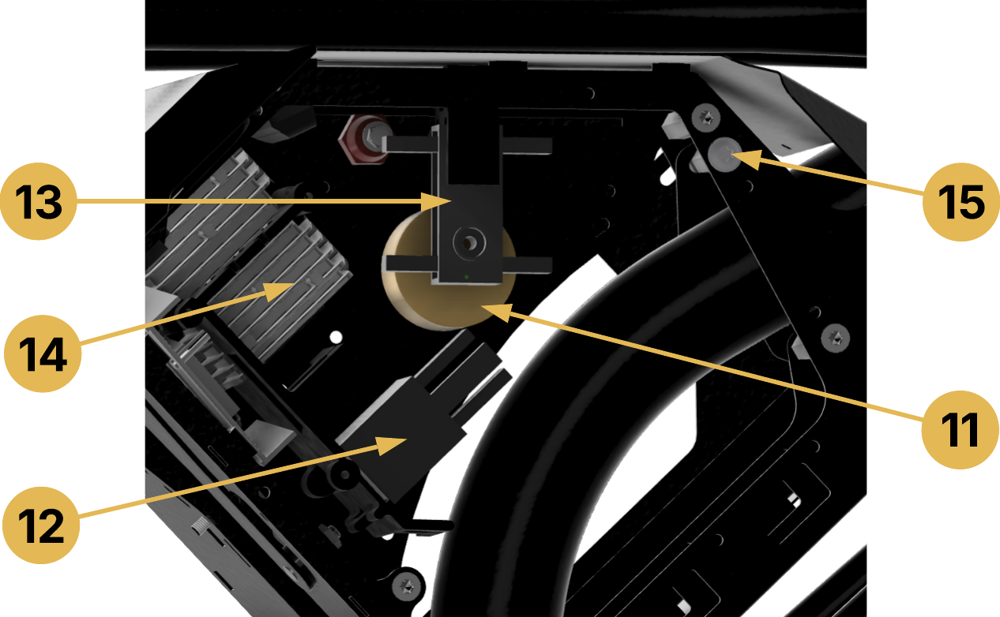

Als Nächstes verbindest du das „EDU AUX Cable" vom Antriebsmodul mit dem mitgelieferten „AUX DCDC-Brake Cable". Stecke die beiden zusammen und verschraube die Steckersicherung.

Verbinde nun die 4 roten Kabel des Second Ride 12V Kabels mit dem Zündschloss an folgenden Kontakten:

**59, 59B, 30, unbeschrifteter Dreifachstecker**

Du musst übrigens keine Sicherung mehr verwenden, da die Spannungsversorgung im Falle eines Kurzschlusses automatisch abschaltet, bis der Kurzschluss wieder aufgehoben wird.

Unter folgendem Link findest du den für dein Moped passenden Schaltplan. Dort ist abgebildet, welche Komponenten entfernt werden können. Du musst keine Sorge haben, etwas falsch zu machen. Unser System hat einen Kurzschlussschutz, sodass lediglich das Licht solange nicht angeht, bis du den Fehler behoben hast.

<a href="https://second-ride.de/schaltplaene?utm_source=anleitung">Hier geht es zu den Schaltplänen</a>

Falls dein Fahrzeug noch mit 6V Elektrik ausgestattet ist, musst du alle Glühbirnen, den Blinkgeber und evt. die Hupe gegen 12V Komponenten austauschen.

!!! info "Info: Vorteil 12V gegenüber 6V Beleuchtung"
    Die 12V Glühbirnen sind deutlich heller als die 6V Versionen und auch die Hupe ist mit 12V lauter. Nach dem Umbau bist du also sicherer unterwegs auf den Straßen.

Jetzt kannst du das originale Zündschloss auf die Stellung mit dem Scheinwerfer- bzw. „II"-Symbol (die dritte im Uhrzeigersinn) stellen.

Zuletzt musst du noch das Motorabschaltungskabel anstecken. Mithilfe von diesem Kabel erfährt das Antriebsmodul, ob du die Hinterradbremse (oder auch Vorderradbremse, wenn du dort auch einen Bremskontakt hast) betätigst. Solange die Bremse betätigt ist, ist es dann nicht mehr möglich, Gas zu geben.

!!! info "Info: Was das Motorabschaltungskabel macht"
    Wir haben diese Funktion vorgesehen, weil es keine Kupplung mehr gibt und somit keine Möglichkeit mehr, die Kraftübertragung zu trennen, wenn ein Fehler mit der Gasannahme auftritt. Zum Beispiel könnte der Gasgriff auf offener Stellung hängen bleiben. Ein solches Szenario stellt keine Gefahr mehr dar, wenn man nur die Fußbremse betätigen muss, um die Leistung des Motors wegzunehmen.

!!! tip "Tipp: Externer Bremslichtschalter für mehr Zuverlässigkeit"
    Der originale Bremslichttaster von Simson befindet sich in der Nabe des Hinterrads. Dort ist er nur sehr schwer einstellbar und zusätzlich bauartbedingt unzuverlässig. Wir empfehlen stark einen externen Bremslichtschalter nachzurüsten und Bremslicht und Motorabschaltung daran anzuschließen.

Führe das schwarze einadrige Motorabschaltungskabel entlang der Schwinge zum Bremskontakt am Hinterrad oder zu dem externen Bremslichtschalter. Entferne dort das originale Bremssignalkabel, stecke unseres auf und verbinde das originale mit der Extra-Fahne, welche von unserem Kabel abgeht. Nutze die Kabelbinder, um das Motorabschaltungskabel an der Schwinge entlang zu führen, so dass es nicht durch deren Auf- und Ab-Bewegung beschädigt werden kann.

!!! warning "Achtung"
    Wenn du eine S51/1 hast, dann kann es sein, dass dein Bremslicht invertiert funktioniert. Das bedeutet, dass das Bremslicht im ausgeschalteten Zustand mit Masse verbunden ist und wenn es eingeschaltet wird, der Bremslichtschalter den zweiten Kontakt des Bremslichtes mit 12V verbindet. 
    Sollte das bei dir der Fall sein, lasse das Motorabschaltungskabel erst mal unangeschlossen und verstaue es gut. Damit in Zukunft die Motorabschaltung mittels Bremslichterkennung funktioniert, melde dich bitte bei support@second-ride.de und frage nach dem „S51/1 Bremslichtkabelsatz".

#### Akkuherzkasten Bedienung

Öffne die Steckerklappe(2), indem du das Schloss(1) im Uhrzeigersinn drehst.

!!! warning "Achtung"
    Zu starkes Drehen entgegen dem Uhrzeigersinn kann das Schloss beschädigen.

  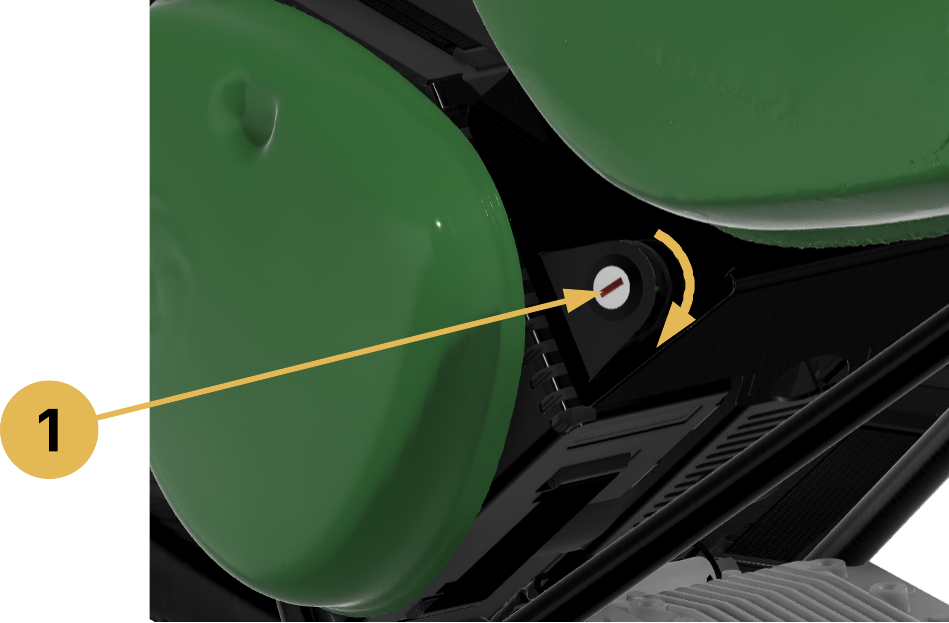

Die Steckerklappe(2) sollte nun aufspringen. Bei zwei eingesetzten Akkus kann es sein, dass du mit einem leichten Anheben des Hebels(3) nachhelfen musst.

  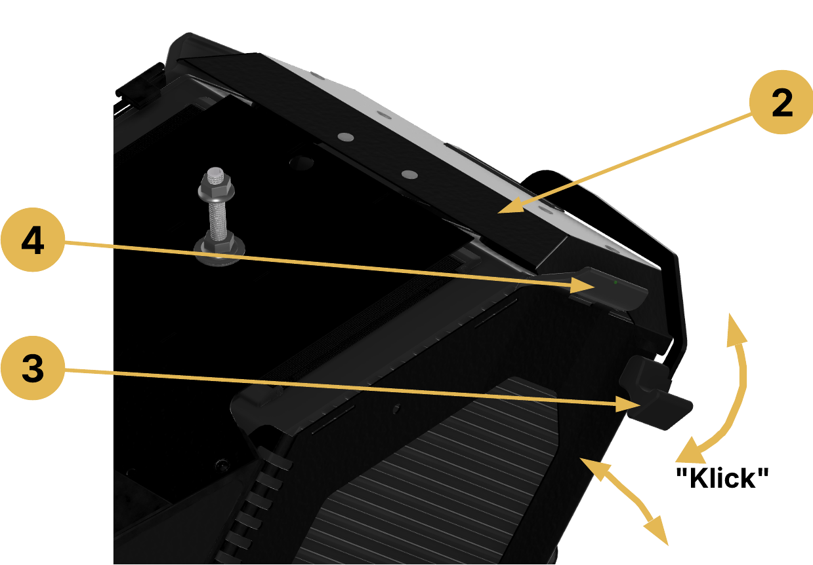

Mit dem Akkufachgriff(4) öffnest du das Akkufach. Anschließend kannst du den Akku mit dem Akkugriff(5) aus dem Akkufach herausheben.

  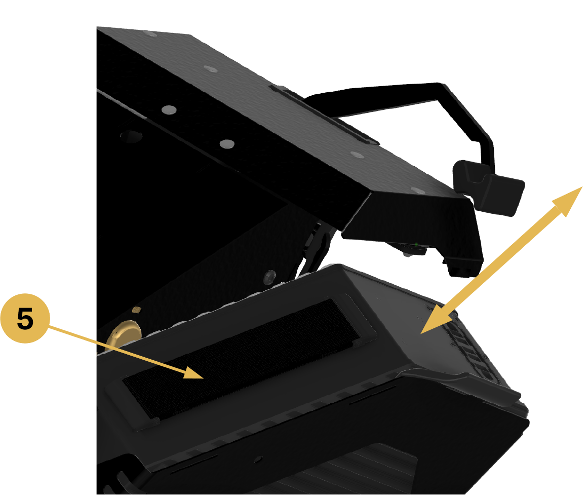

Um den Akku im Herzkasten zu verriegeln, muss das Akkufach vollständig geschlossen sein. Bewege dann den Hebel(3) nach unten, bis die Stecker spürbar einrasten und der Verriegelungsmechanismus mit einem hörbaren Klick bestätigt.

!!! warning "Achtung"
    Arbeite dich an die zum Einrasten nötige Kraft langsam heran, denn das kann etwas Kraft erfordern. Zu viel Gewalt kann jedoch den Mechanismus beschädigen. Möchte der Hebel nicht in seine Endstellung, blockiert wahrscheinlich an anderer Stelle etwas oder der Akku sitzt falsch. Achte unbedingt darauf, dass die Steckerklappe wirklich in der Verriegelung hängt. Das kannst du mit einem leichten Anheben des Hebels(3) kontrollieren.

### 4. Armaturen

Die Armatureneinheit bestehend aus Zündschloss(14) und Taster(15) wird an der vorderen linken M6 Schraube der Lenkerauflage befestigt. Die Ladestandsanzeige(13) sollte zuerst an das Halterungsblech geschraubt und der rechteckige Stecker vom Zündschloss an der Rückseite eingesteckt werden. In der Pappschachtel der Ladestandsanzeige sind Unterlegscheiben und Muttern zur Befestigung am Blech beigelegt. Dann kann das Halterungsblech analog zum Tacho an der linken Stoßdämpferschraube befestigt werden. Stecke nun den schwarzen Stecker, welcher vom Zündschloss kommt, in die Ladestandsanzeige. Das lange Kabel vom Zündschloss kannst du entlang des Rahmens unter dem Tank hindurch in zu dem Herzkasten führen. Auf der Rückseite des Antriebsmoduls kommt ein Kabel mit passendem Stecker heraus. Führe es in den Herzkasten und verbinde die Stecker dort. Auf beiden Steckern sind Pfeile aufgebracht, welche die richtige Orientierung zum Zusammenstecken anzeigen. Befestige die Kabel sicher am Rahmen mithilfe der mitgelieferten Kabelbinder. Achte darauf, dass bei vollem Lenkeinschlag in beide Richtungen das Kabel nicht gezerrt wird oder es sogar das Lenken behindert.

  

### 5. Gaszug

Damit das Drehen des Gasdrehgriffs richtig über den Bowdenzug in ein elektrisches Signal umgewandelt wird, haben wir den UBS - Universalen Bowdenzugsensor entwickelt und dir mitgeliefert. Entferne zunächst den Gaszug aus dem Vergaserkolben, in dem du den Kolben und Deckel zusammen drückst. Dadurch sollte der Gaszug im Kolben herausnehmbar sein. Kolben, Feder und Deckel werden nicht mehr benötigt.

Nimm dir nun den Gaszugsensor und schraube die Kappe ab. Achtung, darunter sitzt eine komprimierte Feder. Beim UBS sind mehrere Stellschrauben dabei, die verschieden lange Bowdenzugenden und Rückstellkräfte ermöglichen. Für die S50/S51 verwendest du die M8x25 Stellschraube mit Kontermutter.

Schraube die passende Stellschraube(1) in den Deckel(2) ein und schiebe den Gaszug durch die Stellschraube. Schiebe von der anderen Seite die Feder auf und schiebe nun den Magnetschieber(3) seitlich auf den Gaszug auf, bis dieser in der Mitte dessen sitzt. Jetzt kannst du den Magnetschieber mitsamt Feder in den Bowdenzugsensor einsetzen und den Deckel mit etwas Druck aufdrehen.

  

Um den UBS einzustellen, ziehe im montierten Zustand an dem Gaszug. Hier sollte kein Spiel mehr fühlbar sein, aber auch nur minimale Vorspannung anliegen. Drehe die Einstellschraube soweit heraus, bis das Spiel im Gaszug vollständig verschwunden ist. Kontere die Stellschraube mit der Stellmutter.

Nutze einen Kabelbinder, um den UBS an dem rechten Rahmenrohr zu befestigen. Achte darauf, dass das Gaszugkabel nicht zu sehr gebogen wird. Je gerader dieses verläuft, desto besser läuft der Gaszug.

Achte darauf, dass dein Gaszug und Gasdrehgriff geringstmöglichen Reibungswiderstand haben. Der Gasgriff sollte allein mit der Federkraft aus der maximal offenen Stellung vollständig zurückschnappen. Ist das nicht der Fall, hilft es den Gasdrehgriff abzubauen, zu reinigen und neu zu fetten und/oder den Bowdenzug zu ersetzen. Es kann auch sein, dass das Gummi des Gasdrehgriffs am Klemmstück reibt. Dagegen hilft es, das Gummi am demontierten Gasgriffrohr nach außen zu verschieben. Eine Videoanleitung rund um die Gasdrehgriffwartung findest du auf dem Youtubekanal 2Radgeber:

<iframe width="560" height="315" src="https://www.youtube.com/embed/XWQ3W5QNqvs" title="Youtubekanal 2Radgeber" frameborder="0" allow="accelerometer; autoplay; clipboard-write; encrypted-media; gyroscope; picture-in-picture" allowfullscreen></iframe>

!!! warning "Wichtig: Firmwareupdate durchführen"
    Bitte führe bevor du das umgebaute Fahrzeug benutzt erst ein Firmwareupdate durch. Wie das funktioniert, erfährst du im Kapitel [Firmware Update](../../../user-manual/MID50/02-firmware-update/index.md).

Die digitale Drosselung deines Antriebs wird im Kapitel [Antrieb drosseln](../throttling/how-to-throttle-your-drive/index.md) beschrieben.

Im Anschluss kannst du den Tank und die Sitzbank wieder montieren.