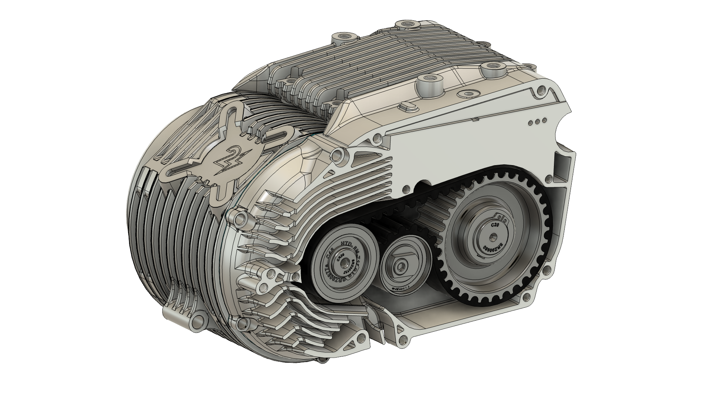
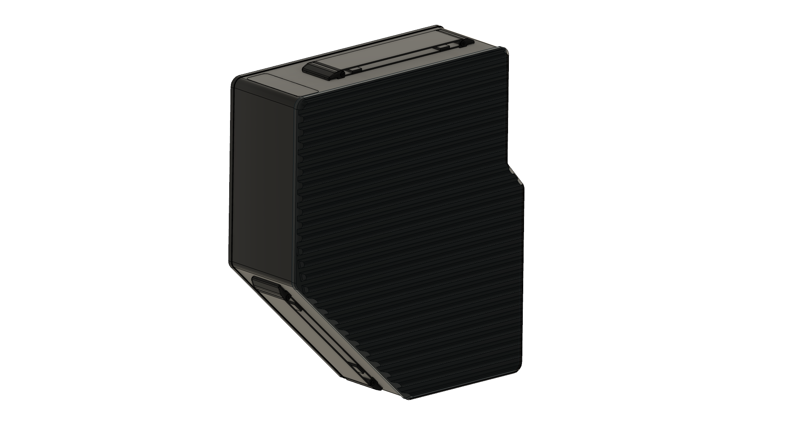

# Antriebsmodul
Das Antriebsmodul gibt es in drei Varianten: 
## Zylinderanschraubung +60° und Abtrieb rechts
3D-Modell: [MID50-Drive-Unit-Community-Model.step](drawings/MID50-Drive-Unit-Community-Model.step)

2D-Zeichnung: kommt bald

## Zylinderanschraubung +0° und Abtrieb links
3D-Modell: kommt bald

2D-Zeichnung: kommt bald

## Zylinderanschraubung -60° und Abtrieb links
3D-Modell: kommt bald

2D-Zeichnung: kommt bald

# Akku
Vom Akku gibt es für alle Modelle nur eine Variante. Der Griff des Akkus kann vom Nutzer an zwei unterschiedlichen Stellen des Akkus festgeschraubt werden. In der Schwalbe sollte der Griff zb. an der Seite der Ladestandsanzeige angeschraubt werden, während er für die Nutzung in der S51 an der großen 45° Schrägen montiert werden sollte.

3D-Modell: [MID50-Battery-Community-Model.step](drawings/MID50-Battery-Community-Model.step)

2D-Zeichnung: kommt bald

# Adapter-Kits
Für die Montage des Antriebmoduls an den modellspezifischen Rahmenanbindungspunkten gibt es Adapterkits, bestehend aus mehreren Blechen. 

Die Zeichnungen dafür folgen hier bald.

# Akkuhalterungen
Für die Montage der Akkus an den modellspezifischen Rahmenanbindungspunkten gibt es Akkuhalterungen. 

Die Zeichnungen dafür folgen hier bald.

# Armaturen
Am Lenker werden Ladestandsanzeige, Zündschloss und Taster untergebracht. Es gibt verschiedene Ausführungen dieser Baugruppe für verschiedene Fahrzeugmodelle. 

Die Zeichnungen dafür folgen hier bald.