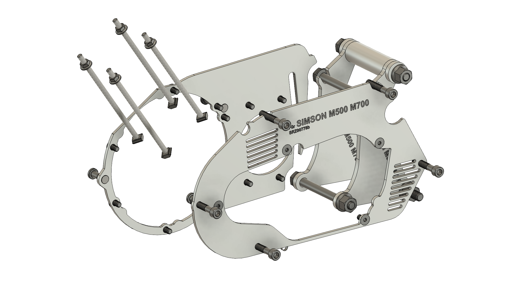
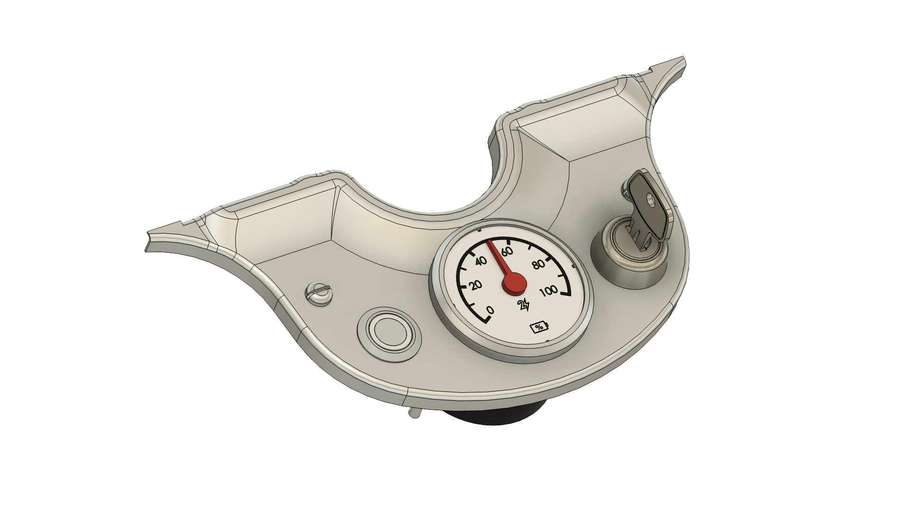

# MID50 Mechanik - Dokumentation für Entwickler

Wir haben den MID50 Antrieb und Akku so entwickelt, dass mit einfach zu entwickelnden und fertigenden Adaptern die Module in quasi alle Fahrzeuge im Hubraumbereich bis 125 ccm und mit Ketten- oder Riementrieb integriert werden können. Damit ihr nicht darauf warten müsst, dass wir diese Adapter für eure jeweiligen Fahrzeuge entwickeln, stellen wir alle Ressourcen bereit, die ihr dafür braucht. 

---
## Antriebsmodul
Das Antriebsmodul gibt es in drei Varianten: 

- Zylinder +60° und Abtrieb in Fahrtrichtung rechts
- Zylinder +0° und Abtrieb in Fahrtrichtung links
- Zylinder -60° und Abtrieb in Fahrtrichtung links

=== "Vorschaubild"

        

=== "3D Model"

        <iframe width="100%" height="480" style="border:1px solid #eeeeee;" src="https://3dviewer.net/embed.html#model=https://raw.githubusercontent.com/Second-Ride/docs/main/docs/for-developers/MID50/mechanics/drawings/MID50-Drive-Unit-Community-Model.step$camera=656.37517,177.17326,434.88746,435.26201,13.20497,50.90208,0.00000,1.00000,0.00000,45.00000$projectionmode=perspective$envsettings=fishermans_bastion,off$backgroundcolor=42,43,46,255$defaultcolor=200,200,200$defaultlinecolor=100,100,100$edgesettings=off,0,0,0,1"></iframe>

        Download:    [MID50-Drive-Unit-Community-Model.step](drawings/MID50-Drive-Unit-Community-Model.step)

=== "2D Zeichnung"
        kommt bald

---
## Akku
Vom Akku gibt es für alle Modelle nur eine Variante. Der Griff des Akkus kann vom Nutzer an zwei unterschiedlichen Stellen des Akkus festgeschraubt werden. In der Schwalbe sollte der Griff zb. an der Seite der Ladestandsanzeige angeschraubt werden, während er für die Nutzung in der S51 an der großen 45° Schrägen montiert werden sollte.

3D-Modell: [MID50-Battery-Community-Model.step](drawings/MID50-Battery-Community-Model.step)

2D-Zeichnung: kommt bald

---
## Adapter-Kits
Damit unser Antriebmodul die passenden Anschraubpunkte für den Rahmen und die Seitenteile verschiedenster Fahrzeuge annehmen kann, gibt es Adapterkits.

Die Zeichnungen dafür folgen hier bald.

---
## Akkuhalterungen
Für die Montage der Akkus an den modellspezifischen Rahmenanbindungspunkten gibt es Akkuhalterungen. 

Die Zeichnungen dafür folgen hier bald.

---
# Armaturen
Am Lenker werden Ladestandsanzeige, Zündschloss und Taster untergebracht. Es gibt verschiedene Ausführungen dieser Baugruppe für verschiedene Fahrzeugmodelle. 

Die Zeichnungen dafür folgen hier bald.

