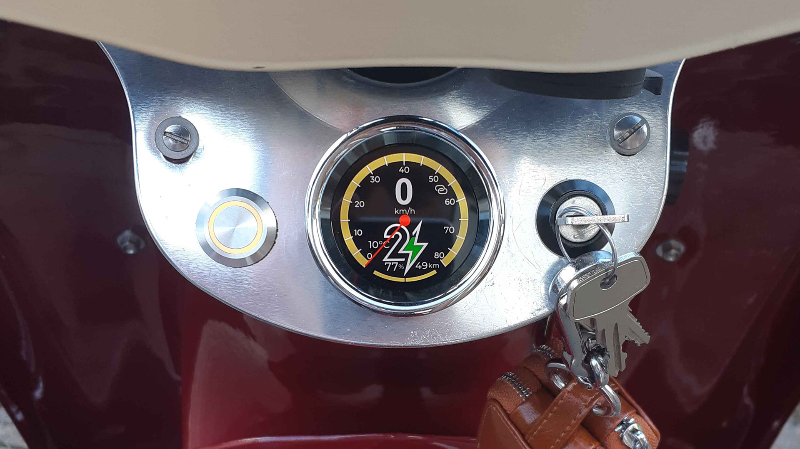
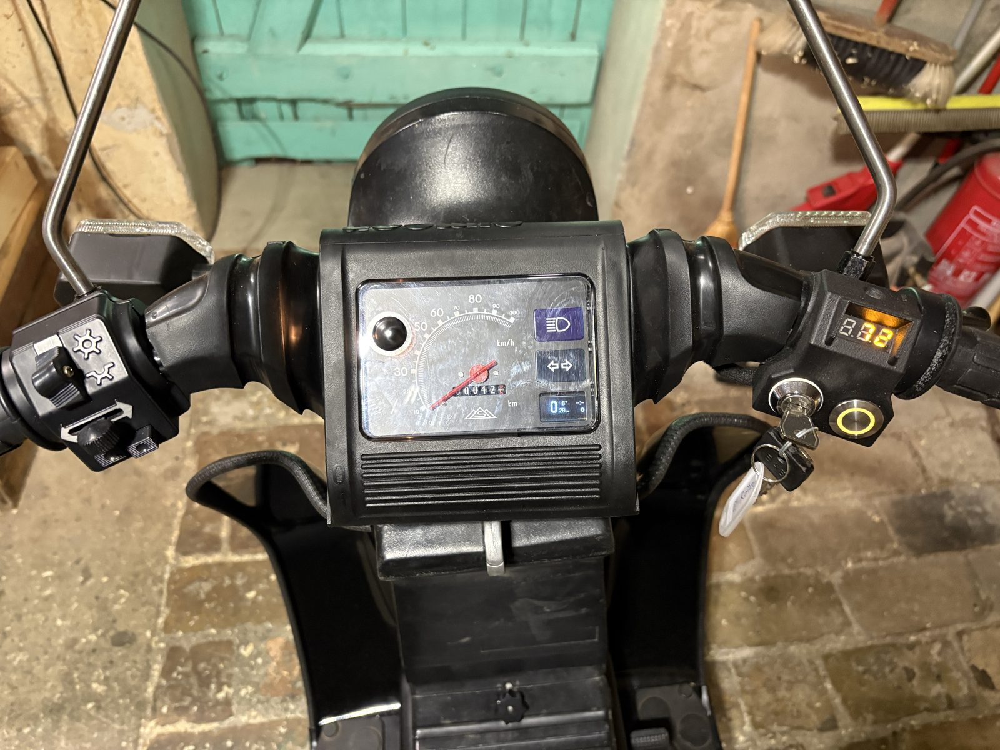
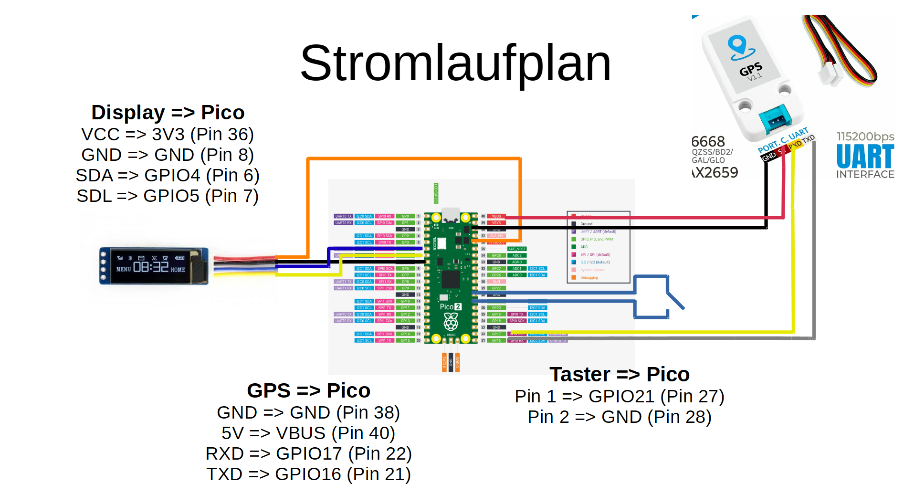
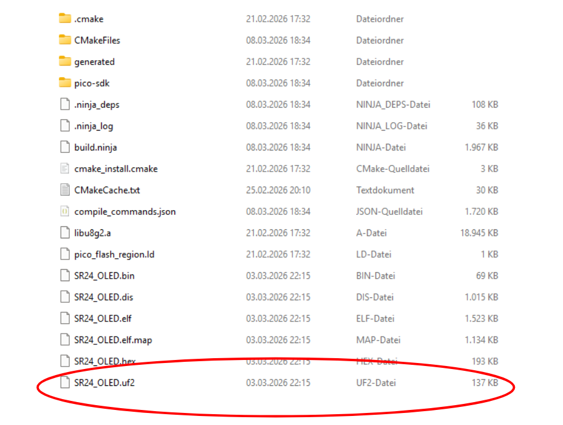
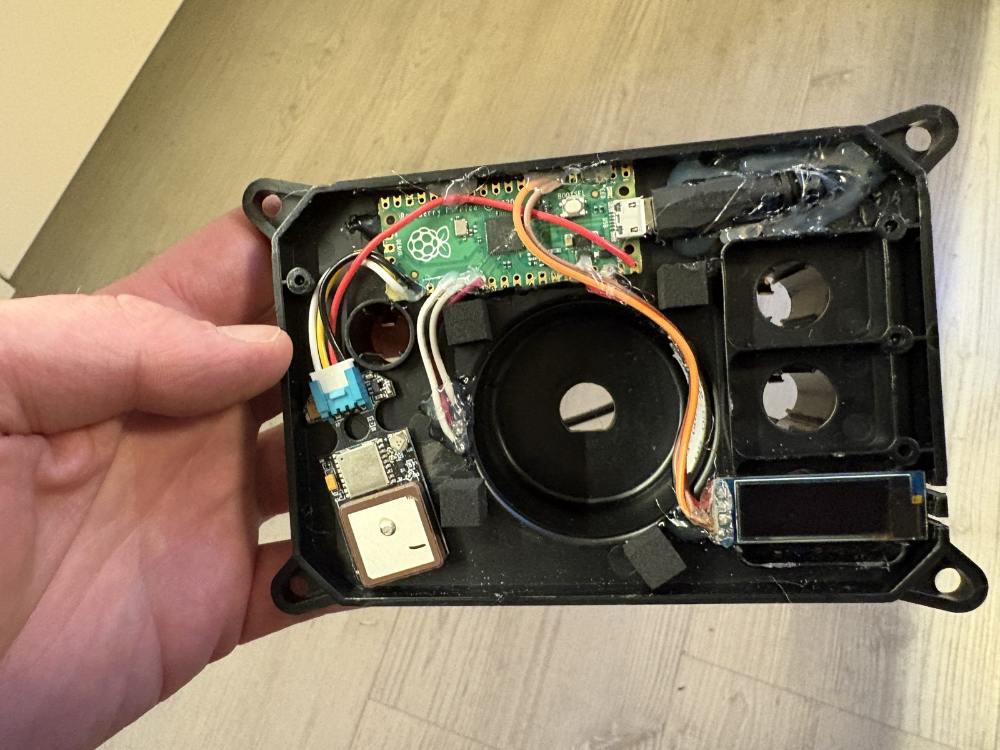

# Community Erweiterungen für SR23 und SR24 Umbaukits
Es gibt bereits viele tolle Erweiterungen für SR23 und SR24 Umbaukits, die aus der Community entwickelt wurden. Bisher wurden diese nur auf [unserem Discord-Server](https://second-ride.de/community-gast) dokumentiert. Wir bitten die Verantwortlichen in der Community ihre Projekte hier zur besseren Übersicht zu dokumentieren.

!!! info "Projekte aus der Community"
    Die Projekte auf dieser Seite stammen von Mitgliedern der Community. Second Ride hat sie nicht geprüft und pflegt sie nicht. Nachbau auf eigene Verantwortung.

## Touchdisplay in den Armaturen von [kilipet75](https://github.com/kilipet75)
Ein rundes Touchdisplay mit 1,43 Zoll AMOLED, das als Zusatzanzeige in die Armaturen passt (zum Beispiel statt der analogen Ladestandsanzeige). Es zeigt Geschwindigkeit, Akkustand, Restreichweite und Akkutemperatur und dazu viele Diagnosedaten des Antriebs. Das Projekt stammt von Kilian Peters (**kilipet75**), die Anleitung dazu hat er 08/2025 mit Genehmigung von Second Ride geschrieben. Hier findest du die wichtigsten Punkte daraus, im [Handbuch (PDF)](https://github.com/kilipet75/SRdisplay/blob/main/Manual.pdf) stehen alle Bilder und Schaltpläne.

[Zum Discord Thread  :simple-discord:](https://discord.com/channels/985901178254659615/1351281991332659210){ .md-button .md-button--primary }
[Zur Github Repo  :simple-github:](https://github.com/kilipet75/SRdisplay/tree/main?tab=readme-ov-file){ .md-button .md-button--primary }

!!! warning "Kein Ersatz für den Tacho"
    Das Display ist laut Entwickler nicht als Ersatz für den originalen Tacho zugelassen. Nach der StVZO muss das Fahrzeug einen zugelassenen Geschwindigkeitsmesser haben. Das Display ist als Zusatzanzeige für den Ladezustand des Akkus und für Diagnosezwecke gedacht. Der Nachbau ist ein privates Bastelprojekt und erfolgt auf eigene Gefahr. Ob die Anzeige mit der gedruckten Dichtung wasserdicht ist, wurde bisher nicht getestet.

### Was das Display kann
- **Tacho:** analoges Ziffernblatt mit Geschwindigkeit, Uhrzeit, Akkustand, Restreichweite, Akkutemperatur und der Motorleistung als Balken am unteren Rand (nach rechts beim Fahren, nach links beim Rekuperieren). Die Akkutemperatur wird ab 40 °C orange und ab 45 °C rot.
- **Akkuanzeige:** das Second-Ride-Logo mit Akkustand, Restreichweite, Temperatur und Uhrzeit.
- **Diagnose:** Akkuspannung und -strom, Akkutemperaturen (min und max), Ladeleistung, Temperatur von Motorregler und Motor, Leistungsbegrenzung wegen Akkustand und Temperatur, Kilometerzähler (Trip und gesamt) sowie die Softwareversionen von Display, Steuergerät und Hardware.
- **Ladegrenze:** Das Display kann das Laden beim eingestellten Akkustand abschalten, um den Akku zu schonen. Dafür schaltet es per WLAN eine Steckdose mit Shelly oder Tasmota. Ohne Steckdose lädt das Gerät weiter, auf Wunsch kommt dann eine WhatsApp-Nachricht.
- **Heimautomatisierung:** Über MQTT sendet das Display alle Daten des Steuergeräts, zum Beispiel an ioBroker oder Home Assistant.
- **Einstellbar:** WLAN, Farben (zwei Farbthemen), Uhr und die Startanzeige per Webinterface.

### Benötigte Teile
Das Display besteht aus zwei Teilen: einem Display-Modul mit Touchscreen und einem getrennten ESP32-Mini. Der Mini empfängt die Diagnosedaten über USB vom Fahrzeug und gibt sie seriell an das Display weiter. Direkt am Display geht das laut Entwickler nicht, weil die verwendeten Bibliotheken und die Programmierumgebung es nicht unterstützen.

| Bauteil | Bezeichnung |
|---|---|
| Display | ESP32-S3 1.43inch AMOLED Display (Waveshare) |
| USB-Bridge | ESP32-S3 Mini |
| Stiftleiste | 1,27 mm Raster |
| USB-Adapter | USB-C auf USB-A-OTG-Adapter mit Kabel |
| Chromring | 54 mm Außendurchmesser (laut Entwickler nur als Set für Harley-Davidson-Instrumente gefunden: vier passende und zwei größere Ringe) |
| Schrauben | M2,5 x 5 mm |
| Pufferbatterie (optional) | CR2016 oder CR2032, damit die Uhrzeit beim Abschalten nicht verloren geht |
| Batteriestecker (optional) | Mini-JST SH1.0-2P |

Die Bezugsquellen (Amazon, eBay) stehen im [Handbuch](https://github.com/kilipet75/SRdisplay/blob/main/Manual.pdf).

!!! note "Zwei Ausgabestände des Displays"
    Waveshare verkauft das Display in zwei Ausgabeständen (V1 und V2). Es gibt für beide eine eigene Firmware. Ist die Anzeige nach dem Aufspielen fehlerhaft, ist es vermutlich der andere Ausgabestand.

### Gehäuse drucken
Alle Teile außer der Dichtung werden aus PLA oder ABS gedruckt, die Dichtung aus TPU. Da das Gehäuse eingebaut nicht mehr zu sehen ist, ist die Farbe egal. Die Druckdateien liegen im Ordner [3D-Print](https://github.com/kilipet75/SRdisplay/tree/main/3D-Print) des Projekts.

| Teil | Datei | Material |
|---|---|---|
| Gehäuse | Basis.stl | PLA/ABS |
| Display-Halterung | Baseplate.stl | PLA/ABS |
| Überwurfmutter | Überwurfmutter.stl | PLA/ABS |
| Mutter | Mutter.stl | PLA/ABS |
| ESP32-Gehäuse | ESP-Case.stl | PLA/ABS |
| Deckel fürs ESP32-Gehäuse | ESP-Deckel.stl | PLA/ABS |
| Dichtung | Dichtung.stl | TPU |

- Die Muttern gegebenenfalls 1 bis 2 % größer drucken, falls das Gewinde zu stramm ist.
- Der Chromring sollte sich fest vorne auf das Basis-Teil stecken lassen. Bei Bedarf mit etwas Kleber fixieren.
- Das Display wird mit vier M2,5-Schrauben an der Baseplate befestigt, das ESP-Case und sein Deckel ebenfalls mit M2,5-Schrauben. Zusätzlich kann das Display mit Silikon eingeklebt werden, um es gegen Regenwasser abzudichten.

### Verdrahtung
Display und ESP32-Mini werden mit vier dünnen Drähten verbunden. An den Mini kannst du direkt löten. Am Display sitzen 1,27-mm-Stiftleisten, die sehr klein und nicht einfach zu löten sind. Isoliere die Drähte danach mit Schrumpfschlauch.

| Vom ESP32-Mini | Zum Display |
|---|---|
| 5V | 5V (linke Stiftleiste) |
| GND | GND (linke Stiftleiste) |
| TX | RXD (rechte Stiftleiste) |
| RX | TXD (rechte Stiftleiste) |

Die RX-Leitung vom Mini zum Display (TXD am Display) ist theoretisch nicht nötig, weil die Daten bisher nur vom Mini zum Display laufen. Den genauen Schaltplan zeigt Seite 5 im [Handbuch](https://github.com/kilipet75/SRdisplay/blob/main/Manual.pdf).

Für die Echtzeituhr kannst du eine Pufferbatterie an den Batterieanschluss des Displays löten. Ohne sie geht die Uhrzeit beim Abschalten verloren. Mit WLAN und Internet stellt sich die Uhr per NTP von selbst. Die Uhr lässt sich im Webinterface abschalten.

### Firmware aufspielen
Die Firmware liegt im Ordner [Release](https://github.com/kilipet75/SRdisplay/tree/main/Release) des Projekts:

| Datei | Für |
|---|---|
| `SR_SoC-Display 0.6.0 DISP V1.bin` | Display, Ausgabestand V1 |
| `SR_SoC-Display 0.6.0 DISP V2.bin` | Display, Ausgabestand V2 |
| `CDC-Host-Bridge 1.0.bin` | ESP32-Mini (USB-Bridge) |

Aufgespielt wird mit dem Flash Download Tool von Espressif (Windows). Der Ablauf ist für beide ESPs gleich, du wählst nur die passende Datei:

1. Schließe immer nur einen ESP gleichzeitig an den PC an, damit du den neuen COM-Port eindeutig erkennst.
2. Starte das Flash Download Tool mit ChipType **ESP32-S3**, WorkMode **Develop** und LoadMode **USB**.
3. Wähle die Firmware-Datei und trage als Startadresse `0x0` ein.
4. Wähle den COM-Port des ESP und klicke auf **START**. Alle anderen Einstellungen bleiben auf Standard.
5. Drücke danach die Reset-Taste oder trenne den ESP kurz von der Spannung. Das Display sollte etwas anzeigen und auf Wischgesten reagieren.

Wird der ESP nicht erkannt, halte die Boot-Taste gedrückt und drücke dabei kurz Reset, um in den Upload-Modus zu kommen. Spätere Updates des Displays gehen bequem über das Webinterface.

### Anschluss am Fahrzeug
Das Display hängt am USB-Anschlusskabel des Umrüstsatzes, das auch für Firmware-Updates verwendet wird. Ein USB-C-auf-USB-A-OTG-Adapter stellt die Verbindung her. Eine eigene Stromversorgung brauchst du nicht, das Display wird über USB versorgt. Am Fahrzeug musst du nichts einstellen.

Du kannst das Display auch zusammen mit dem [Bluetooth-Modul](../../../user-manual/SR24/02-bt-module/index.md) von Second Ride nutzen. Dann steckst du das USB-Kabel an den Stecker des Bluetooth-Moduls.

Das Display braucht die aktuelle Firmware im Antriebsmodul („Günter“). Bei einem Nutzer lief der Akkustand, aber die Geschwindigkeit fehlte, bis das [Firmware-Update](../../../user-manual/SR24/03-firmware-update/index.md) gemacht war.

### Einrichtung über das Webinterface
Im Auslieferungszustand ist kein WLAN eingerichtet. Das Display öffnet dann ein eigenes, unverschlüsseltes WLAN („SR HotSpot 192.168.4.1“). Nach dem Verbinden öffnet sich die Konfigurationsseite von selbst, sonst rufst du <http://192.168.4.1/> auf. Ist das Display im Heimnetz, erreichst du die Seite auch unter <http://srdisplay/>.

- **WLAN:** Du kannst zwei Netzwerke eintragen, zum Beispiel zu Hause und bei der Arbeit. Das Display versucht zuerst WLAN 1, dann WLAN 2. Klappt beides nicht, öffnet es wieder den eigenen Hotspot. Statt eines Heimnetzes kannst du auch die Zugangsdaten einer Steckdose eintragen, dann verbindet sich das Display direkt mit ihr.
- **Steckdose (Smartplug):** Trage die IP-Adresse des Shelly oder Tasmota je WLAN ein und wähle den Typ. Bei **Abschaltung bei SoC** legst du den Akkustand fest, ab dem die Steckdose ausschaltet (zum Beispiel 80 %). Ein- und Ausschalten geht auch von Hand, sobald die Verbindung steht.
- **MQTT** (nur für Heimautomatisierung): Server (zum Beispiel ioBroker oder Home Assistant), Port (zum Beispiel 1883) und Node-Name (zum Beispiel „Schwalbe“). Das Display sendet dann alle Daten des Steuergeräts. Das Webinterface hat keine Felder für Benutzername und Passwort, der Broker muss also Verbindungen ohne Anmeldung erlauben. Das Mosquitto-Add-on von Home Assistant erlaubt standardmäßig nur Zugänge mit Anmeldung, das war im Discord-Thread ein Thema.
- **Displayeinstellungen:** Startanzeige (Tacho oder Akkuanzeige) und ob die Uhr angezeigt wird.
- **Farben:** Zwei Farbthemen mit frei wählbarer Hintergrund-, Vordergrund-, Skalen- und Panelfarbe. Zwischen den beiden schaltest du direkt am Display um, die letzte Wahl bleibt gespeichert. „Farben auf Standard“ setzt alles zurück.
- **WhatsApp-Nachricht:** Beim Erreichen der Ladegrenze kann das Display eine WhatsApp-Nachricht schicken. Dafür richtest du den CallMe-Bot von WhatsApp ein und trägst Telefonnummer (Format +4917…) und API-Key ein. Mit „Testnachricht senden“ prüfst du es. Die Funktion ist optional, wie alle Zusatzfunktionen des Webinterfaces.
- **Speichern und System:** „Einstellungen speichern“, „ESP neustarten“, „Diagnosedaten“ (alle Daten vom Steuergerät) und „Update“ für die Display-Firmware. Updates für das Antriebsmodul und das Bluetooth-Modul laufen weiter per USB.

### Bedienung am Display
Mit einer Wischgeste nach links oder rechts wechselst du zwischen den Anzeigen: Tacho, Akkuanzeige, Einstellungen, Verbindungen und Diagnose. In den Einstellungen schaltest du die Steckdose, wählst die Ladegrenze (SoC) und wechselst das Farbthema. Unter „Verbindungen“ siehst du den Status von WLAN, Steckdose und MQTT.

| Symbol | Bedeutung |
|---|---|
| Kettenglied | Display arbeitet als WLAN-Hotspot |
| WLAN mit Haken | Mit WLAN verbunden |
| Steckdose mit Haken | Verbindung zur Steckdose steht |
| GO (grün) | Antriebssteuerung im Fahrbetrieb |
| Bremse (orange) | Bremslichtsignal erkannt („Brake detect“) |
| Warndreieck (orange) | Fahrleistung wird wegen Akkustand oder Akkutemperatur reduziert |
| Warndreieck (rot) | Das Display empfängt keine Daten vom Steuergerät („Günter“) |

### Bekannte Probleme
Im Discord-Thread nannte Kilipet im Oktober 2025 zwei Fehler: Das Display schickt die WhatsApp-Nachricht bei jedem Einschalten, wenn der Akkustand über der Grenze liegt. Und die Verbindung zur Steckdose hakt, wenn das Display im zweiten WLAN hängt. Ein Update dazu hatte er angekündigt. Schau im [Release-Ordner](https://github.com/kilipet75/SRdisplay/tree/main/Release) nach, ob es eine neuere Version als 0.6.0 gibt.

## Zusatzanzeige mit Raspberry Pico und OLED von [chrisob111](https://github.com/chrisob111)
Ein Raspberry Pi Pico liest über die USB-Schnittstelle Daten vom SR24-Steuergerät ein und zeigt sie auf einem kleinen OLED-Display an. Das Projekt stammt von chrisob111, der auch die Fotos und den Schaltplan auf dieser Seite beigesteuert hat.

Im Beispiel sitzt das Display an der Stelle der Leerlaufanzeige im Tacho einer SR50. Alle Bauteile sind im Tachogehäuse untergebracht.

### Was angezeigt wird
Sobald der Motor läuft, liest der Pico sämtliche Daten mit, die das Steuergerät seriell über USB sendet.

| Bildschirm | Anzeige |
|---|---|
| 1 | Geschwindigkeit, Akkutemperatur, Restreichweite, Akkustand |
| 2 (optional, mit Taster) | Balken für die Momentanleistung, Verbrauch, Momentanleistung |
| 3 (optional, mit Taster) | Spannung, Strom |

Mit einem optionalen GPS-Modul wird zusätzlich die Uhrzeit angezeigt. Mit dem Taster schaltest du zwischen den Bildschirmen um.

### Das brauchst du
- Raspberry Pi Pico (die Version mit dem RP2040-Chip, im Projekt als "Pico 1" bezeichnet), zum Beispiel von [Berrybase](https://www.berrybase.de/raspberry-pi-pico-rp2040-mikrocontroller-board)
- [Waveshare 0,91" OLED](https://www.berrybase.de/0.91-128x32-oled-display-modul-einfarbig-weiss-i2c-interface) (128 x 32 Pixel, I2C)
- [USB-OTG-Adapter](https://www.berrybase.de/usb-2.0-hi-speed-adapterkabel-0-20m-a-buchse-micro-b-stecker) von Micro-USB-Stecker auf USB-Buchse, damit der Pico am USB-Kabel des SR24 hängen kann
- optional: ein Taster
- optional: [M5Stack GPS-Einheit v1.1](https://openelab.de/products/m5stack-gps-bds-einheit-v1-1?_pos=4&_psq=gps&_ss=e&_v=1.0) oder ein anderes GPS-Modul. Bei einem anderen Modul musst du die Baudrate gegebenenfalls anpassen.

Die Links sind Beispiele für die Teile, die im Projekt verbaut wurden.

### Anschluss
Der Pico wird so verdrahtet:

| Bauteil | Anschluss am Bauteil | Anschluss am Pico |
|---|---|---|
| Display | VCC | 3V3 (Pin 36) |
| Display | GND | GND (Pin 8) |
| Display | SDA | GPIO4 (Pin 6) |
| Display | SCL | GPIO5 (Pin 7) |
| GPS (optional) | GND | GND (Pin 38) |
| GPS (optional) | 5V | VBUS (Pin 40) |
| GPS (optional) | RXD | GPIO17 (Pin 22) |
| GPS (optional) | TXD | GPIO16 (Pin 21) |
| Taster (optional) | Pin 1 | GPIO21 (Pin 27) |
| Taster (optional) | Pin 2 | GND (Pin 28) |

Im Original-Schaltplan steht bei der Display-Leitung "SDL". Gemeint ist SCL, die Taktleitung des I2C-Busses.

### Software aufspielen
1. Stecke den Pico mit **gedrückter BOOTSEL-Taste** an deinen PC. Er meldet sich als Massenspeicher.
2. Lade die Datei `SR24_OLED.uf2` aus dem [build-Ordner des Projekts](https://github.com/chrisob111/SR24_oled/tree/SR24_oled/build) herunter. Im Ordnerfenster ist sie auf dem Bild unten rot umrahmt.
3. Ziehe die Datei per Drag and Drop auf den Pico. Sobald sie kopiert ist, startet der Pico neu.
4. Verbinde den Pico mit dem USB-Kabel des SR24.

### Bedienung
Ein kurzer Druck auf den Taster schaltet zwischen den Bildschirmen um. Hältst du den Taster mindestens 2 Sekunden gedrückt, startet der Pico im Bootmodus und meldet sich wieder als Massenspeicher am PC. So kannst du eine überarbeitete Software aufspielen, ohne an die BOOTSEL-Taste am Pico zu müssen.

### Einbau
Im Beispiel sitzen Pico, GPS-Modul und Display im Gehäuse des SR50-Tachos. Befestigt ist alles mit Heißkleber, Schaumstoffstücke polstern die Bauteile.

### Weiterführende Links
[Zum Discord Thread  :simple-discord:](https://discord.com/channels/985901178254659615/1463626198453059796){ .md-button .md-button--primary }
[Zur Github Repo  :simple-github:](https://github.com/chrisob111/SR24_oled){ .md-button .md-button--primary }

Im GitHub-Projekt findest du außerdem den Quellcode, falls du die Anzeige anpassen möchtest.
