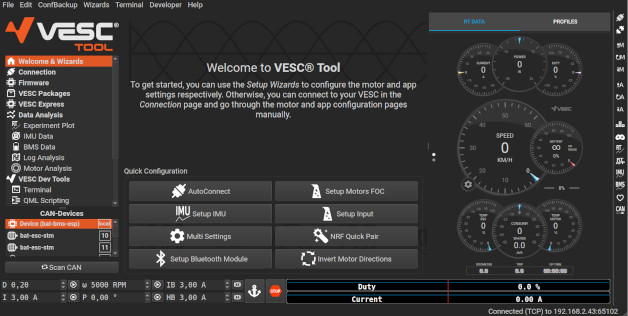

# Unsere Open Source Philiosophie

Willkommen im Entwicklerbereich von Second Ride.

Unsere Mission ist es, die Elektrifizierung der tausenden Fahrzeugemodelle da draußen genauso einfach zu machen, wie wir es für Simson Mopeds bereits gezeigt haben. Doch allein schaffen wir das nicht: Nur gemeinsam als Community können wir die Vielzahl aller Modelle digitalisieren und modelspzifische Adapterkits, Akkuhalterungen und Anleitungen entwickeln. 

Darüber hinaus wollen wir euch außerdem die Möglichkeit bieten Erweiterungen wie Displays, Soundmodule, IoT-Funktionen, Schaltgetriebe-Simulatoren, etc. zu entwickeln ... Dafür veröffentlichen wir hier alle dafür notwendigen Schaltpläne und Kommunikationsprotokolle.

!!! warning

    Wir freuen uns sehr über euren Beitrag zur Weiterentwicklung von Second Ride. Bitte seid euch jedoch bewusst, dass ihr mit eigenen Änderungen an Soft- oder Hardware folgende Punkte in Kauf nehmt: 
    1. Erlöschen der Haftung bzw. Garantie
    2. Erlöschen der Betriebserlaubnis
    3. Erhebliche Risiken für Personen und Sachgüter
    4. Pflicht, Risiken und Warnungen transparent aufzuzeigen

## Mechanische Integration in Fahrzeuge aller Art

Wir haben den MID50 Antrieb und Akku so entwickelt, dass mit einfach zu entwickelnden und fertigenden Adaptern die Module in quasi alle Fahrzeuge im Hubraumbereich bis 125 ccm und mit Ketten- oder Riementrieb integriert werden können. Damit ihr nicht darauf warten müsst, dass wir diese Adapter für eure jeweiligen Fahrzeuge entwickeln, stellen wir alle Ressourcen bereit, die ihr dafür braucht. Dies beinhaltet: 
- 3D-Modelle von Motor und Akku 
- 2D-Zeichnungen mit Bemaßung der Anschlusspunkte 
- Zeichnungen der bereits entwickelten Adapterteile zur Referenz 
- 3D-Scans von Fahrzeugen (wenn ihr Zugriff auf einen 3D-Scanner habt, fügt eure Modelle ebenso hier hinzu) 

## Motorsteuergerät des MID50 Antrieb

Beim Motorsteuergerät haben wir bewusst auf das Open Source Projekt **[VESC](https://vesc-project.com/)** gesetzt. Es ist eines der am weitesten entwickelten und funktionsreichsten Motorsteuergeräte auf dem Markt. Das VESC-Projekt macht vor allem die geniale Software aus. Softwareseitig sind endlose Weiterentwicklungen basierend auf dieser Plattform denkbar.

  
  

## Wie wir trotz Open Source straßenverkehrskonform, sicher und haftbar bleiben

Es war eine schwierige Aufgabe, MID50 so zu gestalten, dass wir einerseits euch möglichst viele Freiheiten lassen können, andererseits aber 
- keine Gefahr durch gefährliche Modifikation von dem Akku ausgehen kann, 
- das System sicher gegen Tuning nach der Änderungsabnahme ist (Anforderung für die Zulassung), 
- wir nicht mit Garantiefällen oder Kundensupport überhäuft werden, welche durch Modifikation des Systems entstehen. 

### 1. Sicherheit

Lithium-Ionen-Akkus sind, wenn man sie innerhalb ihrer elektrischen, thermischen und mechanischen Grenzen betreibt, heutzutage sehr sicher. Die Brände, von denen man leider immer wieder liest, sind unserer Erfahrung nach oft darauf zurückzuführen, dass mindestens eine dieser drei Grenzen nicht eingehalten wurde. Wir haben uns daher entschieden, den Akku inkl. BMS komplett Closed Source zu gestalten und bitten euch, das zu respektieren. 

Auch von falscher Konfiguration des Motors kann eine große Gefahr für euch und andere ausgehen. Unserer Ansicht nach sind diese Risiken aber für Laien besser einschätzbar. Trotzdem seid bitte extrem vorsichtig und bedenkt, dass jegliche sicherheitsrelevante Änderungen zum Erlöschen der Betriebserlaubnis im Straßenverkehr führen (siehe nächstes Kapitel). 

### 2. Straßenverkehrskonformität

Im deutschen und EU-Recht ist vorgeschrieben, dass wenn Fahrzeuge einmal für den Straßenverkehr zugelassen wurden, Leistung und Geschwindigkeit gegenüber den in den Fahrzeugpapieren angegebenen Werten nicht mehr gesteigert werden dürfen, ohne eine Änderungsabnahme oder Neuzulassung durchzuführen. 

Daher haben wir zusätzlich zu dem Open Source Motorsteuergerät ein weiteres Closed-Source-Steuergerät namens "Malcolm" im Antrieb untergebracht, welches genau das sicherstellt. Wie in der Anleitung beschrieben (tbd), kann nach Kauf des Umbaukits die Drosselung frei gewählt und entweder vorübergehend oder endgültig gespeichert werden. Ist eure Drosselung endgültig gespeichert und ihr versucht, eine höhere Drehzahl oder höhere Leistung in dem VESC Motorsteuergerät zu programmieren, wird der Akku die Stromzufuhr des Akkus abschalten. Wollt ihr also z. B. euren Antrieb nur für Offroad-Einsatz nutzen, braucht ihr euren Antrieb nie endgültig zu drosseln und habt abgesehen von den Limits des Akkus keine Begrenzungen. 

Selbst wenn ihr aber nicht Leistung und Geschwindigkeit verändert, aber sonst irgendeine sicherheitsrelevante Änderung vornehmt, erlischt eure Betriebserlaubnis gemäß StVZO §19 (2) (solang ihr denn vorher überhaupt eine hattet). Ggf. könnt ihr die Betriebserlaubnis dann über eine Änderungsabnahme zurückerlangen. Sprecht dafür bitte mit den technischen Sachverständigen eurer Wahl (TÜV, Dekra, KÜS, ...). 

### 3. Haftung / Gewährleistung / Garantie

Zu guter Letzt müssen wir uns auch noch davor schützen, für Schadensfälle, für die wir gar nichts können, haften zu müssen. Es muss klar sein, dass Modifikationen an Software und Hardware schnell zu Schäden an unserem Produkt, aber auch zu Personen- und Sachschäden führen **können**. 

- Jegliche Veränderungen von Software oder Hardware durch Dritte (außer Second Ride) führen zum Erlöschen der Haftung und Gewährleistung. Solche Änderungen bergen erhebliche Risiken für Personen und Sachgüter. 
- Ausnahme: Updates, die offiziell von Second Ride stammen, dürfen selbstverständlich auch durch Dritte (z. B. Händler, Werkstätten) aufgespielt werden – außer wir kommunizieren explizit etwas anderes. 

**Software umfasst insbesondere:** 
- Firmware 
- Parameter 
- Steuerungs- und Konfigurationssoftware aller elektronischen Steuergeräte (insbesondere VESC-bezogen) 

**Hardware umfasst insbesondere:** 
- Modifikationen an der Antriebseinheit 
- Anschließen oder paralleles Schalten von Fremdakkus 
- Weitere Änderungen, die sicherheitsrelevante Komponenten betreffen 