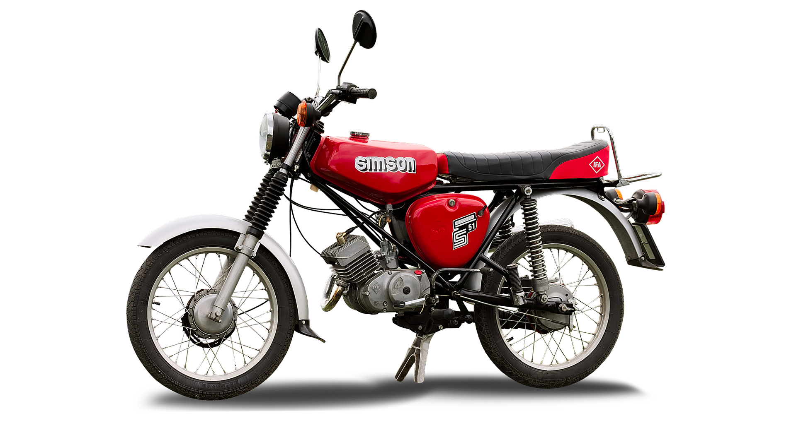
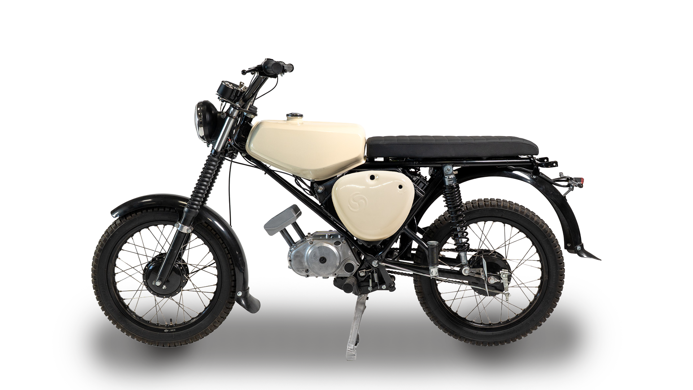
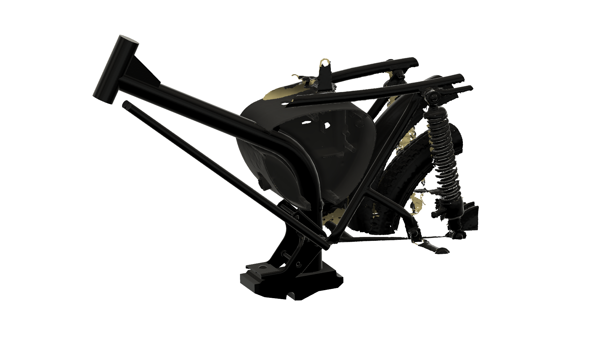
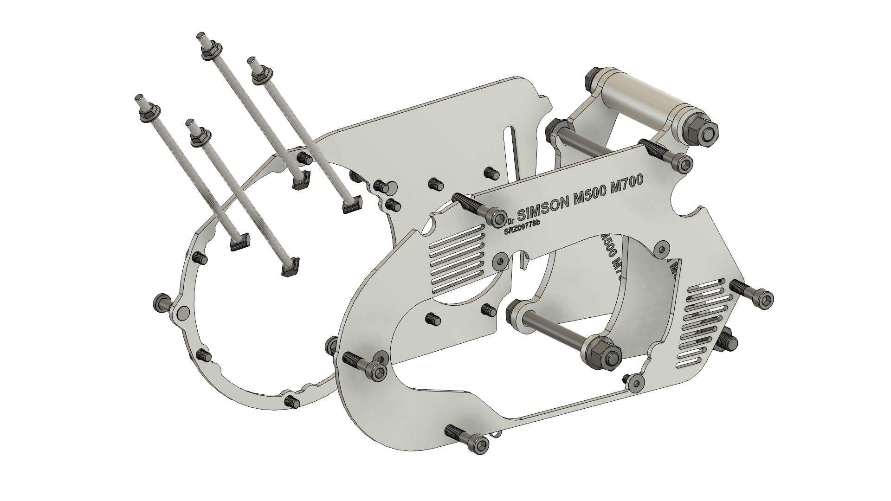
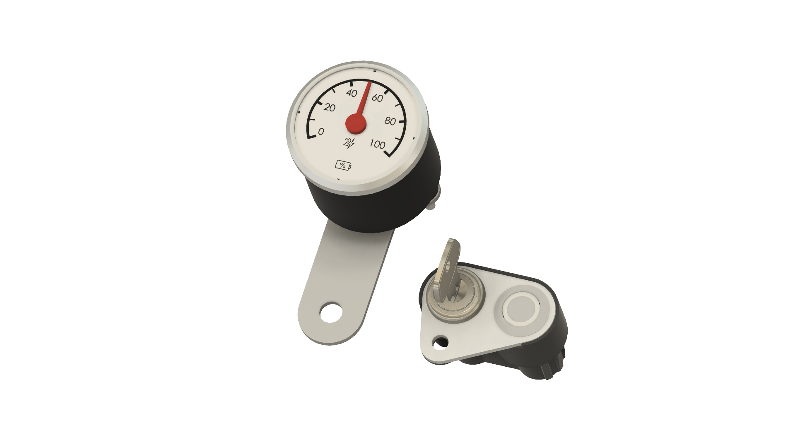

# Simson S50 / S51

!!! success "Von Second Ride freigegeben"

    Das MID50 Umbaukit für Simson S50/S51 ist fertig entwickelt und im [Shop](https://second-ride.de/shop) verfügbar.

=== "Foto vor der Elektrifizierung"

    

=== "Foto nach der Elektrifizierung"

    

---

## Dokumentation zum Fahrzeug

### Allgemeine Technische Daten
| Eigenschaft                                               | Wert                          |
| :---------------------------------------------------------| :-----------------------------|
| Modellbezeichnungen                                       | S50, S51                      |
| Höchstgeschwindigkeit                                     | 60 km/h                       |
| Originale Motorleistung                                   | 3,6 PS / 3,7 PS (S50 / S51)   |
| Baujahre                                                  | 1975 - 1989                   |

### Maßstabsgetreue Zeichnungen

=== "Vorschaubild"

    

=== "3D Model"

    Wir überarbeiten gerade diese Daten, bitte komme später noch ein mal wieder

=== "2D Zeichnung"

    Wir überarbeiten gerade diese Daten, bitte komme später noch ein mal wieder
    
### Bordnetz

<iframe 
    src="technical-vehicle-docs/S50-51-70-schaltplan-v2.pdf" 
    width="100%" 
    height="450px">
    Dieser Browser unterstützt keine PDFs. 
    <a href="technical-vehicle-docs/S50-51-70-schaltplan-v2.pdf">PDF herunterladen</a>
</iframe>

---

## MID50 Adaption für die Simson S50 / S51

| Meilenstein                                               | Status                          |
| :---------------------------------------------------------| :---------------------------------------|
| 3D Scan                                                   | :white_check_mark: vorhanden            |
| Adapterkit für Antrieb                                    | :white_check_mark: entwickelt & im Shop erhältlich           |
| Akkuhalterung                                             | :white_check_mark: entwickelt & im Shop erhältlich           |
| Umbau- und Bedienungsanleitung                            | :white_check_mark: veröffentlicht           |
| Teilegutachten                                            | :white_check_mark: vorhanden             |

### MID50 Adapterkits

=== "Vorschaubild"

    

=== "3D Model"

    Werden wir bald hier veröffentlichen.

=== "2D Zeichnung"

    Werden wir bald hier veröffentlichen.

### MID50 Akkuhalterung

=== "Vorschaubild"

    

=== "3D Model"

    Werden wir bald hier veröffentlichen.

=== "2D Zeichnung"

    Werden wir bald hier veröffentlichen.

### MID50 Armaturen

=== "Vorschaubild"

    

=== "3D Model"

    Werden wir bald hier veröffentlichen.

=== "2D Zeichnung"

    Werden wir bald hier veröffentlichen.

### MID50 Anleitung

Bald werden jeweils Anleitungen in den Kapiteln [Umbauanleitung](/conversion-manual/MID50) und [Bedienungsanleitung](/user-manual/MID50) erscheinen.

## Referenzen
Auf den Social Media Kanälen von Second Ride sind viele Beispiele zu sehen wie die S51 mit MID50 aussieht.

## Sonstiges
