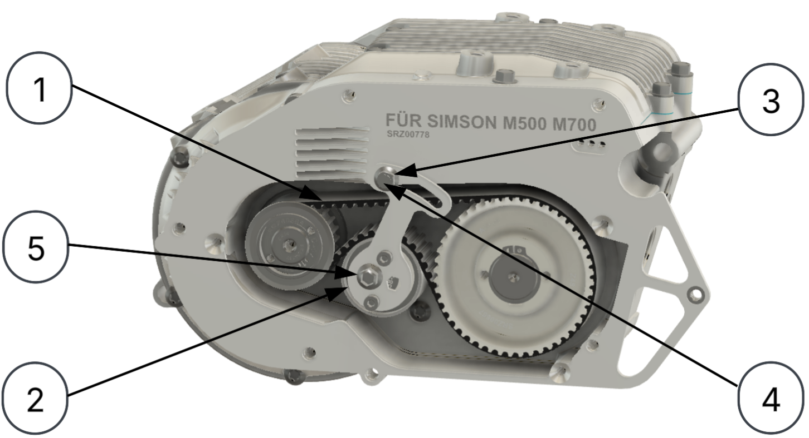
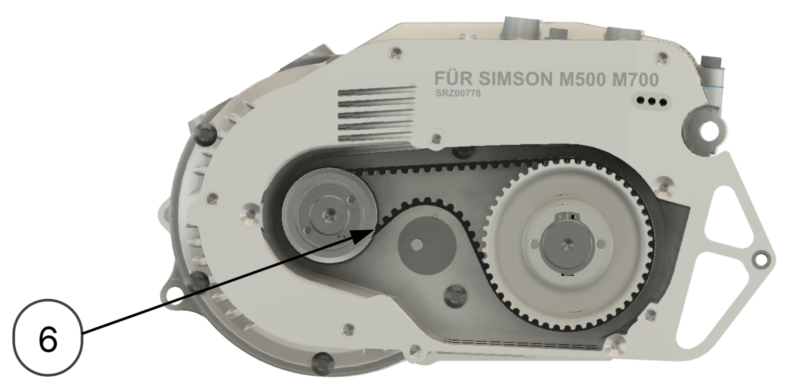
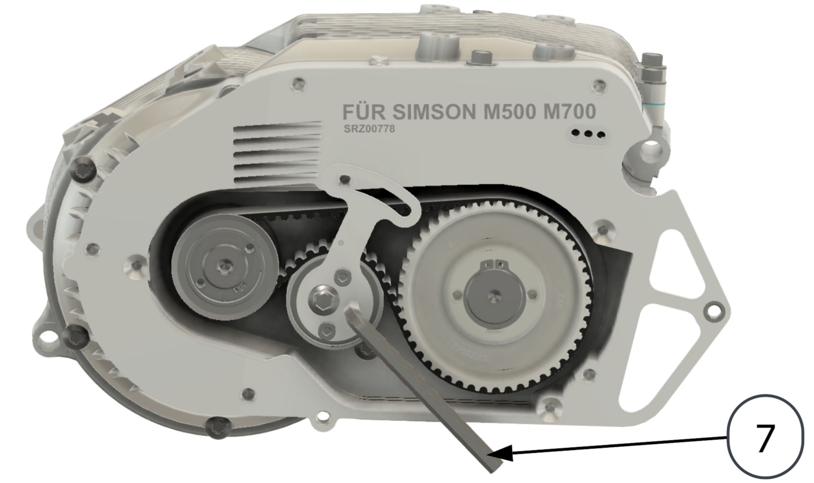
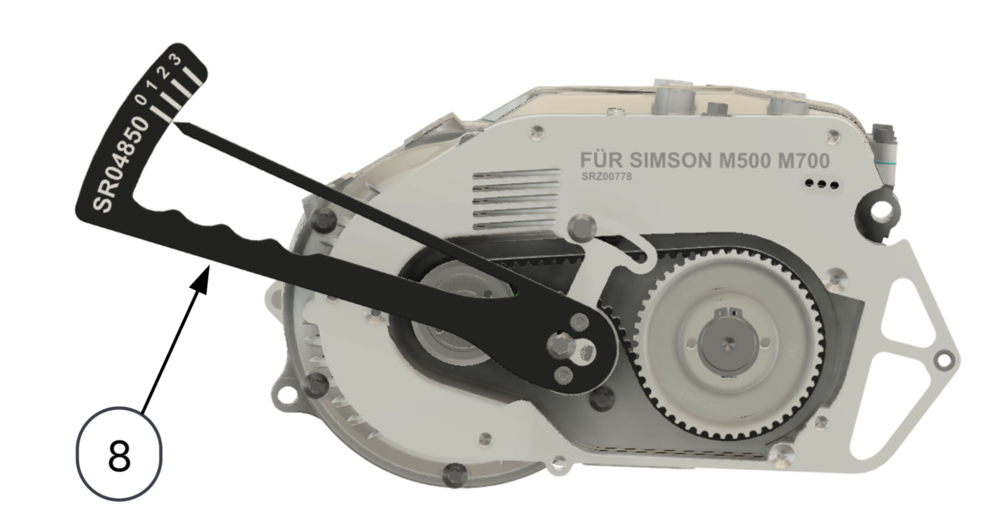

# Bedienungsanleitung – MID50

## Ein- und Ausschalten

Um das Fahrzeug einzuschalten, einfach den Akku in die Akkuhalterung einsetzen und das Zündschloss einschalten (Schlüssel 45° im Uhrzeigersinn drehen). Nach maximal 5 Sekunden macht dann die Ladestandsanzeige einen Funktionstest (Zeiger fährt bis zum maximalen Anschlag und wieder zurück) und das Bordnetz des Fahrzeugs wird mit 12V versorgt. Wenn das originale Simson-Zündschloss auf der Stellung "II" ist und du keinen Fehler im Bordnetz hast, sollten dabei die Lichter angehen.

Nun ist das Fahrzeug im inaktiven Fahrbetrieb, was durch die an und aus dimmende LED im Armaturen-Taster angezeigt wird. Wenn du nun den Armaturen-Taster einmal kurz drückst, leuchtet dieser durchgängig und du befindest dich im aktiven Fahrbetrieb. Wenn du nun Gas gibst, beschleunigt das Fahrzeug. Wenn du das Fahrzeug in den aktiven Fahrbetrieb bringst, während das Gas-Signal mehr als 0% beträgt, wartet das System bis das Gas-Signal einmal auf 0% gesenkt wird, bevor es das Gas annimmt.

**Achtung**: Es ist ungewohnt, dass kein Motorgeräusch zu hören ist ;)

Wenn du die Fahrt beenden möchtest, kannst du entweder das Zündschloss wieder ausschalten (Schlüssel gegen den Uhrzeigersinn drehen), was das gesamte Fahrzeug ausschaltet, oder nochmal den Taster drücken, was das Fahrzeug wieder in den inaktiven Fahrbetrieb versetzt.

Nach 10 Minuten ohne Verwendung des Gasdrehgriffs schaltet das Fahrzeug automatisch in den inaktiven Fahrbetrieb, um unbeabsichtigtes Beschleunigen vorzubeugen.

---

## Armaturentaster-LED

Nachfolgend alle Leuchtzeichen, welche die LED im Armaturentaster anzeigen kann:

| Leuchtmuster | Bedeutung |
|---|---|
| LED dimmt einmal an und wieder aus | Inaktiver Fahrbetrieb. Licht und Hupe funktionieren, das Fahren jedoch nicht. |
| LED dauerhaft an | Aktiver Fahrbetrieb ohne Fehler. |
| LED blinkt: 2 s lange an, dann 0,2 s aus, wieder 2 s lange an | Aktiver Fahrbetrieb mit gedrosselter Leistung. |
| Doppelblinken, kurze Pause, Doppelblinken | Konfigurationsmodus. |
| Nach Drücken des Tasters blinkt die LED drei Mal kurz und ist dann aus | Batterie leer. Bitte aufladen. |

---

## Beschleunigen

Im Unterschied zum Fahren mit Verbrennungsmotor, muss keine Kupplung betätigt, nicht geschaltet und kein Kickstarter bedient werden. Beschleunigt wird wie beim originalen Fahrzeug durch das Drehen des Gasdrehgriffs. Beachte, dass der Elektromotor schneller beschleunigt und kleinere Bewegungen am Gasdrehgriff notwendig sind.

---

## Bremsen

Die Bedienung der Bremsen bleibt unverändert. Jedoch ist zu beachten, dass, sobald der Bremskontakt betätigt ist, das Fahrzeug kein Gas annimmt und rekuperiert (= Motor bremst und lädt Akku). Wenn der Tasterkontakt wieder geöffnet wird und dabei kein Gas gegeben wird, ist die Gasannahme wieder möglich. Dies ist ein Sicherheitsmechanismus, den wir vorgesehen haben, damit man im Fall, dass das Fahrzeug unbeabsichtigt beschleunigt, den Motor sicher wieder außer Betrieb nehmen kann.

---

## Rekuperation

Wenn du vom Gas gehst, fängt der Elektromotor an zu bremsen. Dabei wandelt er deine Bewegungsenergie in elektrische Energie um und speist diese wieder in deinen Akku zurück. Das nennt man im Fachjargon Rekuperation. Rekuperation verlängert deine Reichweite und die Lebensdauer deiner Bremsen. Eine echte Win-Win-Situation!

Wenn der Akku ganz voll geladen ist, ist die Rekuperation jedoch ausgeschaltet, da sonst der Akku überladen werden würde. Der Motor ist dann einfach im Leerlauf, wenn du vom Gas gehst. Auch wenn sich die Akkutemperatur außerhalb von 0…+45°C befindet, wird die Rekuperation unterbunden.

**Achtung!** Beachte bei nasser oder glatter Straße, dass zu starke Rekuperation den Hinterreifen ins Rutschen bringen kann. Du kannst die Stärke der Rekuperation kontrollieren, indem du den Gasdrehgriff weniger oder mehr drehst.

---

## Licht

Das Simson-Zündschloss dient nun nur noch zum Auswählen zwischen Stellung "II" (Licht an, Hupe und Blinker funktionsfähig) und Parklicht auf der vierten Stellung im Uhrzeigersinn. Stelle vor jeder Fahrt sicher, dass das Simson-Zündschloss auf der dritten Stellung im Uhrzeigersinn steht, da sonst Blinker, Hupe und Lichter evtl. nicht funktionieren.

Das Licht schaltet sich von selbst aus, wenn die Zündung des Umbausatzes auf die Aus-Stellung gedreht wird.

Wenn die Ladestandsanzeige bei 0% ist, ist der Fahrbetrieb zwar nicht mehr möglich, aber das Licht funktioniert noch weiter. Nutze es dann aber nur noch in Notfällen, da eine regelmäßige Entladung unter dieser Grenze die Lebensdauer des Akkus vermindert. Sinkt die Spannung des Akkus dann noch weiter, schaltet das Batteriemanagement-System im Akku den Strom ab. Um eine lange Lebensdauer des Akkus zu bewerkstelligen, solltest du das nicht zu oft passieren lassen.

---

## Ladestandsanzeigen

Der Umbausatz verfügt über zwei Ladestandsanzeigen: eine an den Armaturen und eine am Akku. Die Ladestandsanzeige an den Armaturen ist immer aktiv, wenn das Zündschloss betätigt und der Akku angesteckt ist. Die Ladestandsanzeige des Akkus hingegen muss mittels Berührung der linken oberen Ecke der Akkuanzeigenoberfläche angeschaltet werden und schaltet dann nach wenigen Sekunden selbst wieder aus.

---

## Akku aufladen

Zum Aufladen des Akkus muss dieser dem Fahrzeug entnommen werden und das Ladegerät mit dem Akku und einer normalen Haushaltssteckdose (230 VAC 50-60 Hz) verbunden werden. Die im Ladegerät verbaute/-n LED zeigt dabei den Status an:

| Ladegerät Modell: | 0,4 kW | 1,0 kW |
|---|:---:|:---:|
| **Kein Akku verbunden** | 🟢 grüne LED dauerhaft an | 🟢 …1 s… ⚫ …1 s… grüne LED blinkt im 2 s Takt |
| **Akku lädt** | 🔴 rote LED dauerhaft an | 🔴 rote LED dauerhaft an |
| **Akku ist voll oder sperrt das Laden** | 🟢 grüne LED dauerhaft an | 🟢 grüne LED dauerhaft an |

Auf dem Gehäuse des 1 kW Ladegeräts sind noch für verschiedene Fehlerfälle andere LED-Muster beschrieben.

Das Laden ist nur in einem Temperaturbereich von 0–45°C möglich. Außerhalb dieses Temperaturbereiches verhindert das Batteriemanagement-System das Laden. Das macht sich insofern bemerkbar, als dass das Ladegerät anzeigt, der Akku sei voll, die Ladestandsanzeige des Akkus dem jedoch widerspricht. Lass den Akku dann einfach angesteckt, er wird von selbst weiter laden, sobald er wieder innerhalb seiner Komfortzone ist.

Für eine lange Lebensdauer des Akkus empfehlen wir den Akku im Winter bei Raumtemperatur zu lagern und ca. alle 3 Monate an das Ladegerät anzuschließen. Lagere die Batterie nicht über längere Zeit mit 0% Kapazität! Das könnte zu Tiefentladung und damit zu einer drastischen Reduktion der Lebensdauer führen.

Beide Ladegeräte sind nur für die Nutzung in Innenräumen, in nicht tropischem Klima und unter 2000 m über dem Meeresspiegel vorgesehen. Schütze beim Laden das Ladegerät, die Stecker und den Akku vor Feuchtigkeit. Stecke grundsätzlich keine feuchten Stecker ineinander.

Der Akku darf nur mit dem mitgelieferten oder anderen von uns explizit freigegebenen Ladegeräten und dazugehörigen Steckern geladen werden. Das Anschließen von anderen Geräten oder Steckern kann zu einer Beschädigung der Bauteile führen.

Der Ladevorgang sollte grundsätzlich nicht ohne Aufsicht durchgeführt werden und das Ladegerät nach Erreichung des maximalen Ladestands vom Strom und Akku getrennt werden.

---

## Handhabung des Akkus

Der Akku besitzt einen Tragegriff, mit dem der Akku getragen werden kann. Stelle den Akku nicht auf harten, kratzenden Oberflächen wie Stein ab, um Kratzer im eloxierten Aluminiumgehäuse zu vermeiden.

Ein Herunterfallen des Akkus kann zur Deformation des Gehäuses und damit dem Verlust der Wasserdichtigkeit führen. Es kann außerdem zu elektrischen Problemen im Inneren führen. Dieser Fall ist nicht von unserer Garantie abgedeckt.

Der Akku ist gegen Spritzwasser und Regen geschützt, allerdings sollte er nicht unter Wasser getaucht werden.

---

## Nutzungsempfehlung für lange Lebensdauer von Li-Ionen Akkus

Damit dein Akku dich so lange wie möglich begleitet, werden dir im folgenden ein paar Verhaltensweisen im Umgang mit einem Lithium-Ionen Akku an die Hand gegeben.

### Fahrbetrieb

Nutze deinen Akku am besten zwischen 20% und 80% Ladezustand. Das Vermeiden von häufigem Entladen bis auf 0% Ladezustand verlängert die Lebensdauer deines Akkus signifikant.  
Das bedeutet nicht, dass du deinen Akku nicht unter 20% Ladezustand fahren, sondern es möglichst zur Ausnahme als zur Regel machen solltest.  
Zusätzlich dazu ist es zu empfehlen, den Akku möglichst in einem Temperaturfenster von 15–35°C zu nutzen. Das ist zum Beispiel gut möglich, wenn der Akku nach der Fahrt mit in die Wohnung genommen wird und die Nacht nicht im Kalten verbringt. Benutzung unter 0°C und über 50°C sollte auch hier nur in Ausnahmefällen passieren und nicht zur Regel werden, da sonst die Akkualterung stark beschleunigt wird.

### Laden

Lade deinen Akku möglichst nur bis zu 80% Ladezustand im Alltag und auf 100%, wenn du mal die volle Reichweite benötigst. Lade lieber häufiger zwischen 20% und 80% Ladezustand als einmalig von 0% auf 100%.  
Solltest du den Akku auf 100% laden, tue dies am besten so, dass dein Akku nicht zu lange vollgeladen rumsteht, da dies schlecht für die Akkulebensdauer ist.  
Wenn du gerade von einer längeren Fahrt bei sehr warmen bzw. sehr kalten Temperaturen nach Hause kommst, gib dem Akku ruhig etwas Zeit, um sich an die Zimmertemperatur anzupassen, bevor du ihn lädst (2–3 h).  
Auch hier gilt wieder, dass es nicht notwendig ist, aber die Akkulebensdauer verbessert.

### Lagerung

Solltest du deinen Akku längere Zeit nicht benutzen wollen, empfehlen wir dir den Akku bei Raumtemperatur und einem Ladezustand von etwa 30–50% abzustellen. Dann hat dein Akku eine Selbstentladerate von 1–3% pro Monat, wodurch dein Akku am Ende einer Saisoneinlagerung noch ca. 24–42% Ladezustand hat. Schaue ab und zu nach dem Akkustand des Akkus und lade nach, sollte dieser zu niedrig werden, um schädliche Akku-Tiefentladung zu vermeiden.

### Motivation und Mehrwert der Akkupflege

Bei einer hauptsächlichen Nutzung des Akkus mit 20–80% Ladezustand, korrektem Ladeverhalten und Lagerung können somit aus unseren angegebenen 500 Zyklen leicht mehr als 1000 Zyklen Lebensdauer des Akkus werden. Dadurch hält dein Akku je nach Benutzung bis zu 45.000 km.

Das bedeutet, dass du bei einem Strompreis von 0,4 €/kWh, einem Spritpreis von 1,8 €/l und einem Verbrauch von 2,85 l/100 km satte 1.900 € (2 kWh Akku) Spritkosten sparen kannst. Damit hätte sich dein Kit nach der Lebensdauer des ersten Akkus zu einem Großteil selbst bezahlt gemacht.

---

## Reichweite Maximieren

Hier siehst du die Einflussfaktoren auf die Reichweite grob nach Relevanz sortiert.  
Die Reichweite ist bei folgenden Konditionen am höchsten:

1. Temperatur des Akkus bei 20–30°C (Bei 0°C ist die Reichweite ca. 30% geringer)
2. Keine Anstiege / Berge
3. Geringe Durchschnittsgeschwindigkeit
4. Geringes Gesamtgewicht
5. Hoher Reifendruck
6. Geringer 12V-Verbrauch (z.B. durch LEDs statt Glühbirnen)
7. Vorausschauendes Fahren: wenig bremsen und beschleunigen, sondern eine möglichst konstante Geschwindigkeit halten
8. Korrekte Kettenspannung

Die von uns ermittelten Reichweite von 55 km mit 2 kWh Akkukapazität ist durch diverse Testfahrten im Berliner Stadtverkehr bei ca. 20 °C Außentemperatur entstanden. Die Durchschnittsgeschwindigkeit im Berliner Stadtverkehr beträgt üblicherweise 30 km/h. Das Gewicht des Fahrers war dabei ca. 80 kg. Es wurde der von Simson empfohlene Reifendruck, originale Glühbirnen und die korrekte Kettenspannung verwendet. Der Fahrstil ist eher sportlich (es macht zu viel Spaß, als dass wir an dieser Stelle Energie sparen können…).

---

## Notlauf und Notabschaltung

Wenn die Temperatur des Akkus außerhalb von -10…+50°C ist, oder der Akku 15% oder weniger Ladung hat, wird bei weiter steigender Temperatur oder fallendem Ladezustand die Maximalleistung linear gedrosselt. Das ist eine Maßnahme, die deinen Akku schützt und die Lebensdauer des Akkus verlängert. Die Drosselung wird durch eine kontinuierlich blinkende LED angezeigt. Wenn die Temperatur außerhalb von -20…+60°C ist, schaltet der Akku komplett ab, bis die Temperatur sich wieder in den Bereich zurück bewegt hat. Die Nutzung des Tasters, des Lichts oder des Motors ist dann nicht mehr möglich.

Die Rekuperation und Aufladung des Akkus ist nur im Temperaturbereich 0…+45°C möglich. Wenn man z.B. bei 48°C Akkutemperatur vom Gas geht, rollt das Fahrzeug also einfach aus, statt wie gewohnt leicht zu bremsen. Wenn man bei gleicher Temperatur den Akku mit dem Ladegerät verbindet, wird das Ladegerät anzeigen der Akku sei voll. Den tatsächlichen Ladezustand könnt ihr dann nur an der Ladestandsanzeige des Akkus ablesen. Mehr dazu findet ihr im Kapitel *Akku aufladen*.

Damit du also dein Fahrzeug möglichst ohne Einschränkungen nutzen kannst, lohnt es sich auf ein paar Dinge zu achten:

1. Im Sommer das Fahrzeug und den Akku in den Schatten stellen
2. Im Winter das Akkupack bei Raumtemperatur und Ladezustand von 20–50% lagern
3. Das Aufladen des Akkus (besonders beim 1 kW Ladegerät) nicht direkt vor der Fahrt machen
4. Last beim Fahren gering halten (siehe *Reichweite Maximieren*)

---

## Diebstahlschutz

Zum Abschließen einfach den Zündschlüssel nach links drehen und herausziehen. Der Akku wird mit dem Sitzbankschloss auf der linken Seite am Fahrzeug gesichert.

---

## Reinigung

Bitte keinen Hochdruckreiniger und keine chemischen Reinigungsmittel zum Reinigen des umgebauten Fahrzeugs benutzen. Verwende am Besten einfach einen nassen Lappen und Seife bzw. Fit-Wasser ;).

---

## Riemen Wartung und Tausch

<a href="https://second-ride.de/riemenanleitung-als-video?utm_source=anleitung">Unter diesem Link findest du das folgende Kapitel als Videoanleitung.</a>

!!! warning "Warnung Zuerst Akkus entfernen"
    Für folgende Schritte müssen alle Akkus aus dem System entfernt sein und der Schlüssel gezogen sein, um ein Drehen des Antriebs während der Wartung des Systems zu verhindern.

Der Riemen des MID50 Antriebmoduls ist ein Verschleißteil, welches in einem Wartungsintervall präventiv getauscht werden muss, damit ein Versagen auf der Straße nicht zum Liegenbleiben führt.

!!! warning "Riementauschintervall"
    Nach 5000 km sollte der Riemen getauscht werden, um ein Versagen auf der Straße zu vermeiden.

### Riemenwechsel

Um den Riemen (1) zu wechseln, musst du zuerst den Seitendeckel des Antriebsmoduls abschrauben. Darunter sitzt der Riementrieb. Sobald dieser frei ist, ist der Riemenspanner (2) zu entfernen. Das machst du, indem du die M5 Mutter (3) und dann den Gewindestift (4) am Riemenspanner und dann die zentrale Schraube (5) des Riemenspanners löst.

  

Jetzt solltest du den Riemenspanner abnehmen können. Um den Riemen nun entfernen zu können, beginne ihn an der gezeigten Stelle (6) herauszunehmen.

  

Setze nun den neuen Riemen so ein, wie er auch im Antriebsmodul verläuft. Achte dabei darauf, dass du ihn nicht zu sehr biegst oder gar knickst, sonst können die Carbonzugstränge im Riemen brechen, was zum frühzeitigen Versagen des Riemens führen würde. Sobald der Riemen richtig in den Riemenscheiben sitzt, kannst du den Riemenspanner wieder an seine ursprüngliche Position setzen und die zentrale Schraube (5) des Riemenspanners einschrauben. Drehe diese fest und drehe sie dann eine halbe Umdrehung zurück, so dass der Riemenspanner gerade so schwenkbar ist.

Spanne nun den Riemenspanner mit einem 6 mm-Inbusschlüssel (7) in der dafür vorgesehenen Werkzeugaufnahme, wie unten abgebildet, bis es möglich ist, den M5 Gewindestift (4) in die Bohrung zu schrauben. Achte hierbei darauf, dass du den Stift gerade und nicht schief in das Gewinde schraubst, sonst könnte das Gewinde beschädigt werden. Schraube diesen so weit rein, dass gerade genug Gewinde für die M5 Mutter (3) übrig ist. Schraube diese locker auf, sodass sie nicht klemmt.

  

Nimm nun den Riemenspannschlüssel (8) wie unten dargestellt und spanne diesen, bis der Zeiger auf der Skala auf Stufe 3 zeigt. Achte hierbei darauf, nur die vier Finger in den vorgesehenen Vertiefungen zu nutzen. **Auflegen des Daumens verfälscht die Messung.**

Halte die Spannung und ziehe die M5 Mutter (3) mit 5 Nm an. Im Anschluss kannst du den Riemenspannschlüssel (8) abnehmen und nun die zentrale Schraube (5) des Riemenspanners mit 8 Nm festziehen.

  

### Riemen Diagnose

**Geräusche:** Sollte der Antrieb seltsame Geräusche machen oder beim Beschleunigen ruckeln oder ein Knackgeräusch von sich geben, spricht das dafür, dass der Riemen überspringt. Durch das Überspringen ist er vorgeschädigt und kann bei der Fahrt plötzlich kaputt gehen. Du solltest den Riemen daher austauschen.

**Visuell:** Es ist normal, wenn der Riemen etwas Abrieb produziert und sich etwas schwarzer Gummistaub ablagert. Wenn du allerdings Beschädigungen am Riemen siehst, wie gelöste Gummistücke am Riemen oder Risse, solltest du den Riemen tauschen.

---

## Sonstige Wartung

Im Vergleich zum originalen Verbrennungsmotor ist der Umbausatz deutlich wartungsärmer. Es empfiehlt sich lediglich, die beweglichen Teile einmal im Jahr zu schmieren. Alle mechanischen Schlösser solltest du mit ein paar Tropfen Öl schmieren und die Kette und den Tachoantrieb mit Maschinenfett. Sollte die Kette verschlissen sein, sollte diese gewechselt werden. Das Antriebskettenrad kannst du auf Anfrage bei uns nachbestellen, wenn es verschlissen sein sollte.
