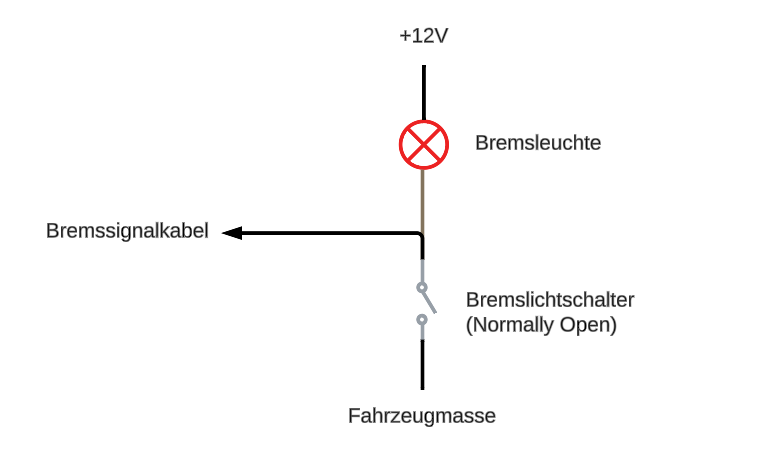

# Fehlerbehebung

Solltest du Probleme bei der Inbetriebnahme deines Umbausatzes haben, findest du unter folgendem Link Hilfe:

[second-ride.de/fehlerbehebung](https://www.second-ride.de/fehlerbehebung)

## Status LEDs Antriebsmodul

An der linken Seite des Antriebsmoduls befinden sich drei LEDs. Von links nach rechts haben sie folgende Bedeutung:

| | LED 1 – Systemstatus | LED 2 – Status der Drosselung | LED 3 – Error Code |
|---|---|---|---|
| **Motorabschaltung aktiv** | 🔴 Rote LED dauerhaft an | | |
| **Leistungsreduktion aktiv** | 🟡 Gelbe LED blinkt | | |
| **Inaktiver Fahrzustand** | 🟢 Grüne LED dauerhaft an | | |
| **Aktiver Fahrzustand** | 🟢 Grüne LED blinkt | | |
| **Konfigurationsmodus aktiv** | 🟣 Lila LED dauerhaft an | | |
| **System Legal NICHT gedrosselt** | | 🟡 Gelbe LED dauerhaft an | |
| **System Legal gedrosselt** | | 🟢 Grüne LED dauerhaft an | |
| **Error liegt vor** | | | 🔴 Rote LED blinkt mind. einmal. Anzahl des Blinkens zeigt Fehlernummer\*. Anschließend 3 s Pause |

\* Eine Tabelle mit Fehlernummern wird demnächst unter [docs.second-ride.de](https://docs.second-ride.de) veröffentlicht.

## Sonstige Tipps zur Fehlerbehebung

Falls dir das nicht weiterhilft, verfolge die Fehlerdiagnose im Folgenden.

**1. Weder die Ladestandsanzeige noch die Taster-LED geht an, wenn das Zündschloss betätigt wird.**

- Prüfe, ob die Steckverbindungen zwischen Zündschloss und Antriebsmodul, sowie Antriebsmodul und Akku richtig verbunden sind.
- Weiterhin könnte der Akku zu wenig Ladung haben oder die Temperatur des Akkus außerhalb von -20°C und 60°C sein. Sorge dann zuerst dafür, dass der Akku wieder Raumtemperatur annimmt (was einige Stunden dauern kann) und verbinde ihn dann mit dem Ladegerät.

**2. Keines der Bordnetz-Lichter geht an, wenn das neue Zündschloss betätigt wird, und das Simson-Zündschloss auf der Stellung des Scheinwerfer- bzw. "II"-Symbols ist.**

- Prüfe, ob alle elektrischen Steckverbindungen zwischen Antriebsmodul und Bordnetz richtig verbunden sind.
- Ist das nicht das Problem, liegt es wahrscheinlich an deinem Bordnetz. Entweder hast du einen Kurzschluss oder irgendwo ist eine Verbindung nicht richtig. Im Falle eines Kurzschlusses schaltet das Antriebsmodul die Spannung aus. Dann kannst du mit einem Spannungsmessgerät keine Spannung zwischen dem 12 V und Masse-Kabel messen.

**3. Die Lichter gehen an, die Taster-LED leuchtet durchgängig, aber es lässt sich kein Gas geben.**

- Leuchtet die erste der drei Status LEDs **rot** auf der linken Seite des Antriebsmoduls? Dann denkt dein Antriebsmodul, dass die Bremse aktiviert ist und gibt den Motor nicht frei.  
  Falls ja, verbinde eines der roten 12V Kabel des Bordnetzkabels mit dem Ende des mitgelieferten Bremssignalkabels. Nun sollte die rote LED erloschen sein und beim Gas geben sollte der Motor sich anfangen zu drehen. Ist das der Fall, liegt der Fehler bei deinem Fahrzeug, siehe unten für weitere Diagnosen. Sollte die LED weiterhin rot leuchten, liegt es am Antriebsmodul. Bitte kontaktiere uns.
- Leuchtet dein Bremslicht, obwohl du nicht bremst? Dann liegt der Fehler bei deinem Bremslichtschalter. Dein Bremslichtschalter ist falsch eingestellt und muss justiert werden, sodass er nur dann schaltet, wenn du tatsächlich die Bremse betätigst. Dafür gibt es bei einem externen Bremslichtschalter eine Einstellschraube. Bei einem innenliegenden Bremslichtschalter musst du das Hinterrad ausbauen und die Kontaktfahne so verbiegen, dass der Kontakt nur hergestellt wird, wenn du bremst.
- Ist das Bremssignalkabel richtig angeschlossen, wie in der Umbauanleitung im Kapitel *Montage des Umbaukits → Akkuhalterung* beschrieben?
- Prüfe, ob am Motorabschaltungskabel 12V anliegen, wenn das Fahrzeug eingeschaltet ist und die Bremse NICHT betätigt wird. Wenn keine 12V anliegen, hast du ein Problem mit der Simson Elektrik und das Antriebsmodul empfängt daher das Signal zum Bremsen. Zur Veranschaulichung der korrekten Schaltung des Bremssignalkabels / Motorabschaltungskabels:

  

- Wenn die vorherigen Punkte nicht zutreffen, dann befolge die Anleitung im Kapitel *Montage des Umbaukits → Gaszug*, um die Leerlaufstellung des Kolbenschiebers noch einmal richtig einzustellen.

**4. Die Kette schleift an der Schwinge oder die Kettenschläuche passen nicht.**

- Prüfe, ob deine Stoßdämpfer die originale Länge haben. Ist das nicht der Fall, kann durch die andere Position der Schwinge die Kette schleifen.
- Prüfe, ob du die originalen Kettenschläuche und Kettenkasten verwendest und ob die Schläuche korrekt auf dem Kettenkasten montiert sind.

**5. Hilft das alles nichts, oder hast du ein ganz anderes Problem?**

Ruf uns an oder schreib in die Discord Gruppe (siehe Nützliche Links in der Umbauanleitung).

---

## Verlorene Schlüssel

Falls du deinen Zündschlüssel verlieren solltest, kannst du uns per E-Mail oder Discord kontaktieren. Wir benötigen dann nur die 3-stellige Nummer auf deinem Ersatzschlüssel.
