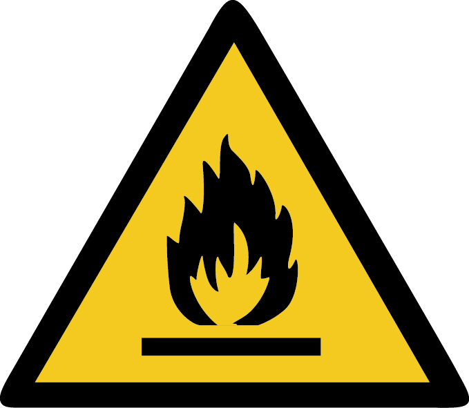
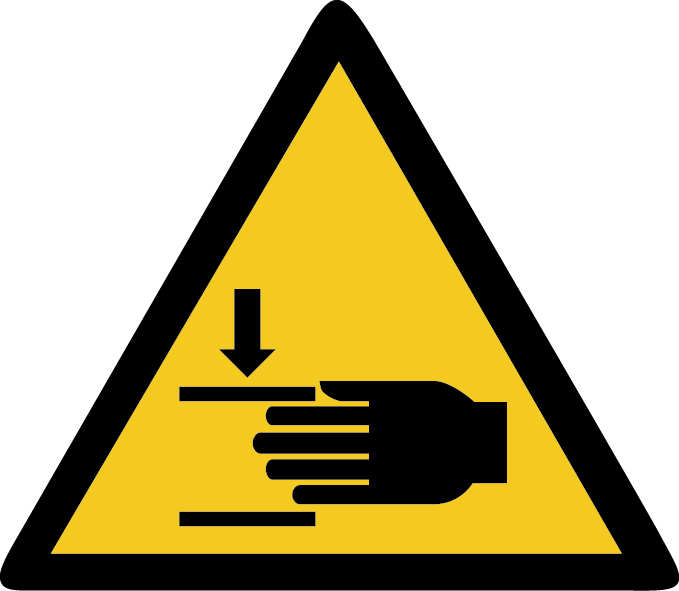
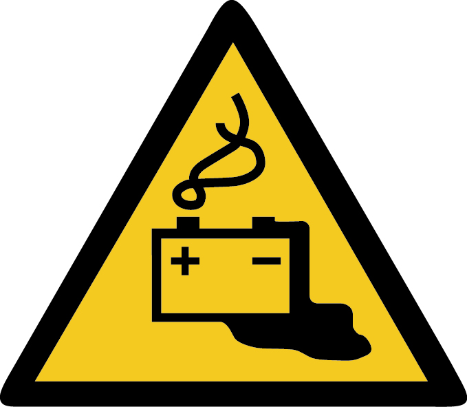
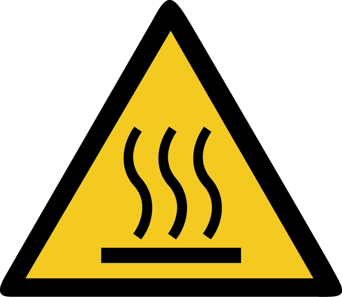

# Warnhinweise

| Warnzeichen | Bedeutung |
|---|---|
|  | **Der Akku enthält Lithium-Ionen-Zellen mit Nickel-Mangan-Kobalt-Kathoden (NMC). Diese Zellchemie birgt ein erhöhtes Brandrisiko. Besondere Vorsicht ist geboten, wenn die Zellen beschädigt sein könnten, wie z.B. nach einem Unfall.** |
|  | **Bitte öffne weder das Gehäuse des Akkus noch des Antriebsmoduls eigenständig. Es besteht eine hohe Gefahr, etwas kaputt zu machen oder sogar sich selbst zu gefährden. Besonders beim Akku ist der Zelltausch oder sonstige Reparaturen nur durch Second Ride oder benannte Servicepartner erlaubt.** |
|  | **Da dein Fahrzeug nun keine Kupplung mehr hat, ist es umso wichtiger darauf zu achten, dass der Gaszug reibungsarm funktioniert und nicht auf einer offenen Stellung hängen bleiben kann. Der Gasdrehgriff sollte aus der offensten Stellung allein mit Federkraft zurückschnappen. Bleibt er doch während der Fahrt hängen, kannst du die Fußbremse betätigen und damit die Motorleistung wegnehmen. Du kannst auch während der Fahrt über das neue Zündschloss das Fahrzeug abschalten oder mit dem Taster in den inaktiven Fahrbetrieb wechseln. Für Schäden, die durch einen hakenden oder trägen Gaszug entstehen, trägt die Second Ride GmbH keine Haftung.** |
|  | **Schließe die Sitzbank immer vor Inbetriebnahme des Fahrzeugs ab, da das Schloss nicht nur zur Diebstahlsicherheit, sondern auch zur festen Montage des Akkus am Fahrzeug dient.** |
|  | **Beim Einsetzen des Akkus besteht ein Risiko, sich die Hand einzuquetschen. Besondere Vorsicht ist geboten.** |
|  | **Im Antriebsmodul sind große Kondensatoren verbaut, welche die Batteriespannung für einige Minuten speichern können, nachdem der Akku abgesteckt wurde. Es kann also nicht nur auf dem Stecker in dem Akku eine Spannung anliegen, sondern auch auf dem Stecker, der vom Antriebsmodul kommt, sowie auf anderen Kabeln und Komponenten, welche mit dem Antriebsmodul verbunden sind.** |
|  | **Der Akku sollte nicht in Räumen oder an Orten gelagert werden, die Temperaturen von 60°C übersteigen. Dadurch entsteht ein Brandrisiko. Vermeide es den Akku zum Beispiel in den Innenräumen von Autos oder ähnlichen Räumlichkeiten aufzubewahren, die sich durch Sonneneinstrahlung aufheizen können.** |
|  | **Verwende nur Ladegeräte, die von der Second Ride GmbH für die Verwendung mit dem Umbausatz freigegeben wurden.** |
|  | **Das Antriebsmodul kann während der Fahrt heiß werden.** |
|  | **Nicht durch tiefes Wasser und nicht ohne vollständige Schutzbleche fahren. Antriebsmodul, Akku, Armaturen und Ladegerät dürfen nicht unter Wasser getaucht werden. Zum Reinigen keinen Hochdruckreiniger verwenden.** |
|  | **Das Umbaukit ist nur für die Verwendung im Straßenverkehr und auf ebenen Straßen geeignet. Das umgebaute Fahrzeug ist nicht für das Gelände oder Rennstrecken geeignet.** |
|  | **Beim Eintauchen von Akku, Ladegerät, Antriebsmodul oder Armaturen in Wasser, Bauteile nicht berühren! Stromschlag! Akku und Ladegerät nicht nutzen. Bitte kontaktiere uns!** |
|  | **Wenn Gase oder Flüssigkeiten aus dem Akku kommen, atme diese nicht ein bzw. berühre diese nicht. Die Gase sind giftig und brennbar.** |
|  | **Bei Schäden am Akkugehäuse oder Antriebsmodul, kontaktiere uns bitte, da Akkuzellen oder elektrisch-leitfähige Teile beschädigt sein könnten.** |
|  | **Beim An- und Abstecken des Akkus vom Fahrzeug oder dem Ladegerät können Funken entstehen. Betätige den Stecker daher niemals an explosionsgefährdeten Orten.** |
|  | **Wenn du irgendeine Form von Beschädigung, Materialfehler, Gasaustritt, etc. an Akku, Ladegerät oder Antriebsmodul entdeckst, informiere uns, bevor du den Fahrbetrieb oder Ladebetrieb aufnimmst.** |
|  | **Lade den Akku nur unter Beobachtung, da Brandgefahr herrscht. Informiere dich über geeignete Löschmaßnahmen.** |
