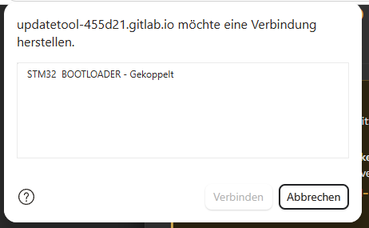
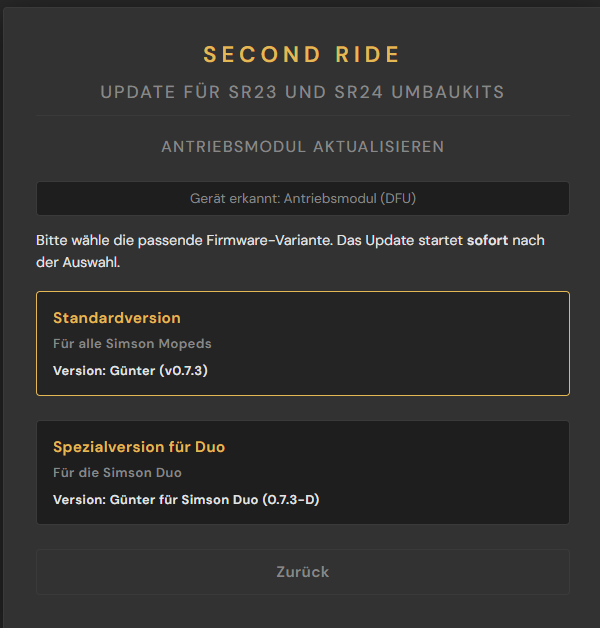
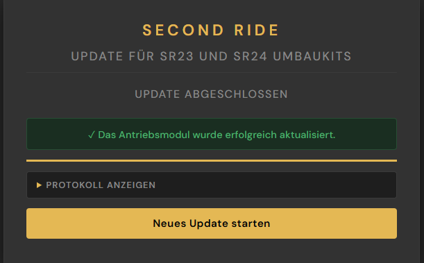
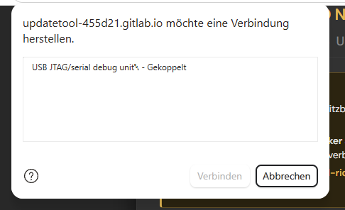
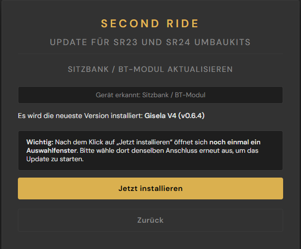
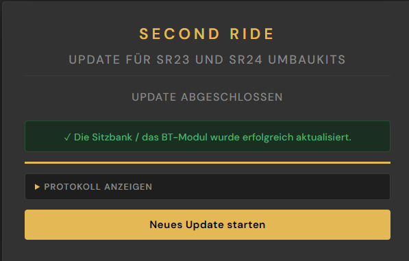

# Anleitung zum Firmwareupdate
> [!info] Info
>
> Der folgende Prozess gilt nur für die Second Ride Umbaukits SR23 und SR24. Die Umbaukits SR23 und SR24 werden nicht länger produziert und wurden durch das MID50 Umbaukit ersetzt.

Seit April 2025 werden alle Komponenten des Umbausatzes mit dem neuen Webupdate-Tool programmiert. Das bisherige Programm „DFU Buddy“ wird nicht mehr verwendet. Mit dem Webupdate-Tool kannst du dein Moped bequem und sicher über den Chrome-Browser aktualisieren: [Link zum Webupdatetool](https://second-ride.de/update)		

## Was wird eigentlich aktualisiert?


Die Firmware ist die Software, die das Verhalten deines Fahrzeugs bestimmt – also wie es beschleunigt, bremst, lädt oder den Ladezustand anzeigt. Wir entwickeln diese Software kontinuierlich weiter, um dir ein besseres Fahrerlebnis zu bieten. Über das Update-Tool kannst du diese Verbesserungen ganz einfach selbst installieren.

## Welche Komponenten benötigen Updates?


Je nach Ausstattung deines Umbausatzes betrifft das ein oder zwei Geräte:

- Antriebsmodul („Günter“)  
- Batterie („Gisela“), nur wenn deine Batterie über einen USB-C-Anschluss verfügt  
- Bluetooth-Modul, falls vorhanden

Ob ein neues Update verfügbar ist und was sich geändert hat, findest du in der [Änderungshistorie - Firmware](https://docs.google.com/document/d/16SFpTpeRKDW-OlozgDFcO0iHk5q1t2Q6hK-TyoXaMT0/edit?usp=sharing).

## Update vom Antriebsmodul („Günter“) 

> [!warning] Achtung
> Verbinde niemals gleichzeitig die Sitzbank und das Antriebsmodul mit deinem Computer über Kabel. Ziehe immer zuerst den Akku-Stecker ab, bevor du deinen Laptop mit der Sitzbank/BT-Modul oder dem Antriebsmodul verbindest.

> [!warning] Achtung
> Ein Firmware-Update verändert das Fahrverhalten. Es kann zu höherer Beschleunigung, höherer Endgeschwindigkeit, anderem Bremsverhalten, etc. kommen. Sei also bei den ersten Fahrten nach dem Update besonders Aufmerksam und Vorsichtig und verlass Dich nicht auf die bisherige Erfahrung mit dem Antrieb. Ließ Dir        außerdem die Änderungshistorie aufmerksam durch. 

> [!warning] Achtung
> Das Aufspielen der Duo-Firmware auf einem anderen Fahrzeug als der Duo führt dazu, dass die Betriebserlaubnis des Fahrzeugs erlischt. Das gleiche gilt, wenn die Nicht-Duo-Firmware auf der Duo installiert wird. 

Zunächst muss das Antriebsmodul an deinen PC angeschlossen werden. Gehe dazu wie folgt vor:

### 1. Suche das Diagnose-Kabel

#### 1.1. Langes Diagnose-Kabel (ab AM\#00193)

Bei Antriebsmodulen mit der Seriennummer \#00193 und höher sollte ein drittes. etwa 40cm langes Kabel unten aus dem Antriebsmodul kommen. Auf dem Stecker befindet sich eine Gummikappe. Ist dies der Fall, fahre mit Schritt 2 fort.

#### 1.2. Kurzes Diagnose Kabel (bis AM\#00193)
Bei Antriebsmodulen mit den Seriennummern \#00038 bis \#00192 findet ihr das Updatekabel wie folgt:

##### 1.2.1. Kabelblende abnehmen		 
Entferne die Kabelblende vom Antriebsmodul, indem du die M4-Zylinderkopf-Schraube (1) an der rechten Seite abnimmst. Dazu brauchst du einen 3 mm Inbus-Schlüssel. Sollte deine Kabelblende auf der Oberseite links in Fahrtrichtung einen ovalen Ausschnitt haben, dann versteckt sich darunter noch eine zweite M4         -Zylinderkopf-Schraube, welche Du nur eine Umdrehung lösen musst, um die Blende abnehmen zu können.

<p align="center">
  
</p>

##### 1.2.2. Diagnose-Kabel identifizieren

Nun hast du die Vehicle Control Unit (2) gefunden (Wir haben sie aus Liebe zu ihr “Günter” getauft). Von Günter geht ein kurzes Kabel (3) ab, welches nicht weiter verbunden und mit einer Gummikappe abgedeckt ist.

### 2. USB-Kabel anschließen

> [!warning] Achtung
> Die Batterie darf während des Updates aus Sicherheitsgründen nicht mit dem Antriebsmodul verbunden sein. Stelle sicher, dass die Sitzbank nicht angeschlossen ist.

Entferne die Gummikappe und schließe das mitgelieferte USB-Kabel an. Wichtig: Achte darauf, dass die Pfeile auf dem männlichen und weiblichen Stecker zueinander zeigen, bevor du sie mit Kraft zusammen schiebst. Schließe das USB Kabel anschließend an deinen PC an.

### 3. [Webupdatetool öffnen](http://Second-ride.de/update):  → Funktioniert nur mit Google Chrome (oder anderen Chromium-Browsern wie Edge).

### 4. Gerät erkennen:  
   Klicke im Bereich „Antriebsmodul aktualisieren“ auf „Gerät erkennen“.  

   <p align="center">
  
</p>

### 5. Gerät im Browser auswählen:  
   Es öffnet sich ein Auswahlfenster deines Browsers. Wähle dort den Eintrag „STM32 BOOTLOADER“ aus und bestätige mit „Verbinden“.  

   <p align="center">
  
</p>

### 6. Firmware-Variante wählen:  
   Das Tool erkennt das Antriebsmodul und zeigt dir die verfügbaren Firmware-Varianten an. Wähle die für dein Fahrzeug passende Version aus:

- **Standardversion**: für alle Simson Mopeds
- **Spezialversion für Duo**: nur für die Simson Duo

> [!warning] Achtung
> Das Update startet sofort nach Auswahl der Firmware-Variante. Stelle vorher sicher, dass die Kabelverbindung stabil ist – ein Verbindungsabbruch kann die Elektronik beschädigen.

<p align="center">
  
</p>

### 7. Abschluss:  
   Nach erfolgreichem Update erscheint eine Bestätigungsmeldung.   
   Nun kannst du das Kabel wieder von dem Diagnosestecker und deinem Laptop trennen.

   <p align="center">
  
</p>

## Update von Sitzbank / Bluetooth-Modul {#update-von-sitzbank-/-bluetooth-modul}

Damit die App korrekt funktioniert, muss die Firmware-Version der Sitzbank bzw. des BT-Moduls in der ersten Ziffer mit der App-Version übereinstimmen. Z.b.: Gisela V1.0.0 ist kompatibel mit App V1.1.3. Gisela V1.0.0 ist nicht mit App V2.0.0 kompatibel.  
 Die App-Version findest du in der App unten, wenn du auf das Info-Symbol oben links tippst.

> [!warning] Achtung
> Verbinde niemals gleichzeitig die Sitzbank und das Antriebsmodul mit deinem Computer über Kabel. Ziehe immer zuerst den Akku-Stecker ab, bevor du dein Laptop mit der Sitzbank oder dem Antriebsmodul verbindest. 
    

### 1. Sitzbank / BT-Modul anschließen
Verbinde die Sitzbank bzw. das BT-Modul mit einem USB-C-Kabel über den USB-C Port neben dem Second Ride Logo mit deinem Laptop. Der USB-C Port an dem BT-Modul/Sitzbank sollte jetzt leuchten.

<p align="center">
  
</p>

### 2. [Webupdatetool öffnen](http://Second-ride.de/update):  → Funktioniert nur mit Google Chrome (oder anderen Chromium-Browsern wie Edge).

### 3. Gerät erkennen:  
   Klicke im Bereich „Sitzbank & BT-Modul updaten“ auf „Gerät erkennen“.

<p align="center">
  
</p>

### 4. Gerät im Browser auswählen:  
   Es öffnet sich ein Auswahlfenster deines Browsers. Wähle dort den Eintrag „USB JTAG/serial debug unit“ aus (das ist die Sitzbank bzw. das BT-Modul) und bestätige mit „Verbinden“.

<p align="center">
  
</p>

### 5. Update installieren:  
   Das Tool erkennt das Gerät und zeigt dir die neueste verfügbare Firmware-Version an. Klicke auf „Jetzt installieren“.

> [!warning] Achtung
> Nach dem Klick auf „Jetzt installieren“ öffnet sich noch einmal ein Auswahlfenster deines Browsers. Wähle dort das einzige angezeigte Gerät aus, um das Update zu starten – es kann sein, dass es dort anders benannt ist als im vorherigen Auswahlfenster. Stelle vorher sicher, dass die Kabelverbindung stabil ist – ein Abbruch kann Schäden verursachen.

<p align="center">
  
</p>

### 6. Abschluss:  
   Nach erfolgreichem Update erscheint eine Bestätigungsmeldung. Jetzt kannst du die USB-C-Verbindung trennen.

<p align="center">
  
</p>

Wenn sowohl das Antriebsmodul als auch das Sitzbank-/BT-Modul auf die aktuelle Firmware aktualisiert wurden, kannst du die App wie vorgesehen nutzen und dein Fahrzeug koppeln.


Die nächsten Schritte zur App-Nutzung werden im folgenden Kapitel beschrieben.

## Troubleshooting: Linux (Ubuntu, Fedora, Arch, …)

Das Update-Tool nutzt WebUSB (Günter) und Web Serial (Gisela) – zwei Browser-APIs, für die Linux standardmäßig keine USB-Zugriffsrechte einräumt. Typische Fehlermeldungen: **„SecurityError: Access denied"** oder es wird kein Gerät im Browser-Dialog angezeigt, obwohl das Kabel korrekt angeschlossen ist.

### Schritt 1: udev-Regeln anlegen

Öffne ein Terminal und führe folgende Befehle aus:

```bash
sudo tee /etc/udev/rules.d/49-second-ride.rules > /dev/null << 'EOF'
# Second Ride - Guenter (STM32, DFU-Modus via WebUSB)
SUBSYSTEM=="usb", ATTRS{idVendor}=="0483", ATTRS{idProduct}=="df11", MODE="0664", TAG+="uaccess"

# Second Ride - Gisela (ESP32-S3, USB-Serial)
SUBSYSTEM=="usb", ATTRS{idVendor}=="303a", ATTRS{idProduct}=="1001", MODE="0660", TAG+="uaccess"
EOF

sudo udevadm control --reload-rules && sudo udevadm trigger
```

Dieser Befehl erstellt eine Konfigurationsdatei, die Linux mitteilt, dass Chrome auf die Second Ride Steuergeräte zugreifen darf. `TAG+="uaccess"` sorgt dafür, dass der aktuell angemeldete Benutzer automatisch Zugriff erhält. Ziehe das USB-Kabel danach kurz ab und stecke es wieder ein – kein Neustart nötig.

### Schritt 2 (nur Gisela): Serielle Gruppe

Auf den meisten Distributionen muss dein Benutzer außerdem Mitglied der Gruppe `dialout` sein, damit Chrome auf das serielle Gerät zugreifen kann:

```bash
sudo usermod -a -G dialout $USER
```

Danach **einmal ab- und wieder anmelden**, damit die Änderung wirksam wird.

> [!info] Hinweis
> Diese Anleitung gilt für systemd-basierte Distributionen (Ubuntu ≥ 20.04, Fedora, openSUSE, Arch, …). Wie die Gruppenberechtigungen auf deiner Distribution konfiguriert sind, erfährst du in der jeweiligen Dokumentation – eine gute Übersicht bietet die [Arch Wiki: udev](https://wiki.archlinux.org/title/Udev#Allowing_regular_users_to_use_devices).

---

Falls du noch die vorherige Version des Webupdate-Tools vor dir hast, findest du die dazu passende Anleitung hier: [Firmwareupdate mit dem alten Update-Tool](altes-update-tool/index.md).

