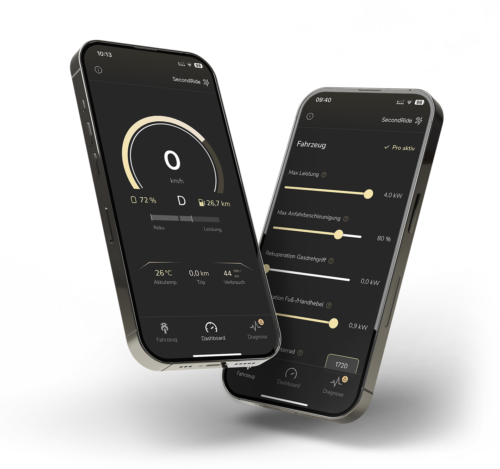

# Second Ride App

---
## Kompatibilität  

Unterstützte Smartphone Modelle:

- iOS-Geräte ab iOS 15 (mindestens iPhone X oder neuer)
- Android-Geräte, ab Baujahr 2019 und mindestens Android 10

Unterstützte Second Ride Umbausätze:

- SR22 ist nicht kompatibel, da die Hardware sich deutlich unterscheidet und nicht unterstützt wird
- SR23 in Verbindung mit unserem Bluetooth-Modul
- SR24 teilweise ohne weitere Hardware und teilweise nur in Verbindung mit unserem Bluetooth-Modul (siehe nächster Abschnitt)
- MID50 ist kompatibel

!!! info "So erkennst du ob deine SR24 Sitzbank Bluetooth hat"
    Wenn deine Sitzbank direkt neben dem Hauptstecker einen USB-C Port besitzt, hat deine Sitzbank bereits ein BT-Modul integriert. Um es zu verwenden, musst du nur noch das Sitzbank-Update machen. Wie das geht, siehst du unter dem Kapitel “Updateprozess”.

    

      
    

---
## Installation der App  

Um dein Fahrzeug mit dem Smartphone zu verbinden, lade dir bitte zunächst die Second Ride App herunter:

[Second Ride App für IPhone](http://www.second-ride.de/app-ios)

[Second Ride App für Android](http://www.second-ride.de/app-android) 

Tipp: Achte darauf, dass du die aktuellste Version der App verwendest. Nur so ist sichergestellt, dass alle Funktionen zuverlässig arbeiten.

---
## Verbindungsaufbau 

Um die Sicherheit deiner Daten und Verbindung zu gewährleisten haben wir einen gesicherten Verbindungsaufbau implementiert. Dieser muss nur einmal beim ersten Verbinden mit einem neuen Smartphone, welches dein Fahrzeug noch nicht kennt, durchgeführt werden.   
Halte dafür die Sitzbank ID (unten auf deiner Sitzbank aufgelasert) bzw. die BT-Modul-ID bereit, die auf der Seite deines BT-Moduls steht.

### Erster Verbindungsaufbau mit MID50: 
kommt bald

### Erster Verbindungsaufbau mit SR24 BT-Sitzbank:  

Um deine Second Ride App mit deinem Fahrzeug zu verbinden, muss das Fahrzeug eingeschaltet sein, sodass der Taster am Zündschloss pulsiert.   
Halte den Sitzbanktaster für 3s gedrückt, bis ein Piepton erklingt und die Logo LED blau pulsiert.  
Öffne nun die Second Ride App und gehe oben rechts auf Verbinden. Es öffnet sich ein Fenster, welches nun ein Gerät namens “SecondRide” anzeigt. Klicke dieses an und bestätige die Kopplungsanforderung, die evtl. auftritt.  
Nun wirst du aufgefordert die Sitzbank ID einzugeben. Bitte gib die 5-stellige Zahl deiner Sitzbank ID ein und bestätige mit “senden”.  
Nun wird eine Verbindung aufgebaut. Bestätige die evtl. auftretende Kopplungsanforderung.  
Nach einem kurzen Moment sollte Verbindung erfolgreich sein und das Dashboard der App erscheinen.

### Erster Verbindungsaufbau mit BT-Modul: 

Um deine Second Ride App mit deinem Fahrzeug zu verbinden, muss das Fahrzeug eingeschaltet sein, sodass der Taster am Zündschloss pulsiert.   
Halte den BT-Modultaster für 3s gedrückt, bis ein Piepton erklingt und die Logo LED blau pulsiert.  
Öffne nun die Second Ride App und gehe oben rechts auf Verbinden. Es öffnet sich ein Fenster, welches nun ein Gerät namens “SecondRide” anzeigt. Klicke dieses an und bestätige die Kopplungsanforderung, die evtl. auftritt.  
Nun wirst du aufgefordert die BT-Modul ID einzugeben. Bitte gib die 5-stellige BT-Modul ID ein und bestätige mit “senden”. Achte hierbei darauf, dass das BT groß geschrieben ist.  
Nun wird eine Verbindung aufgebaut. Bestätige die evtl. auftretende Kopplungsanforderung.  
Nach einem kurzen Moment sollte Verbindung erfolgreich sein und das Dashboard der App erscheinen.

### Automatischer Verbindungsaufbau 

Nach dem dein Smartphone ein mal erfolgreich verbunden wurde, verbindet es sich in Zukunft automatisch, wenn du die App öffnest und deine BT-Sitzbank in Recihweite bzw. BT-Modul mit Strom versorgt ist.

### Zurücksetzen der bekannten Geräte 

Ein 10s gedrückthalten des BT-Modultasters im eingeschalteten Zustand bewirkt, dass dieses alle bekannten Smartphones vergisst sowie dass der BT-Name und alle Verstellt Fahrzeugeinstellungen zurückgesetzt werden. Solltest du vorher Fahrzeugeinstellungen verstellt haben, werden diese dadurch wieder auf die Ursprungsparameter zurückgesetzt.

---
## Bedienung der App 

### Dashboard-Seite 

Das Dashboard gibt dir einen Digitaltacho, auf dem du alle relevanten Fahrparameter einsehen kannst. Um die einzelnen angezeigten zu verstehen, kannst du unter dem Diagnose Bildschirm in der App nachlesen, was die einzelnen Parameter bedeuten. Dafür musst du dort auf das kleine “i” Info Symbol neben dem Parameternamen klicken. 

### Diagnose-Seite 

Der Diagnosebildschirm  liefert dir einen tiefen Einblick in die Systemparameter. Diese sind unterteilt in Statusmeldungen, Akku und Antriebsmodul. Unter Statusmeldungen bekommst du aktuelle Hinweise zum Systemzustand gemeldet.   
Nimm dir den Moment und nutze auch hier wieder die Möglichkeit durch ein Tippen auf die einzelnen Parameternamen eine genauere Beschreibung für den einzelnen Systemparameter aufzurufen.

### Fahrzeug-Seite 

Die App ermöglicht es dir, Einstellungen an deinem Fahrzeug durchzuführen. Diese unterscheiden sich als Pro Features bzw. Standard Features. Um zu verstehen, welche Funktion die Verstellung dieser Einstellungen haben, nutze bitte das kleine “i” Info Symbol neben dem Parameternamen auf der “Einstellungen”  
Die Pro Features sind nur verfügbar, wenn auf deiner BT-Sitzbank bzw. BT-Modul Pro freigeschaltet ist. Wie das geht, siehst du im folgenden Abschnitt.

!!! warning "Achtung"
    Durch das Verstellen von Fahrzeugeinstellungen veränderst du aktiv das Fahrverhalten deines Fahrzeuges. Lies dir vorher den Beschreibungstext des jeweiligen Fahreigenschaften durch und fahre  nach dem Verstellen vorsichtig, um das veränderte Fahrverhalten kennenzulernen. 
    
#### Pro-Features 

Um die Pro-Features freizuschalten, muss ein 8-stelliger Pro-Code auf der App Seite “Fahrzeug” eingegeben werden. 

**Wo  finde ich den Pro-Code?**

Wenn du ein BT-Modul inkl. Pro-Code bestellt hast, findest du diesen auf dem beigelegten Lieferschein. Falls du einen Pro-Code in unserem Shop erworben hast, wird er dir per Email zugesandt.

Wenn du noch kein Pro feature gekauft hast, diese aber nutzen möchtest, kannst du deinen persönlichen Pro-Code unter [diesem Link](http://www.second-ride.de/pro-code) erwerben:

**Was ist wenn ich zwei Handys habe/ das Handy wechsel / das Fahrzeug wechsle?**

Mit dem Pro-Code schaltest du das BT-Modul bzw deine Sitzbank frei. Das heißt, unabhängig davon, ob du später ein anderes Handy nutzt, oder das BT-Modul bzw. die Sitzbank mit einem anderen Fahrzeug nutzt, sind die Pro-Features nutzbar.

### Infoseite: Probleme Melden, App Info & Rechtliches 

In der App Oben links gibt es einen Infobutton. Dieser führt dich zu der Infoseite der App.   
Dort findest findest du hier das Problem melden Feld. Mit diesem kannst du uns Feedback inkl. Logdatei deiner letzten Fahrt und App Nutzung zukommen lassen. Wenn du Probleme mit der App oder dem System haben solltest, nutze diese Funktion, um uns zu informieren.

Zusätzlich findest du dort alle Informationen zu Datenschutz & dessen Einstellung, dem Impressum, Lizenzen, sowie App-Version.

### Datenschutz 

Wir haben den Datenschutz natürlich sehr Ernst genommen und schützen deine Daten auf uns bestmögliche Weise. Alle Informationen zum Datenschutz findest du in [diesem Link](http://www.second-ride.de/datenschutz):

